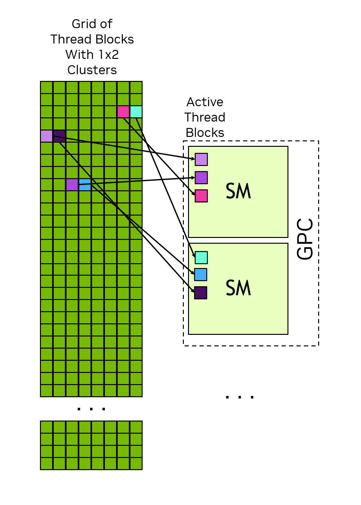

# 1.2 编程模型

> 本文档为 [NVIDIA CUDA Programming Guide](https://docs.nvidia.com/cuda/cuda-programming-guide/) 官方文档中文翻译版
>
> 原文地址：[https://docs.nvidia.com/cuda/cuda-programming-guide/01-introduction/programming-model.html](https://docs.nvidia.com/cuda/cuda-programming-guide/01-introduction/programming-model.html)

---

本页面是否有帮助？

# 1.2. 编程模型

本章从高层次介绍 CUDA 编程模型，且独立于任何具体语言。这里介绍的术语和概念适用于任何受支持的编程语言中的 CUDA。后续章节将在 C++ 中阐述这些概念。

## 1.2.1. 异构系统

CUDA 编程模型假设了一个异构计算系统，这意味着一个同时包含 GPU 和 CPU 的系统。CPU 及其直接连接的内存分别称为*主机*和*主机内存*。GPU 及其直接连接的内存分别称为*设备*和*设备内存*。在一些片上系统（SoC）中，这些可能是单个封装的一部分。在更大的系统中，可能存在多个 CPU 或 GPU。

CUDA 应用程序在 GPU 上执行其部分代码，但应用程序总是在 CPU 上开始执行。主机代码（即在 CPU 上运行的代码）可以使用 CUDA API 在主机内存和设备内存之间复制数据、启动在 GPU 上执行的代码，并等待数据复制或 GPU 代码完成。CPU 和 GPU 可以同时执行代码，通常通过最大化利用 CPU 和 GPU 来获得最佳性能。

应用程序在 GPU 上执行的代码称为*设备代码*，由于历史原因，为在 GPU 上执行而调用的函数称为*内核*。启动内核运行的行为称为*启动*内核。内核启动可以看作是在 GPU 上并行启动许多线程执行内核代码。GPU 线程的操作方式与 CPU 上的线程类似，但存在一些对正确性和性能都很重要的差异，这些将在后续章节中介绍（参见 [第 3.2.2.1.1 节](../03-advanced/advanced-kernel-programming.html#advanced-kernels-independent-thread-scheduling)）。

## 1.2.2. GPU 硬件模型

与任何编程模型一样，CUDA 依赖于底层硬件的概念模型。出于 CUDA 编程的目的，GPU 可以被视为一组*流式多处理器*（SM）的集合，这些 SM 被组织成称为*图形处理集群*（GPC）的组。每个 SM 包含一个本地寄存器文件、一个统一数据缓存以及许多执行计算的功能单元。统一数据缓存为*共享内存*和 L1 缓存提供物理资源。统一数据缓存在 L1 和共享内存之间的分配可以在运行时配置。不同类型内存的大小以及 SM 内功能单元的数量可能因 GPU 架构而异。

!!! note "注意"
    GPU 的实际硬件布局或其物理执行编程模型的方式可能有所不同。这些差异不会影响使用 CUDA 编程模型编写的软件的正确性。

*图 2一个 GPU 包含许多流式多处理器（SM），每个 SM 又包含许多功能单元。图形处理集群（GPC）是 SM 的集合。GPU 是一组连接到 GPU 内存的 GPC。CPU 通常有多个核心和一个连接到系统内存的内存控制器。CPU 和 GPU 通过诸如 PCIe 或 NVLINK 的互连技术连接。#*

### 1.2.2.1. 线程块与线程网格

当应用程序启动一个内核时，它会启动许多线程，通常是数百万个。这些线程被组织成块。一个线程块，或许并不意外，被称为*线程块*。线程块被组织成一个*线程网格*。网格中的所有线程块具有相同的大小和维度。[图 3](#thread-hierarchy-grid-of-thread-blocks) 展示了一个线程块网格的示意图。

*图 3线程块网格。每个箭头代表一个线程（箭头数量不代表实际线程数）。#*

线程块和网格可以是一维、二维或三维的。这些维度可以简化将单个线程映射到工作单元或数据项的过程。

当内核启动时，会使用一个特定的*执行配置*来启动，该配置指定了网格和线程块的维度。执行配置还可能包含可选参数，例如集群大小、流和 SM 配置设置，这些将在后续章节介绍。

通过使用内置变量，每个执行内核的线程可以确定其在其所属块内的位置，以及其所属块在网格内的位置。线程还可以使用这些内置变量来确定线程块的维度和启动内核的网格的维度。这使得每个线程在所有运行内核的线程中拥有唯一的身份标识。这个身份标识经常被用来确定线程负责哪些数据或操作。

一个线程块的所有线程都在单个 SM 上执行。这使得线程块内的线程能够高效地相互通信和同步。线程块内的所有线程都可以访问片上的共享内存，这可以用于在线程块的线程之间交换信息。

一个网格可能包含数百万个线程块，而执行该网格的 GPU 可能只有几十或几百个 SM。一个线程块的所有线程都由单个 SM 执行，并且在大多数情况下 [[1]](#fn-non-completion)，会在该 SM 上运行至完成。线程块之间的调度没有保证，因此一个线程块不能依赖其他线程块的结果，因为在该线程块完成之前，其他线程块可能无法被调度。[图 4](#thread-block-scheduling) 展示了一个网格中的线程块如何分配给 SM 的示例。

*图 4每个 SM 有一个或多个活动线程块。在此示例中，每个 SM 同时调度了三个线程块。网格中的线程块分配给 SM 的顺序没有保证。#*
CUDA 编程模型支持任意规模的线程网格在任何规模的 GPU 上运行，无论该 GPU 仅包含一个 SM 还是包含数千个 SM。为实现这一目标，除少数例外情况外，CUDA 编程模型要求不同线程块中的线程之间不得存在数据依赖关系。也就是说，线程不应依赖同一网格中不同线程块内线程的计算结果，也不应与这些线程进行同步。同一线程块内的所有线程在同一时间运行于同一个 SM 上。网格中的不同线程块则在可用的 SM 之间进行调度，并且可以按任意顺序执行。简而言之，CUDA 编程模型要求线程块能够以任意顺序、并行或串行地执行。

#### 1.2.2.1.1. 线程块簇

除了线程块之外，计算能力 9.0 及更高版本的 GPU 还提供了一个可选的线程分组层级，称为*簇*。簇是一组线程块，与线程块和网格类似，可以按一维、二维或三维进行组织。[图 5](#figure-thread-block-clusters) 展示了一个由线程块组成的网格，该网格同时也被组织成了簇。指定簇并不会改变网格的维度，也不会改变线程块在网格内的索引。

*图 5当指定簇时，线程块在网格中的位置不变，但在其所属的簇内也有一个位置。#*

指定簇会将相邻的线程块分组为簇，并在簇级别提供一些额外的同步和通信机会。具体来说，一个簇内的所有线程块都在同一个 GPC 中执行。[图 6](#thread-block-scheduling-with-clusters) 展示了在指定簇时，线程块如何被调度到 GPC 内的 SM 上。由于这些线程块被同时调度且位于同一个 GPC 内，因此不同线程块但属于同一簇的线程，可以使用[协作组](../02-basics/writing-cuda-kernels.html#writing-cuda-kernels-cooperative-groups)提供的软件接口进行相互通信和同步。簇内的线程可以访问该簇内所有线程块的共享内存，这被称为[分布式共享内存](../02-basics/writing-cuda-kernels.html#writing-cuda-kernels-distributed-shared-memory)。簇的最大尺寸取决于硬件，在不同设备间可能有所不同。

[图 6](#thread-block-scheduling-with-clusters) 说明了簇内的线程块如何在 GPC 内的 SM 上同时被调度。簇内的线程块在网格内始终彼此相邻。

*图 6当指定簇时，簇内的线程块在网格内按照其簇的形状排列。一个簇内的线程块在单个 GPC 的 SM 上同时被调度。#*
### 1.2.2.2. 线程束与 SIMT

在线程块内部，线程被组织成 32 个线程一组，称为*线程束*。一个线程束以*单指令多线程*范式执行内核代码。在 SIMT 范式中，线程束内的所有线程执行相同的内核代码，但每个线程可能遵循代码中的不同分支。也就是说，尽管程序的所有线程执行相同的代码，但线程不需要遵循相同的执行路径。

当线程由线程束执行时，它们会被分配一个线程束通道。线程束通道编号为 0 到 31，线程块中的线程会按照[硬件多线程](../03-advanced/advanced-kernel-programming.html#advanced-kernels-hardware-implementation-hardware-multithreading)中详述的可预测方式分配到线程束中。

线程束中的所有线程同时执行相同的指令。如果线程束中的某些线程在执行时遵循某个控制流分支，而其他线程不遵循，那么不遵循该分支的线程将被屏蔽，而遵循该分支的线程则继续执行。例如，如果一个条件仅对线程束中一半的线程为真，那么当活跃线程执行这些指令时，线程束的另一半将被屏蔽。这种情况在[图 7](#active-warp-lanes) 中进行了说明。当线程束中的不同线程遵循不同的代码路径时，有时称为线程束发散。由此可见，当线程束内的线程遵循相同的控制流路径时，GPU 的利用率最高。

*图 7在此示例中，只有线程索引为偶数的线程执行 if 语句的主体，其他线程在执行主体时被屏蔽。#*

在 SIMT 模型中，线程束中的所有线程以锁步方式在内核中前进。硬件执行可能有所不同。有关此区别在何处重要的更多信息，请参阅[独立线程调度](../03-advanced/advanced-kernel-programming.html#advanced-kernels-independent-thread-scheduling)部分。不鼓励利用线程束执行如何实际映射到真实硬件的知识。CUDA 编程模型和 SIMT 规定线程束中的所有线程一起在代码中前进。只要遵循编程模型，硬件可能会以对程序透明的方式优化被屏蔽的通道。如果程序违反此模型，可能会导致未定义行为，并且在不同 GPU 硬件上可能表现不同。

虽然在编写 CUDA 代码时不必考虑线程束，但理解线程束执行模型有助于理解诸如[全局内存合并](../02-basics/writing-cuda-kernels.html#writing-cuda-kernels-coalesced-global-memory-access)和[共享内存体访问模式](../02-basics/writing-cuda-kernels.html#writing-cuda-kernels-shared-memory-access-patterns)等概念。一些高级编程技术利用线程块内线程束的特化来限制线程发散并最大化利用率。此优化及其他优化利用了线程在执行时被分组为线程束这一知识。
线程束执行的一个含义是，线程块最好指定总线程数为 32 的倍数。使用任意数量的线程都是合法的，但当总数不是 32 的倍数时，线程块的最后一个线程束在执行过程中将有一些通道未被使用。这很可能导致该线程束的功能单元利用率和内存访问效率不佳。

> SIMT 常被拿来与单指令多数据（SIMD）并行进行比较，但两者存在一些重要区别。在 SIMD 中，执行遵循单一控制流路径，而在 SIMT 中，每个线程被允许遵循其自己的控制流路径。因此，SIMT 不像 SIMD 那样具有固定的数据宽度。关于 SIMT 更详细的讨论，请参阅
> [SIMT 执行模型](#simt-execution-model)
> 。

## 1.2.3. GPU 内存

在现代计算系统中，高效利用内存与最大化执行计算的功能单元的使用同等重要。异构系统拥有多个内存空间，GPU 除了缓存之外，还包含各种类型的可编程片上内存。以下各节将更详细地介绍这些内存空间。

### 1.2.3.1. 异构系统中的 DRAM 内存

GPU 和 CPU 都直接连接着 DRAM 芯片。在拥有多个 GPU 的系统中，每个 GPU 都有自己的内存。从设备代码的角度来看，连接到 GPU 的 DRAM 被称为*全局内存*，因为 GPU 中的所有 SM 都可以访问它。这个术语并不意味着它在系统内任何地方都必然可访问。连接到 CPU 的 DRAM 被称为*系统内存*或*主机内存*。

与 CPU 类似，GPU 使用虚拟内存寻址。在所有当前支持的系统中，CPU 和 GPU 使用一个统一的虚拟内存空间。这意味着系统中每个 GPU 的虚拟内存地址范围是唯一的，并且与 CPU 以及系统中其他所有 GPU 的地址范围不同。对于给定的虚拟内存地址，可以确定该地址是在 GPU 内存中还是在系统内存中，并且在多 GPU 系统中，还可以确定哪个 GPU 内存包含该地址。

CUDA 提供了用于分配 GPU 内存、CPU 内存以及在 CPU 和 GPU 之间、GPU 内部或多 GPU 系统中的 GPU 之间进行内存复制的 API。在需要时，可以显式控制数据的局部性。下文将讨论的[统一内存](#programming-model-unified-memory)，允许由 CUDA 运行时或系统硬件自动处理内存的放置。

### 1.2.3.2. GPU 中的片上内存

除了全局内存，每个 GPU 还有一些片上内存。每个 SM 都有自己的寄存器文件和共享内存。这些内存是 SM 的一部分，可以由在 SM 内执行的线程极快地访问，但运行在其他 SM 中的线程无法访问它们。

寄存器文件存储线程局部变量，这些变量通常由编译器分配。共享内存可由一个线程块或集群内的所有线程访问。共享内存可用于在线程块或集群的线程之间交换数据。
SM中的寄存器文件和统一数据缓存具有有限的大小。SM的寄存器文件大小、统一数据缓存大小以及统一数据缓存如何配置以平衡L1和共享内存，可在[每个计算能力的内存信息](../05-appendices/compute-capabilities.html#compute-capabilities-table-memory-information-per-compute-capability)中找到。寄存器文件、共享内存空间和L1缓存在一个线程块的所有线程之间共享。

要将一个线程块调度到SM上，每个线程所需的寄存器总数乘以线程块中的线程数必须小于或等于SM中可用的寄存器数。如果一个线程块所需的寄存器数量超过了寄存器文件的大小，则内核无法启动，必须减少线程块中的线程数才能使线程块可启动。

共享内存分配在线程块级别进行。也就是说，与按线程分配的寄存器不同，共享内存的分配对整个线程块是共用的。

#### 1.2.3.2.1. 缓存

除了可编程内存外，GPU还具有L1和L2缓存。每个SM都有一个L1缓存，它是统一数据缓存的一部分。一个更大的L2缓存由GPU内的所有SM共享。这可以在[图2](#gpu-cpu-system-diagram)的GPU框图中看到。每个SM还有一个独立的[常量缓存](../02-basics/writing-cuda-kernels.html#writing-cuda-kernels-constant-memory)，用于缓存全局内存中那些在内核生命周期内被声明为常量的值。编译器也可能将内核参数放入常量内存。这可以通过允许内核参数在SM中独立于L1数据缓存进行缓存来提高内核性能。

### 1.2.3.3. 统一内存

当应用程序在GPU或CPU上显式分配内存时，该内存只能由在该设备上运行的代码访问。也就是说，CPU内存只能从CPU代码访问，GPU内存只能从在GPU上运行的内核访问[[2]](#fn-mapped-memory-system-access)。用于在CPU和GPU之间复制内存的CUDA API用于在正确的时间将数据显式复制到正确的内存。

一项名为*统一内存*的CUDA功能允许应用程序进行内存分配，这些内存可以从CPU或GPU访问。CUDA运行时或底层硬件在需要时启用访问或将数据重定位到正确的位置。即使使用统一内存，通过最小化内存迁移并尽可能从直接连接到内存所在位置的处理器访问数据，才能获得最佳性能。

系统的硬件特性决定了如何实现内存空间之间的数据访问和交换。[统一内存](../02-basics/understanding-memory.html#memory-unified-memory)一节介绍了不同类别的统一内存系统。[统一内存](../04-special-topics/unified-memory.html#um-details-intro)一节包含了关于统一内存在所有情况下的使用和行为的更多详细信息。
[
1
]

在某些情况下，当使用诸如 [CUDA 动态并行](../04-special-topics/dynamic-parallelism.html#cuda-dynamic-parallelism) 等功能时，线程块可能会被挂起到内存中。这意味着 SM 的状态被存储到 GPU 内存中一个由系统管理的区域，并且该 SM 被释放以执行其他线程块。这类似于 CPU 上的上下文交换。这种情况并不常见。

[
2
]

一个例外是 [映射内存](../02-basics/understanding-memory.html#memory-mapped-memory)，这是一种通过特定属性分配的 CPU 内存，使得 GPU 可以直接访问它。然而，映射访问是通过 PCIe 或 NVLINK 连接进行的。GPU 无法通过并行性来掩盖更高的延迟和更低的带宽，因此映射内存并不能作为统一内存或将数据放置在适当内存空间的高性能替代方案。

 本页