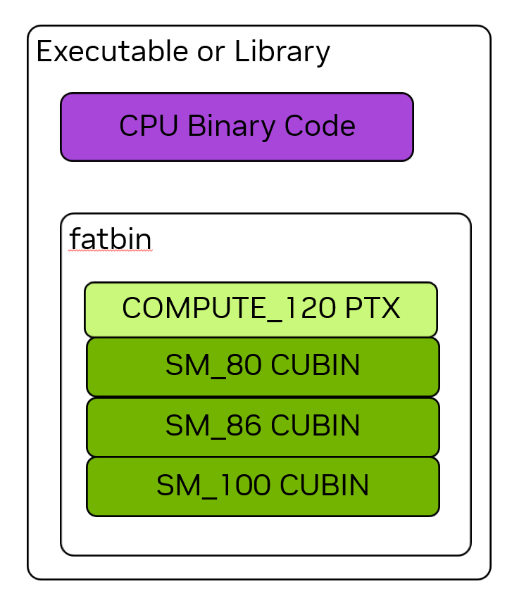

# 1.3 CUDA 平台

> 本文档为 [NVIDIA CUDA Programming Guide](https://docs.nvidia.com/cuda/cuda-programming-guide/) 官方文档中文翻译版
>
> 原文地址：[https://docs.nvidia.com/cuda/cuda-programming-guide/01-introduction/cuda-platform.html](https://docs.nvidia.com/cuda/cuda-programming-guide/01-introduction/cuda-platform.html)

---

此页面是否有帮助？

# 1.3. CUDA 平台

NVIDIA CUDA 平台由许多软件和硬件组件以及为实现在异构系统上进行计算而开发的许多重要技术组成。本章旨在介绍 CUDA 平台的一些基本概念和组件，这些对于应用程序开发者理解非常重要。与[编程模型](programming-model.html#programming-model)一样，本章不针对任何特定的编程语言，而是适用于使用 CUDA 平台的一切。

## 1.3.1. 计算能力与流式多处理器版本

每个 NVIDIA GPU 都有一个*计算能力*编号，它指示该 GPU 支持哪些功能，并规定了该 GPU 的一些硬件参数。这些规格在[第 5.1 节](../05-appendices/compute-capabilities.html#compute-capabilities)附录中有详细说明。所有 NVIDIA GPU 及其计算能力的列表维护在[CUDA GPU 计算能力页面](https://developer.nvidia.com/cuda-gpus)上。

计算能力表示为一个主版本号和次版本号，格式为 X.Y，其中 X 是主版本号，Y 是次版本号。例如，CC 12.0 的主版本是 12，次版本是 0。计算能力直接对应于 SM 的版本号。例如，CC 12.0 的 GPU 内部的 SM 具有 SM 版本 sm_120。此版本用于标记二进制文件。

[第 5.1.1 节](../05-appendices/compute-capabilities.html#compute-capabilities-querying)展示了如何查询和确定系统中 GPU 的计算能力。

## 1.3.2. CUDA 工具包与 NVIDIA 驱动程序

*NVIDIA 驱动程序*可以看作是 GPU 的操作系统。NVIDIA 驱动程序是一个必须安装在主机系统操作系统上的软件组件，是所有 GPU 使用（包括显示和图形功能）所必需的。NVIDIA 驱动程序是 CUDA 平台的基础。除了 CUDA，NVIDIA 驱动程序还提供了使用 GPU 的所有其他方法，例如 Vulkan 和 Direct3D。NVIDIA 驱动程序具有诸如 r580 之类的版本号。

*CUDA 工具包*是一组用于编写、构建和分析利用 GPU 计算的软件的库、头文件和工具。CUDA 工具包是与 NVIDIA 驱动程序分开的软件产品。

*CUDA 运行时*是 CUDA 工具包提供的库中的一个特例。CUDA 运行时提供了一个 API 和一些语言扩展，用于处理常见任务，例如分配内存、在 GPU 与其他 GPU 或 CPU 之间复制数据以及启动内核。CUDA 运行时的 API 组件被称为 CUDA 运行时 API。

[CUDA 兼容性](https://docs.nvidia.com/deploy/cuda-compatibility/index.html)文档提供了不同 GPU、NVIDIA 驱动程序和 CUDA 工具包版本之间兼容性的完整详细信息。

### 1.3.2.1. CUDA 运行时 API 与 CUDA 驱动程序 API
CUDA 运行时 API 构建在一个称为 *CUDA 驱动程序 API* 的低级 API 之上，后者是由 NVIDIA 驱动程序公开的 API。本指南主要关注 CUDA 运行时 API 所公开的接口。如果需要，仅使用驱动程序 API 也可以实现所有相同的功能。某些功能仅能通过驱动程序 API 使用。应用程序可以单独使用任一 API，也可以同时使用两者并实现互操作。章节 [CUDA 驱动程序 API](../03-advanced/driver-api.html#driver-api) 涵盖了运行时 API 与驱动程序 API 之间的互操作。

CUDA 运行时 API 函数的完整 API 参考可在 [CUDA 运行时 API 文档](https://docs.nvidia.com/cuda/cuda-runtime-api/index.html) 中找到。

CUDA 驱动程序 API 的完整 API 参考可在 [CUDA 驱动程序 API 文档](https://docs.nvidia.com/cuda/cuda-driver-api/index.html) 中找到。

## 1.3.3. 并行线程执行 (PTX)

CUDA 平台的一个基础但有时不可见的层是 *并行线程执行* (PTX) 虚拟指令集架构 (ISA)。PTX 是用于 NVIDIA GPU 的高级汇编语言。PTX 在真实 GPU 硬件的物理 ISA 之上提供了一个抽象层。与其他平台类似，应用程序可以直接用这种汇编语言编写，但这样做可能会给软件开发增加不必要的复杂性和难度。

领域特定语言和高级语言编译器可以将 PTX 代码生成为中间表示 (IR)，然后使用 NVIDIA 的离线或即时 (JIT) 编译工具来生成可执行的二进制 GPU 代码。这使得 CUDA 平台能够通过 NVIDIA 提供的工具（如 [NVCC：NVIDIA CUDA 编译器](../02-basics/nvcc.html#nvcc)）所支持的语言之外的其他语言进行编程。

由于 GPU 功能会随着时间变化和增长，PTX 虚拟 ISA 规范是有版本号的。PTX 版本，类似于 SM 版本，对应一个计算能力。例如，支持计算能力 8.0 所有特性的 PTX 称为 compute_80。

关于 PTX 的完整文档可在 [PTX ISA](https://docs.nvidia.com/cuda/parallel-thread-execution/index.html) 中找到。

## 1.3.4. Cubin 和 Fatbin

CUDA 应用程序和库通常使用像 C++ 这样的高级语言编写。该高级语言被编译为 PTX，然后 PTX 被编译成针对物理 GPU 的真实二进制文件，称为 *CUDA 二进制文件*，或简称为 *cubin*。一个 cubin 具有针对特定 SM 版本（例如 sm_120）的特定二进制格式。

使用 GPU 计算的可执行文件和库二进制文件同时包含 CPU 和 GPU 代码。GPU 代码存储在一个称为 *fatbin* 的容器内。Fatbin 可以包含针对多个不同目标的 cubin 和 PTX。例如，一个应用程序可以构建为包含针对多种不同 GPU 架构（即不同 SM 版本）的二进制文件。当应用程序运行时，其 GPU 代码被加载到特定的 GPU 上，并使用 fatbin 中针对该 GPU 的最佳二进制文件。

*图 8 可执行文件或库的二进制文件包含 CPU 二进制代码和用于 GPU 代码的 fatbin 容器。fatbin 可同时包含 cubin GPU 二进制代码和 PTX 虚拟 ISA 代码。PTX 代码可通过 JIT 编译以面向未来目标。*

Fatbin 还可以包含一个或多个 GPU 代码的 PTX 版本，其用途在 [PTX 兼容性](#cuda-platform-ptx-compatibility) 中描述。[图 8](#fatbin-graphic) 展示了一个应用程序或库二进制文件的示例，其中包含多个 GPU 代码的 cubin 版本以及一个 PTX 代码版本。

### 1.3.4.1. 二进制兼容性

NVIDIA GPU 在某些情况下保证二进制兼容性。具体来说，在主要计算能力版本内，次要计算能力大于或等于 cubin 目标版本的 GPU 可以加载并执行该 cubin。例如，如果一个应用程序包含一个为计算能力 8.6 编译的 cubin 代码，那么该 cubin 可以在计算能力为 8.6 或 8.9 的 GPU 上加载和执行。然而，它不能在计算能力为 8.0 的 GPU 上加载，因为 GPU 的次要版本 0 低于代码的次要版本 6。

NVIDIA GPU 在不同主要计算能力版本之间不保证二进制兼容性。也就是说，为计算能力 8.6 编译的 cubin 代码将无法在计算能力 9.0 的 GPU 上加载。

在讨论二进制代码时，二进制代码通常被称为具有某个版本，例如上例中的 sm_86。这等同于说该二进制文件是为计算能力 8.6 构建的。这种简写方式经常被使用，因为它是开发者向 NVIDIA CUDA 编译器 [nvcc](../02-basics/nvcc.html#nvcc) 指定此二进制构建目标的方式。

!!! note "注意"
    二进制兼容性仅针对由 NVIDIA 工具（如 nvcc）创建的二进制文件做出承诺。不支持手动编辑或为 NVIDIA GPU 生成二进制代码。如果二进制文件以任何方式被修改，兼容性承诺将失效。

### 1.3.4.2. PTX 兼容性

GPU 代码可以以二进制或 PTX 形式存储在可执行文件中，这在 [Cubin 和 Fatbin](#cuda-platform-cubins-fatbins) 中有所介绍。当应用程序存储 GPU 代码的 PTX 版本时，该 PTX 可以在应用程序运行时，针对等于或高于该 PTX 代码计算能力的任何计算能力进行 JIT 编译。例如，如果一个应用程序包含针对 compute_80 的 PTX，那么该 PTX 代码可以在应用程序运行时 JIT 编译到更新的 SM 版本，例如 sm_120。这使得应用程序或库无需重新构建即可实现与未来 GPU 的前向兼容。

### 1.3.4.3. 即时编译

应用程序在运行时加载的 PTX 代码由设备驱动程序编译为二进制代码。这称为即时（JIT）编译。即时编译会增加应用程序的加载时间，但允许应用程序受益于每个新设备驱动程序带来的任何新编译器改进。它还使应用程序能够在编译时尚未存在的设备上运行。
当设备驱动程序为应用程序即时编译 PTX 代码时，它会自动缓存生成的二进制代码副本，以避免在后续调用应用程序时重复编译。该缓存（称为计算缓存）会在设备驱动程序升级时自动失效，从而使应用程序能够受益于设备驱动程序中内置的新即时编译器的改进。

自 CUDA 早期版本以来，运行时 PTX 的 JIT 编译方式和时机已变得更加灵活，允许更灵活地决定是否以及何时 JIT 编译部分或全部内核。[延迟加载](../04-special-topics/lazy-loading.html#lazy-loading) 一节描述了可用选项以及如何控制 JIT 行为。还有一些环境变量控制即时编译行为，详见 [CUDA 环境变量](../05-appendices/environment-variables.html#cuda-environment-variables)。

除了使用 `nvcc` 编译 CUDA C++ 设备代码外，还可以使用 NVRTC 在运行时将 CUDA C++ 设备代码编译为 PTX。NVRTC 是用于 CUDA C++ 的运行时编译库；更多信息可在 NVRTC 用户指南中找到。

本页内容