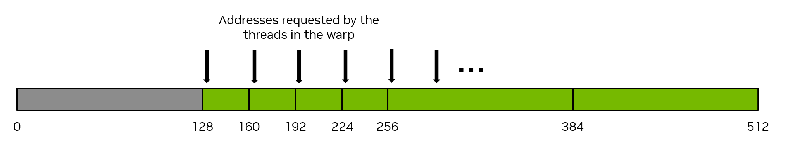

# 2.2 编写 CUDA SIMT 内核

> 本文档为 [NVIDIA CUDA Programming Guide](https://docs.nvidia.com/cuda/cuda-programming-guide/) 官方文档中文翻译版
>
> 原文地址：[https://docs.nvidia.com/cuda/cuda-programming-guide/02-basics/writing-cuda-kernels.html](https://docs.nvidia.com/cuda/cuda-programming-guide/02-basics/writing-cuda-kernels.html)

---

本页面是否有帮助？

# 2.2. 编写 CUDA SIMT 内核

对于给定的问题，CUDA C++ 内核的编写方式在很大程度上可以与为传统 CPU 编写代码的方式相同。然而，GPU 有一些独特的特性可以用来提高性能。此外，了解 GPU 上的线程如何调度、如何访问内存以及它们的执行如何进行，可以帮助开发者编写能够最大化利用可用计算资源的内核。

## 2.2.1. SIMT 基础

从开发者的角度来看，CUDA 线程是并行性的基本单位。[线程束和 SIMT](../01-introduction/programming-model.html#programming-model-warps-simt) 描述了 GPU 执行的基本 SIMT 模型，而 [SIMT 执行模型](../03-advanced/advanced-kernel-programming.html#advanced-kernels-hardware-implementation-simt-architecture) 提供了 SIMT 模型的更多细节。SIMT 模型允许每个线程维护自己的状态和控制流。从功能角度来看，每个线程可以执行独立的代码路径。然而，通过注意让内核代码最小化同一线程束中线程执行不同代码路径的情况，可以实现显著的性能提升。

## 2.2.2. 线程层次结构

线程被组织成线程块，线程块再被组织成线程网格。网格可以是 1 维、2 维或 3 维的，网格的大小可以在内核内部使用内置变量 `gridDim` 查询。线程块也可以是 1 维、2 维或 3 维的。线程块的大小可以在内核内部使用内置变量 `blockDim` 查询。线程块的索引可以使用内置变量 `blockIdx` 查询。在线程块内部，线程的索引使用内置变量 `threadIdx` 获取。这些内置变量用于为每个线程计算一个唯一的全局线程索引，从而使每个线程能够根据需要从全局内存加载/存储特定数据并执行唯一的代码路径。

- gridDim.[x|y|z] : 网格在 x、y 和 z 维度上的大小。这些值在内核启动时设置。
- blockDim.[x|y|z] : 线程块在 x、y 和 z 维度上的大小。这些值在内核启动时设置。
- blockIdx.[x|y|z] : 线程块在 x、y 和 z 维度上的索引。这些值根据正在执行的线程块而变化。
- threadIdx.[x|y|z] : 线程在 x、y 和 z 维度上的索引。这些值根据正在执行的线程而变化。

使用多维线程块和网格仅是为了方便，并不影响性能。一个线程块中的线程以可预测的方式线性化：第一个索引 `x` 变化最快，其次是 `y`，然后是 `z`。这意味着在线程索引的线性化中，连续的 `threadIdx.x` 值表示连续的线程，`threadIdx.y` 的步长为 `blockDim.x`，而 `threadIdx.z` 的步长为 `blockDim.x * blockDim.y`。这会影响线程如何被分配到线程束，详见 [硬件多线程](../03-advanced/advanced-kernel-programming.html#advanced-kernels-hardware-implementation-hardware-multithreading)。
[图 9](#writing-cuda-kernels-thread-hierarchy-review-grid-of-thread-blocks) 展示了一个简单的 2D 网格示例，其中包含 1D 线程块。


*图 9 线程块网格#*

## 2.2.3. GPU 设备内存空间

CUDA 设备拥有多个内存空间，这些空间可以被内核中的 CUDA 线程访问。[表 1](#writing-cuda-kernels-memory-types-scopes-lifetimes) 总结了常见的内存类型、它们的线程作用域以及生命周期。以下各节将更详细地解释这些内存类型。

| 内存类型 | 作用域 | 生命周期 | 位置 |
| --- | --- | --- | --- |
| 全局内存 | 网格 | 应用程序 | 设备 |
| 常量内存 | 网格 | 应用程序 | 设备 |
| 共享内存 | 线程块 | 内核 | SM |
| 本地内存 | 线程 | 内核 | 设备 |
| 寄存器 | 线程 | 内核 | SM |

### 2.2.3.1. 全局内存

全局内存（也称为设备内存）是存储数据的主要内存空间，内核中的所有线程都可以访问它。它类似于 CPU 系统中的 RAM。在 GPU 上运行的内核可以直接访问全局内存，就像在 CPU 上运行的代码可以访问系统内存一样。

全局内存是持久性的。也就是说，在全局内存中进行的分配以及存储其中的数据会一直存在，直到分配被释放或应用程序终止。`cudaDeviceReset` 也会释放所有分配。

全局内存通过 CUDA API 调用（如 `cudaMalloc` 和 `cudaMallocManaged`）进行分配。可以使用 CUDA 运行时 API 调用（如 `cudaMemcpy`）将数据从 CPU 内存复制到全局内存。使用 CUDA API 进行的全局内存分配通过 `cudaFree` 释放。

在内核启动之前，全局内存通过 CUDA API 调用进行分配和初始化。在内核执行期间，CUDA 线程可以读取全局内存中的数据，并且 CUDA 线程执行操作的结果可以写回全局内存。一旦内核完成执行，它写入全局内存的结果可以复制回主机或由 GPU 上的其他内核使用。

由于网格中的所有线程都可以访问全局内存，因此必须注意避免线程间的数据竞争。由于从主机启动的 CUDA 内核的返回类型是 `void`，内核计算的数值结果返回给主机的唯一方法是将这些结果写入全局内存。

一个说明全局内存使用的简单例子是下面的 `vecAdd` 内核，其中三个数组 `A`、`B` 和 `C` 位于全局内存中，并由这个向量加法内核访问。

```cpp
__global__ void vecAdd(float* A, float* B, float* C, int vectorLength)
{
    int workIndex = threadIdx.x + blockIdx.x*blockDim.x;
    if(workIndex < vectorLength)
    {
        C[workIndex] = A[workIndex] + B[workIndex];
```

### 2.2.3.2. 共享内存

共享内存是一个内存空间，线程块中的所有线程都可以访问它。它物理上位于每个 SM 上，并与 L1 缓存（统一数据缓存）使用相同的物理资源。共享内存中的数据在内核执行期间持续存在。共享内存可以被视为内核执行期间使用的用户管理的暂存器。虽然与全局内存相比，共享内存的容量较小，但由于共享内存位于每个 SM 上，其带宽更高，访问延迟也比访问全局内存低。
由于共享内存可被线程块内的所有线程访问，必须注意避免同一线程块内线程间的数据竞争。同一线程块内线程间的同步可以通过 `__syncthreads()` 函数实现。此函数会阻塞线程块内的所有线程，直到所有线程都执行到对 `__syncthreads()` 的调用。

```cpp
// assuming blockDim.x is 128
__global__ void example_syncthreads(int* input_data, int* output_data) {
    __shared__ int shared_data[128];
    // Every thread writes to a distinct element of 'shared_data':
    shared_data[threadIdx.x] = input_data[threadIdx.x];

    // All threads synchronize, guaranteeing all writes to 'shared_data' are ordered 
    // before any thread is unblocked from '__syncthreads()':
    __syncthreads();

    // A single thread safely reads 'shared_data':
    if (threadIdx.x == 0) {
        int sum = 0;
        for (int i = 0; i < blockDim.x; ++i) {
            sum += shared_data[i];
        }
        output_data[blockIdx.x] = sum;
    }
}
```

共享内存的大小因所使用的 GPU 架构而异。由于共享内存和 L1 缓存共享相同的物理空间，使用共享内存会减少内核可用的 L1 缓存大小。此外，如果内核不使用共享内存，整个物理空间将全部用作 L1 缓存。CUDA 运行时 API 提供了函数来查询每个 SM 和每个线程块的共享内存大小，可以使用 `cudaGetDeviceProperties` 函数并检查 `cudaDeviceProp.sharedMemPerMultiprocessor` 和 `cudaDeviceProp.sharedMemPerBlock` 设备属性。

CUDA 运行时 API 提供了一个函数 `cudaFuncSetCacheConfig`，用于告知运行时是为共享内存分配更多空间，还是为 L1 缓存分配更多空间。此函数向运行时指定一个偏好，但不保证一定会被采纳。运行时可以根据可用资源和内核的需求自由做出决定。

共享内存可以静态分配和动态分配。

#### 2.2.3.2.1. 共享内存的静态分配

要静态分配共享内存，程序员必须在内核中使用 `__shared__` 限定符声明一个变量。该变量将在共享内存中分配，并在内核执行期间持续存在。以这种方式声明的共享内存大小必须在编译时指定。例如，位于内核主体中的以下代码片段声明了一个包含 1024 个元素的 `float` 类型共享内存数组。

```cpp
__shared__ float sharedArray[1024];
```

在此声明之后，线程块中的所有线程都将可以访问此共享内存数组。必须注意避免同一线程块内线程间的数据竞争，通常需要使用 `__syncthreads()`。

#### 2.2.3.2.2. 共享内存的动态分配

要动态分配共享内存，程序员可以在内核启动的三括号表示法中，将每个线程块所需的共享内存字节数指定为第三个（可选）参数，格式如下：`functionName<<<grid, block, sharedMemoryBytes>>>()`。
然后，在内核内部，程序员可以使用 `extern __shared__` 说明符来声明一个将在内核启动时动态分配的变量。

```cpp
extern __shared__ float sharedArray[];
```

需要注意的一点是，如果想要多个动态分配的共享内存数组，必须使用指针运算手动划分单个 `extern __shared__` 区域。例如，如果想要实现以下静态分配的效果：

```cpp
short array0[128];
float array1[64];
int   array2[256];
```

使用动态分配的共享内存，可以按以下方式声明和初始化数组：

```cpp
extern __shared__ float array[];

short* array0 = (short*)array;
float* array1 = (float*)&array0[128];
int*   array2 =   (int*)&array1[64];
```

请注意，指针需要与其指向的类型对齐，因此，例如以下代码将无法工作，因为 `array1` 没有对齐到 4 字节。

```cpp
extern __shared__ float array[];
short* array0 = (short*)array;
float* array1 = (float*)&array0[127];
```

### 2.2.3.3. 寄存器

寄存器位于 SM 上，具有线程局部作用域。寄存器的使用由编译器管理，在内核执行期间，寄存器用于线程局部存储。每个 SM 的寄存器数量和每个线程块的寄存器数量可以通过查询 GPU 的 `regsPerMultiprocessor` 和 `regsPerBlock` 设备属性来获取。

NVCC 允许开发者通过 `-maxrregcount` 选项来[指定内核使用的最大寄存器数量](https://docs.nvidia.com/cuda/cuda-compiler-driver-nvcc/index.html#maxrregcount-amount-maxrregcount)。使用此选项减少内核可使用的寄存器数量，可能会导致在 SM 上同时调度更多的线程块，但也可能导致更多的寄存器溢出。

### 2.2.3.4. 局部内存

局部内存是类似于寄存器的线程局部存储，由 NVCC 管理，但局部内存的物理位置在全局内存空间中。'局部'这个标签指的是其逻辑作用域，而非物理位置。在内核执行期间，局部内存用于线程局部存储。编译器可能将其放入局部内存的自动变量包括：

*   无法确定其索引是常量值的数组，
*   占用过多寄存器空间的大型结构体或数组，
*   如果内核使用的寄存器超过可用数量（即寄存器溢出）时的任何变量。

由于局部内存空间位于设备内存中，局部内存访问具有与全局内存访问相同的延迟和带宽，并且需要满足与[合并的全局内存访问](#writing-cuda-kernels-coalesced-global-memory-access)中描述的相同的内存合并要求。然而，局部内存的组织方式使得连续的 32 位字由连续的线程 ID 访问。因此，只要一个线程束中的所有线程访问相同的相对地址（例如数组变量中的相同索引或结构体变量中的相同成员），访问就是完全合并的。
### 2.2.3.5. 常量内存

常量内存具有网格作用域，在应用程序的整个生命周期内都可访问。常量内存驻留在设备上，并且对内核是只读的。因此，必须在主机端使用 `__constant__` 限定符在任何函数之外声明并初始化它。

`__constant__` 内存空间限定符声明的变量具有以下特性：

- 驻留在常量内存空间中，
- 其生命周期与创建它的 CUDA 上下文相同，
- 每个设备都有一个独立的对象，
- 可以被网格内的所有线程访问，并且主机可以通过运行时库（cudaGetSymbolAddress() / cudaGetSymbolSize() / cudaMemcpyToSymbol() / cudaMemcpyFromSymbol()）访问。

常量内存的总量可以通过设备属性元素 `totalConstMem` 查询。

常量内存适用于少量数据，这些数据将被每个线程以只读方式使用。相对于其他内存，常量内存较小，通常每个设备为 64KB。

下面是一个声明和使用常量内存的示例片段。

```cpp
// 在你的 .cu 文件中
__constant__ float coeffs[4];

__global__ void compute(float *out) {
    int idx = threadIdx.x;
    out[idx] = coeffs[0] * idx + coeffs[1];
}

// 在你的主机代码中
float h_coeffs[4] = {1.0f, 2.0f, 3.0f, 4.0f};
cudaMemcpyToSymbol(coeffs, h_coeffs, sizeof(h_coeffs));
compute<<<1, 10>>>(device_out);
```

### 2.2.3.6. 缓存

GPU 设备具有多级缓存结构，包括 L2 和 L1 缓存。

L2 缓存位于设备上，并在所有 SM 之间共享。L2 缓存的大小可以通过 `cudaGetDeviceProperties` 函数中的 `l2CacheSize` 设备属性元素查询。

如上文[共享内存](#writing-cuda-kernels-shared-memory)所述，L1 缓存在物理上位于每个 SM 上，并且与共享内存使用的是相同的物理空间。如果一个内核没有使用共享内存，那么整个物理空间将被 L1 缓存使用。

L2 和 L1 缓存可以通过允许开发者指定各种缓存行为的函数来控制。这些函数的详细信息请参阅[配置 L1/共享内存平衡](../03-advanced/advanced-kernel-programming.html#advanced-kernel-l1-shared-config)、[L2 缓存控制](../04-special-topics/l2-cache-control.html#advanced-kernels-l2-control)和[低级加载和存储函数](../05-appendices/cpp-language-extensions.html#low-level-load-store-functions)。

如果不使用这些提示，编译器和运行时将尽力高效地利用缓存。

### 2.2.3.7. 纹理和表面内存

!!! note "注意"
    一些较旧的 CUDA 代码可能会使用纹理内存，因为在较旧的 NVIDIA GPU 中，这样做在某些场景下能带来性能优势。在所有当前支持的 GPU 上，这些场景可以使用直接的加载和存储指令来处理，使用纹理和表面内存指令不再提供任何性能优势。

GPU 可能具有专门的指令，用于从图像中加载数据以用作 3D 渲染中的纹理。CUDA 在[纹理对象 API](https://docs.nvidia.com/cuda/cuda-runtime-api/group__CUDART__TEXTURE__OBJECT.html) 和[表面对象 API](https://docs.nvidia.com/cuda/cuda-runtime-api/group__CUDART__SURFACE__OBJECT.html) 中公开了这些指令及其使用机制。
本指南不再进一步讨论纹理内存和表面内存，因为在当前支持的所有 NVIDIA GPU 上，在 CUDA 中使用它们没有任何优势。CUDA 开发者可以放心地忽略这些 API。对于仍在现有代码库中使用这些 API 的开发者，可以在旧版 [CUDA C++ 编程指南](https://docs.nvidia.com/cuda/cuda-c-programming-guide/index.html#texture-and-surface-memory) 中找到对这些 API 的解释。

### 2.2.3.8. 分布式共享内存

计算能力 9.0 中引入的[线程块集群](../01-introduction/programming-model.html#programming-model-thread-block-clusters)（由[协作组](../04-special-topics/cooperative-groups.html#cooperative-groups)提供支持），使得线程块集群中的线程能够访问该集群中所有参与线程块的共享内存。这种分区的共享内存称为*分布式共享内存*，其对应的地址空间称为分布式共享内存地址空间。属于线程块集群的线程可以在分布式地址空间中进行读取、写入或执行原子操作，无论该地址属于本地线程块还是远程线程块。无论内核是否使用分布式共享内存，共享内存大小的规定（静态或动态）仍然是针对每个线程块的。分布式共享内存的大小只是每个集群的线程块数乘以每个线程块的共享内存大小。

访问分布式共享内存中的数据要求所有线程块都存在。用户可以使用来自 [cluster_group 类](../05-appendices/device-callable-apis.html#cg-api-cluster-group) 的 `cluster.sync()` 来保证所有线程块都已开始执行。用户还需要确保所有分布式共享内存操作在线程块退出之前发生。例如，如果一个远程线程块试图读取某个给定线程块的共享内存，程序需要确保远程线程块读取共享内存的操作在该线程块退出之前完成。

让我们看一个简单的直方图计算示例，以及如何使用线程块集群在 GPU 上对其进行优化。计算直方图的标准方法是在每个线程块的共享内存中执行计算，然后执行全局内存原子操作。这种方法的一个限制是共享内存容量。一旦直方图条柱无法再放入共享内存，用户就需要直接在全局内存中计算直方图，从而执行全局内存原子操作。借助分布式共享内存，CUDA 提供了一个中间步骤，根据直方图条柱的大小，直方图可以直接在共享内存、分布式共享内存或全局内存中计算。

下面的 CUDA 内核示例展示了如何根据直方图条柱的数量，在共享内存或分布式共享内存中计算直方图。

```cpp
#include <cooperative_groups.h>

// Distributed Shared memory histogram kernel
__global__ void clusterHist_kernel(int *bins, const int nbins, const int bins_per_block, const int *__restrict__ input,
                                   size_t array_size)
{
  extern __shared__ int smem[];
  namespace cg = cooperative_groups;
  int tid = cg::this_grid().thread_rank();

  // Cluster initialization, size and calculating local bin offsets.
  cg::cluster_group cluster = cg::this_cluster();
  unsigned int clusterBlockRank = cluster.block_rank();
  int cluster_size = cluster.dim_blocks().x;

  for (int i = threadIdx.x; i < bins_per_block; i += blockDim.x)
  {
    smem[i] = 0; //Initialize shared memory histogram to zeros
  }

  // cluster synchronization ensures that shared memory is initialized to zero in
  // all thread blocks in the cluster. It also ensures that all thread blocks
  // have started executing and they exist concurrently.
  cluster.sync();

  for (int i = tid; i < array_size; i += blockDim.x * gridDim.x)
  {
    int ldata = input[i];

    //Find the right histogram bin.
    int binid = ldata;
    if (ldata < 0)
      binid = 0;
    else if (ldata >= nbins)
      binid = nbins - 1;

    //Find destination block rank and offset for computing
    //distributed shared memory histogram
    int dst_block_rank = (int)(binid / bins_per_block);
    int dst_offset = binid % bins_per_block;

    //Pointer to target block shared memory
    int *dst_smem = cluster.map_shared_rank(smem, dst_block_rank);

    //Perform atomic update of the histogram bin
    atomicAdd(dst_smem + dst_offset, 1);
  }

  // cluster synchronization is required to ensure all distributed shared
  // memory operations are completed and no thread block exits while
  // other thread blocks are still accessing distributed shared memory
  cluster.sync();

  // Perform global memory histogram, using the local distributed memory histogram
  int *lbins = bins + cluster.block_rank() * bins_per_block;
  for (int i = threadIdx.x; i < bins_per_block; i += blockDim.x)
  {
    atomicAdd(&lbins[i], smem[i]);
  }
}
```
上述内核可以在运行时启动，其集群大小取决于所需的分布式共享内存量。如果直方图足够小，可以仅容纳在一个线程块的共享内存中，用户可以用集群大小 1 来启动内核。以下代码片段展示了如何根据共享内存需求动态启动集群内核。

```cpp
// 通过可扩展启动方式启动
{
  cudaLaunchConfig_t config = {0};
  config.gridDim = array_size / threads_per_block;
  config.blockDim = threads_per_block;

  // cluster_size 取决于直方图大小。
  // ( cluster_size == 1 ) 意味着没有分布式共享内存，只有线程块本地的共享内存
  int cluster_size = 2; // 此处以大小 2 为例
  int nbins_per_block = nbins / cluster_size;

  // 动态共享内存大小是按块计算的。
  // 分布式共享内存大小 = cluster_size * nbins_per_block * sizeof(int)
  config.dynamicSmemBytes = nbins_per_block * sizeof(int);

  CUDA_CHECK(::cudaFuncSetAttribute((void *)clusterHist_kernel, cudaFuncAttributeMaxDynamicSharedMemorySize, config.dynamicSmemBytes));

  cudaLaunchAttribute attribute[1];
  attribute[0].id = cudaLaunchAttributeClusterDimension;
  attribute[0].val.clusterDim.x = cluster_size;
  attribute[0].val.clusterDim.y = 1;
  attribute[0].val.clusterDim.z = 1;

  config.numAttrs = 1;
  config.attrs = attribute;

  cudaLaunchKernelEx(&config, clusterHist_kernel, bins, nbins, nbins_per_block, input, array_size);
}
```

## 2.2.4. 内存性能

确保正确的内存使用是在 CUDA 内核中实现高性能的关键。本节讨论在 CUDA 内核中实现高内存吞吐量的一些通用原则和示例。

### 2.2.4.1. 合并的全局内存访问

全局内存通过 32 字节的内存事务进行访问。当 CUDA 线程从全局内存请求一个字的数据时，相关的线程束会根据每个线程访问的字的大小以及内存地址在线程间的分布情况，将该线程束中所有线程的内存请求合并为满足该请求所需数量的内存事务。例如，如果一个线程请求一个 4 字节的字，该线程束将向全局内存生成的实际内存事务总共为 32 字节。为了最有效地使用内存系统，线程束应使用在单个内存事务中获取的所有内存。也就是说，如果一个线程从全局内存请求一个 4 字节的字，并且事务大小为 32 字节，如果该线程束中的其他线程可以使用该 32 字节请求中的其他 4 字节字的数据，这将实现内存系统的最有效利用。

举个简单的例子，如果线程束中的连续线程请求内存中连续的 4 字节字，那么该线程束将总共请求 128 字节的内存，并且这所需的 128 字节将通过四次 32 字节的内存事务获取。这实现了内存系统 100% 的利用率。也就是说，100% 的内存流量都被该线程束利用了。[图 10](#writing-cuda-kernels-128-byte-coalesced-access) 说明了这个完美合并内存访问的示例。


*图 10 合并内存访问*

相反，最糟糕的病态情况是连续的线程访问内存中彼此相距 32 字节或更远的数据元素。在这种情况下，线程束将被迫为每个线程发起一次 32 字节的内存事务，内存传输的总字节数将是 32 字节 * 32 线程/线程束 = 1024 字节。然而，实际使用的内存量仅为 128 字节（线程束中每个线程 4 字节），因此内存利用率仅为 128 / 1024 = 12.5%。这是对内存系统非常低效的使用。[图 11](#writing-cuda-kernels-128-byte-no-coalesced-access) 说明了这种未合并内存访问的示例。



*图 11 未合并内存访问*

实现合并内存访问最直接的方法是让连续的线程访问内存中连续的元素。例如，对于一个使用一维线程块启动的内核，下面的 `VecAdd` 内核将实现合并内存访问。请注意线程 `workIndex` 如何访问三个数组，以及连续的线程（由 `workIndex` 的连续值表示）如何访问数组中的连续元素。

```cpp
__global__ void vecAdd(float* A, float* B, float* C, int vectorLength)
{
    int workIndex = threadIdx.x + blockIdx.x*blockDim.x;
    if(workIndex < vectorLength)
    {
        C[workIndex] = A[workIndex] + B[workIndex];
```

实现合并内存访问并不要求连续的线程必须访问内存中连续的元素，这只是实现合并的典型方式。只要线程束中的所有线程以某种线性或置换的方式访问来自相同 32 字节内存段的元素，就会发生合并内存访问。换句话说，实现合并内存访问的最佳方式是最大化已使用字节数与已传输字节数的比率。

!!! note "注意"
    确保全局内存访问的正确合并是编写高性能 CUDA 内核最重要的性能考量之一。应用程序必须尽可能高效地使用内存系统。

#### 2.2.4.1.1. 使用全局内存的矩阵转置示例

作为一个简单的例子，考虑一个异地矩阵转置内核，它将一个大小为 N x N 的 32 位浮点方阵从矩阵 `a` 转置到矩阵 `c`。此示例使用二维网格，并假设启动大小为 32 x 32 线程的二维线程块，即 `blockDim.x = 32` 且 `blockDim.y = 32`，因此每个二维线程块将处理矩阵的一个 32 x 32 图块。每个线程处理矩阵的一个唯一元素，因此不需要显式的线程同步。[图 12](#writing-cuda-kernels-figure-global-transpose) 说明了这个矩阵转置操作。内核源代码紧随该图之后。


*图 12 使用全局内存的矩阵转置#每个矩阵顶部和左侧的标签是二维线程块索引，也可以看作是图块索引，其中每个小方块表示一个将由二维线程块操作的矩阵图块。在此示例中，图块大小为 32 x 32 个元素，因此每个小方块代表矩阵的一个 32 x 32 图块。绿色阴影方块显示了一个示例图块在转置操作前后的位置。*

```cpp
/* 宏：以行优先顺序，使用二维索引访问一维内存数组 */
/* ld 是主维度，即矩阵的列数 */

#define INDX( row, col, ld ) ( ( (row) * (ld) ) + (col) )

/* 朴素 CUDA 矩阵转置内核 */

__global__ void naive_cuda_transpose(int m, float *a, float *c )
{
    int myCol = blockDim.x * blockIdx.x + threadIdx.x;
    int myRow = blockDim.y * blockIdx.y + threadIdx.y;

    if( myRow < m && myCol < m )
    {
        c[INDX( myCol, myRow, m )] = a[INDX( myRow, myCol, m )];
    } /* end if */
    return;
} /* end naive_cuda_transpose */
```

要判断此内核是否实现了合并内存访问，需要确定连续的线程是否访问连续的内存元素。在二维线程块中，`x` 索引变化最快，因此连续的 `threadIdx.x` 值应该访问连续的内存元素。`threadIdx.x` 出现在 `myCol` 中，可以观察到当 `myCol` 作为 `INDX` 宏的第二个参数时，连续的线程正在读取 `a` 的连续值，因此对 `a` 的读取是完全合并的。

然而，对 `c` 的写入并未合并，因为连续的 `threadIdx.x` 值（再次检查 `myCol`）正在向 `c` 写入彼此相隔 `ld`（主维度）个元素的元素。之所以观察到这一点，是因为现在 `myCol` 是 `INDX` 宏的第一个参数，并且当 `INDX` 的第一个参数递增 1 时，内存位置变化 `ld`。当 `ld` 大于 32 时（只要矩阵尺寸大于 32 就会发生），这等同于[图 11](#writing-cuda-kernels-128-byte-no-coalesced-access) 中所示的病态情况。

为了缓解这些未合并的写入，可以采用共享内存，这将在下一节中描述。

### 2.2.4.2. 共享内存访问模式

共享内存有 32 个存储体，其组织方式是连续的 32 位字映射到连续的存储体。每个存储体每个时钟周期的带宽为 32 位。

当同一线程束中的多个线程尝试访问同一存储体中的不同元素时，会发生存储体冲突。在这种情况下，对该存储体中数据的访问将被序列化，直到所有请求该数据的线程都获得了该存储体中的数据。这种访问的序列化会导致性能损失。

此场景有两个例外情况，发生在同一线程束中的多个线程访问（读取或写入）相同的共享内存位置时。对于读取访问，该字将被广播到请求线程。对于写入访问，每个共享内存地址仅由其中一个线程写入（由哪个线程执行写入是未定义的）。
[图13](#writing-cuda-kernels-shared-memory-5-x-examples-of-strided-shared-memory-accesses)展示了一些跨步访问的示例。存储体内部的红色方框表示共享内存中的一个唯一位置。


*图13 32位存储体大小模式下的跨步共享内存访问。#左侧：跨步为一个32位字的线性寻址（无存储体冲突）。中间：跨步为两个32位字的线性寻址（双向存储体冲突）。右侧：跨步为三个32位字的线性寻址（无存储体冲突）。*

[图14](#writing-cuda-kernels-shared-memory-5-x-examples-of-irregular-shared-memory-accesses)展示了一些涉及广播机制的内存读取访问示例。存储体内部的红色方框表示共享内存中的一个唯一位置。如果多个箭头指向同一位置，数据将被广播给所有请求它的线程。


*图14 不规则共享内存访问。#左侧：通过随机排列实现的无冲突访问。中间：由于线程3、4、6、7和9访问存储体5内的同一个字，因此是无冲突访问。右侧：无冲突的广播访问（线程访问同一存储体内的同一个字）。*

!!! note "注意"
    避免存储体冲突是编写使用共享内存的高性能CUDA内核时一个重要的性能考量因素。

#### 2.2.4.2.1. 使用共享内存的矩阵转置示例

在之前的示例[使用全局内存的矩阵转置示例](#writing-cuda-kernels-matrix-transpose-example-global-memory)中，展示了一个功能正确但未针对全局内存高效使用进行优化的朴素矩阵转置实现，因为对矩阵`c`的写入没有正确合并。在本示例中，共享内存将被视为用户管理的缓存，用于暂存来自全局内存的加载和存储操作，从而实现读取和写入的全局内存合并访问。

 示例

```cpp
 1/* definitions of thread block size in X and Y directions */
 2
 3#define THREADS_PER_BLOCK_X 32
 4#define THREADS_PER_BLOCK_Y 32
 5
 6/* macro to index a 1D memory array with 2D indices in row-major order */
 7/* ld is the leading dimension, i.e. the number of columns in the matrix     */
 8
 9#define INDX( row, col, ld ) ( ( (row) * (ld) ) + (col) )
10
11/* CUDA kernel for shared memory matrix transpose */
12
13__global__ void smem_cuda_transpose(int m, float *a, float *c )
14{
15
16    /* declare a statically allocated shared memory array */
17
18    __shared__ float smemArray[THREADS_PER_BLOCK_X][THREADS_PER_BLOCK_Y];
19
20    /* determine my row tile and column tile index */
21
22    const int tileCol = blockDim.x * blockIdx.x;
23    const int tileRow = blockDim.y * blockIdx.y;
24
25    /* read from global memory into shared memory array */
26    smemArray[threadIdx.x][threadIdx.y] = a[INDX( tileRow + threadIdx.y, tileCol + threadIdx.x, m )];
27
28    /* synchronize the threads in the thread block */
29    __syncthreads();
30
31    /* write the result from shared memory to global memory */
32    c[INDX( tileCol + threadIdx.y, tileRow + threadIdx.x, m )] = smemArray[threadIdx.y][threadIdx.x];
33    return;
34
35} /* end smem_cuda_transpose */
```
带数组检查的示例

```cpp
 1/* definitions of thread block size in X and Y directions */
 2
 3#define THREADS_PER_BLOCK_X 32
 4#define THREADS_PER_BLOCK_Y 32
 5
 6/* macro to index a 1D memory array with 2D indices in column-major order */
 7/* ld is the leading dimension, i.e. the number of rows in the matrix     */
 8
 9#define INDX( row, col, ld ) ( ( (col) * (ld) ) + (row) )
10
11/* CUDA kernel for shared memory matrix transpose */
12
13__global__ void smem_cuda_transpose(int m,
14                                    float *a,
15                                    float *c )
16{
17
18    /* declare a statically allocated shared memory array */
19
20    __shared__ float smemArray[THREADS_PER_BLOCK_X][THREADS_PER_BLOCK_Y];
21
22    /* determine my row and column indices for the error checking code */
23
24    const int myRow = blockDim.x * blockIdx.x + threadIdx.x;
25    const int myCol = blockDim.y * blockIdx.y + threadIdx.y;
26
27    /* determine my row tile and column tile index */
28
29    const int tileX = blockDim.x * blockIdx.x;
30    const int tileY = blockDim.y * blockIdx.y;
31
32    if( myRow < m && myCol < m )
33    {
34        /* read from global memory into shared memory array */
35        smemArray[threadIdx.x][threadIdx.y] = a[INDX( tileX + threadIdx.x, tileY + threadIdx.y, m )];
36    } /* end if */
37
38    /* synchronize the threads in the thread block */
39    __syncthreads();
40
41    if( myRow < m && myCol < m )
42    {
43        /* write the result from shared memory to global memory */
44        c[INDX( tileY + threadIdx.x, tileX + threadIdx.y, m )] = smemArray[threadIdx.y][threadIdx.x];
45    } /* end if */
46    return;
47
48} /* end smem_cuda_transpose */
```

此示例说明的基本性能优化是确保在访问全局内存时，内存访问能正确合并。在执行复制操作之前，每个线程计算其 `tileRow` 和 `tileCol` 索引。这些索引是待操作特定分块的索引，这些分块索引基于正在执行的线程块。同一线程块中的每个线程具有相同的 `tileRow` 和 `tileCol` 值，因此可以将其视为该特定线程块将操作的分块的起始位置。

然后，内核继续执行，每个线程块通过以下语句将矩阵的一个 32 x 32 分块从全局内存复制到共享内存。由于一个线程束的大小是 32 个线程，此复制操作将由 32 个线程束执行，线程束之间的执行顺序没有保证。

```cpp
smemArray[threadIdx.x][threadIdx.y] = a[INDX( tileRow + threadIdx.y, tileCol + threadIdx.x, m )];
```

请注意，由于 `threadIdx.x` 出现在 `INDX` 的第二个参数中，连续的线程正在访问内存中连续的元素，因此对 `a` 的读取是完全合并的。

内核的下一步是调用 `__syncthreads()` 函数。这确保了线程块中的所有线程在继续执行之前都已完成先前代码的执行，从而确保在下一步开始之前，将 `a` 写入共享内存的操作已完成。这一点至关重要，因为下一步将涉及线程从共享内存中读取数据。如果没有 `__syncthreads()` 调用，则无法保证在线程块中的某些线程束在代码中进一步推进之前，所有线程束都已完成将 `a` 读入共享内存的操作。
在内核的这一点上，对于每个线程块，`smemArray` 中存储了一个 32 x 32 的矩阵分块，其排列顺序与原矩阵相同。为了确保分块内的元素被正确转置，线程在读取 `smemArray` 时交换了 `threadIdx.x` 和 `threadIdx.y`。为了确保整个分块被放置在 `c` 中的正确位置，写入 `c` 时也交换了 `tileRow` 和 `tileCol` 索引。为了确保正确的合并访问，`threadIdx.x` 被用作 `INDX` 的第二个参数，如下面的语句所示。

```cpp
c[INDX( tileCol + threadIdx.y, tileRow + threadIdx.x, m )] = smemArray[threadIdx.y][threadIdx.x];
```

这个内核展示了共享内存的两种常见用途。

-   共享内存用于暂存来自全局内存的数据，以确保对全局内存的读取和写入都能正确合并。
-   共享内存允许同一线程块内的线程之间共享数据。

#### 2.2.4.2.2. 共享内存存储体冲突

在[第 2.2.4.2 节](#writing-cuda-kernels-shared-memory-access-patterns)中，描述了共享内存的存储体结构。在前面的矩阵转置示例中，实现了对全局内存的正确合并访问，但没有考虑是否存在共享内存存储体冲突。考虑以下二维共享内存声明：

```cpp
__shared__ float smemArray[32][32];
```

由于一个线程束包含 32 个线程，同一线程束中的每个线程的 `threadIdx.y` 值是固定的，并且满足 `0 <= threadIdx.x < 32`。

[图 15](#writing-cuda-kernels-figure-bank-conflicts-shared-mem) 的左图说明了当一个线程束中的线程访问 `smemArray` 一列数据时的情况。线程束 0 正在访问内存位置 `smemArray[0][0]` 到 `smemArray[31][0]`。按照 C++ 多维数组的存储顺序，最后一个索引变化最快，因此线程束 0 中连续的线程访问的内存位置相隔 32 个元素。如图所示，颜色表示存储体，线程束 0 对整个列的访问导致了 32 路存储体冲突。

[图 15](#writing-cuda-kernels-figure-bank-conflicts-shared-mem) 的右图说明了当一个线程束中的线程访问 `smemArray` 一行数据时的情况。线程束 0 正在访问内存位置 `smemArray[0][0]` 到 `smemArray[0][31]`。在这种情况下，线程束 0 中连续的线程访问的是相邻的内存位置。如图所示，颜色表示存储体，线程束 0 对整个行的访问没有产生存储体冲突。理想的情况是，线程束中的每个线程访问一个具有不同颜色（即不同存储体）的共享内存位置。


*图 15：32 x 32 共享内存数组中的存储体结构。#方框中的数字表示线程束索引。颜色表示该共享内存位置关联的存储体。*
回到[第2.2.4.2.1节](#writing-cuda-kernels-matrix-transpose-example-shared-memory)的示例，我们可以检查共享内存的使用情况，以确定是否存在存储体冲突。共享内存的第一次使用发生在将全局内存数据存储到共享内存时：

```cpp
smemArray[threadIdx.x][threadIdx.y] = a[INDX( tileRow + threadIdx.y, tileCol + threadIdx.x, m )];
```

由于C++数组按行优先顺序存储，同一线程束中连续的线程（由连续的`threadIdx.x`值表示）将以32个元素的步长访问`smemArray`，因为`threadIdx.x`是数组的第一个索引。这导致了32路存储体冲突，如[图15](#writing-cuda-kernels-figure-bank-conflicts-shared-mem)左侧面板所示。

共享内存的第二次使用发生在将共享内存数据写回全局内存时：

```cpp
c[INDX( tileCol + threadIdx.y, tileRow + threadIdx.x, m )] = smemArray[threadIdx.y][threadIdx.x];
```

在这种情况下，由于`threadIdx.x`是`smemArray`数组的第二个索引，同一线程束中的连续线程将以1个元素的步长访问`smemArray`。这不会产生存储体冲突，如[图15](#writing-cuda-kernels-figure-bank-conflicts-shared-mem)右侧面板所示。

如[第2.2.4.2.1节](#writing-cuda-kernels-matrix-transpose-example-shared-memory)所示的矩阵转置内核，有一次共享内存访问没有存储体冲突，另一次访问存在32路存储体冲突。避免存储体冲突的一个常见修复方法是通过在数组的列维度上加一来填充共享内存，如下所示：

```cpp
__shared__ float smemArray[THREADS_PER_BLOCK_X][THREADS_PER_BLOCK_Y+1];
```

对`smemArray`声明的这一微小调整将消除存储体冲突。为了说明这一点，请参考[图16](#writing-cuda-kernels-figure-no-bank-conflicts-shared-mem)，其中共享内存数组被声明为32 x 33的大小。可以观察到，无论同一线程束中的线程是沿整列还是整行访问共享内存数组，存储体冲突都已被消除，即同一线程束中的线程访问具有不同颜色的位置。


*图16：32 x 33共享内存数组中的存储体结构。#方框中的数字表示线程束索引。颜色表示该共享内存位置关联的存储体。*

## 2.2.5.原子操作

高性能的CUDA内核依赖于尽可能多地表达算法并行性。GPU内核执行的异步性要求线程尽可能独立地操作。线程并非总能完全独立，正如我们在[共享内存](#writing-cuda-kernels-shared-memory)中所见，存在一种机制允许同一线程块中的线程交换数据和同步。
在整个线程网格层面，并没有这样的机制来同步网格中的所有线程。然而，存在一种机制，可以通过使用原子函数来提供对全局内存位置的同步访问。原子函数允许线程获取一个全局内存位置的锁，并对该位置执行读-修改-写操作。在锁被持有时，其他线程无法访问同一位置。CUDA 提供了与 C++ 标准库原子操作行为相同的原子操作，即 `cuda::std::atomic` 和 `cuda::std::atomic_ref`。CUDA 还提供了扩展的 C++ 原子操作 `cuda::atomic` 和 `cuda::atomic_ref`，允许用户指定原子操作的[线程作用域](../03-advanced/advanced-kernel-programming.html#advanced-kernels-thread-scopes)。原子函数的详细信息在[原子函数](../05-appendices/cpp-language-extensions.html#atomic-functions)部分介绍。

以下是一个使用 `cuda::atomic_ref` 执行设备级原子加法的示例，其中 `array` 是一个浮点数数组，`result` 是一个指向全局内存中某个位置的浮点指针，该位置将用于存储数组的和。

```cpp
__global__ void sumReduction(int n, float *array, float *result) {
   ...
   tid = threadIdx.x + blockIdx.x * blockDim.x;

   cuda::atomic_ref<float, cuda::thread_scope_device> result_ref(result);
   result_ref.fetch_add(array[tid]);
   ...
}
```

应谨慎使用原子函数，因为它们强制线程同步，可能会影响性能。

## 2.2.6. 协作组

[协作组](../04-special-topics/cooperative-groups.html#cooperative-groups) 是 CUDA C++ 中提供的一个软件工具，它允许应用程序定义可以相互同步的线程组，即使该线程组跨越多个线程块、单个 GPU 上的多个网格，甚至跨越多个 GPU。通常，CUDA 编程模型允许线程块或线程块簇内的线程高效同步，但不提供指定小于线程块或簇的线程组的机制。同样，CUDA 编程模型也不提供能够实现跨线程块同步的机制或保证。

协作组通过软件提供了这两种能力。协作组允许应用程序创建跨越线程块和簇边界的线程组，但这样做会带来一些语义限制和性能影响，这些在[涵盖协作组的特性部分](../04-special-topics/cooperative-groups.html#cooperative-groups)有详细描述。

## 2.2.7. 内核启动与占用率

当 CUDA 内核启动时，CUDA 线程会根据内核启动时指定的执行配置分组为线程块和网格。内核一旦启动，调度器就会将线程块分配给各个 SM。应用程序无法控制或查询哪些线程块被调度到哪些 SM 上执行的细节，调度器也不保证任何执行顺序，因此程序不能依赖特定的调度顺序或方案来保证正确执行。
可在 SM 上调度执行的线程块数量取决于给定线程块所需的硬件资源以及 SM 上可用的硬件资源。当内核首次启动时，调度器开始将线程块分配给各个 SM。只要 SM 拥有未被其他线程块占用的充足硬件资源，调度器就会持续向 SM 分配线程块。如果在某个时刻，没有任何 SM 有能力接受另一个线程块，调度器将等待，直到 SM 完成先前分配的线程块。一旦发生这种情况，SM 便可自由接受更多工作，调度器随之将线程块分配给它们。此过程持续进行，直到所有线程块都被调度并执行完毕。

应用程序可通过 `cudaGetDeviceProperties` 函数查询每个 SM 的限制，相关信息记录在[设备属性](https://docs.nvidia.com/cuda/cuda-runtime-api/structcudaDeviceProp.html#structcudaDeviceProp)中。请注意，这些限制分为 SM 级别和线程块级别。

- maxBlocksPerMultiProcessor : 每个 SM 上可驻留的最大线程块数。
- sharedMemPerMultiprocessor : 每个 SM 可用的共享内存量（字节）。
- regsPerMultiprocessor : 每个 SM 可用的 32 位寄存器数量。
- maxThreadsPerMultiProcessor : 每个 SM 上可驻留的最大线程数。
- sharedMemPerBlock : 单个线程块可分配的最大共享内存量（字节）。
- regsPerBlock : 单个线程块可分配的最大 32 位寄存器数量。
- maxThreadsPerBlock : 每个线程块的最大线程数。

CUDA 内核的占用率是活跃线程束数量与 SM 支持的最大活跃线程束数量之比。通常，尽可能提高占用率是一种良好实践，因为它有助于隐藏延迟并提升性能。

要计算占用率，需要了解 SM 的资源限制（如上所述），以及所讨论的 CUDA 内核所需的资源。为了确定每个内核的资源使用情况，在程序编译期间，可以使用 `nvcc` 的 [`--resource-usage` 选项](https://docs.nvidia.com/cuda/cuda-compiler-driver-nvcc/index.html#resource-usage-res-usage)，该选项将显示内核所需的寄存器数量和共享内存量。

举例说明，考虑一个计算能力为 10.0 的设备，其设备属性如[表 2](#writing-cuda-kernels-sm-resource-example) 所列。

| 资源 | 值 |
| --- | --- |
| maxBlocksPerMultiProcessor | 32 |
| sharedMemPerMultiprocessor | 233472 |
| regsPerMultiprocessor | 65536 |
| maxThreadsPerMultiProcessor | 2048 |
| sharedMemPerBlock | 49152 |
| regsPerBlock | 65536 |
| maxThreadsPerBlock | 1024 |

如果以内核启动配置 `testKernel<<<512, 768>>>()` 启动一个内核，即每个线程块 768 个线程，那么每个 SM 一次只能执行 2 个线程块。调度器无法为每个 SM 分配超过 2 个线程块，因为 `maxThreadsPerMultiProcessor` 是 2048。因此，占用率将是 (768 * 2) / 2048，即 75%。
如果一个内核以 `testKernel<<<512, 32>>>()` 的形式启动，即每个线程块包含 32 个线程，那么每个 SM 不会遇到 `maxThreadsPerMultiProcessor` 的限制。但由于 `maxBlocksPerMultiProcessor` 是 32，调度器只能为每个 SM 分配 32 个线程块。由于每个线程块中的线程数是 32，那么驻留在 SM 上的线程总数将是 32 个线程块 * 每个线程块 32 个线程，总计 1024 个线程。由于计算能力 10.0 的 SM 每个 SM 的最大驻留线程数为 2048，因此这种情况下的占用率是 1024 / 2048，即 50%。

同样的分析也可以用于共享内存。例如，如果一个内核使用了 100KB 的共享内存，那么调度器只能为每个 SM 分配 2 个线程块，因为该 SM 上的第三个线程块将需要额外的 100KB 共享内存，总计 300KB，这超过了每个 SM 可用的 233472 字节。

每个线程块的线程数和每个线程块的共享内存使用量由程序员显式控制，可以进行调整以达到所需的占用率。程序员对寄存器使用的控制有限，因为编译器和运行时系统会尝试优化寄存器使用。然而，程序员可以通过 `nvcc` 的 [`--maxrregcount`](https://docs.nvidia.com/cuda/cuda-compiler-driver-nvcc/index.html#maxrregcount-amount-maxrregcount) 选项指定每个线程块的最大寄存器数量。如果内核需要的寄存器数量超过此指定值，内核可能会溢出到本地内存，这将改变内核的性能特征。在某些情况下，即使发生了溢出，限制寄存器数量允许调度更多的线程块，从而提高了占用率，并可能带来净性能提升。

在本页面