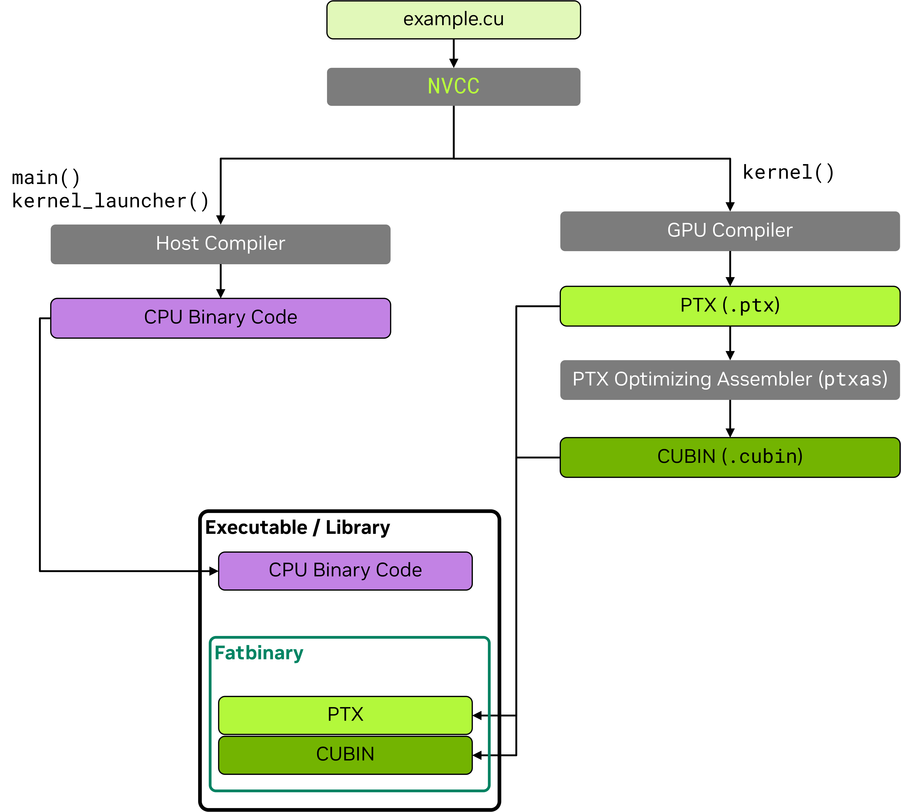

# 2.5 NVCC 编译器

> 本文档为 [NVIDIA CUDA Programming Guide](https://docs.nvidia.com/cuda/cuda-programming-guide/) 官方文档中文翻译版
>
> 原文地址：[https://docs.nvidia.com/cuda/cuda-programming-guide/02-basics/nvcc.html](https://docs.nvidia.com/cuda/cuda-programming-guide/02-basics/nvcc.html)

---

此页面是否有帮助？

# 2.5. NVCC：NVIDIA CUDA 编译器

[NVIDIA CUDA 编译器](https://docs.nvidia.com/cuda/cuda-compiler-driver-nvcc/index.html) `nvcc` 是 NVIDIA 用于编译 CUDA C/C++ 以及 [PTX](https://docs.nvidia.com/cuda/parallel-thread-execution/index.html) 代码的工具链。该工具链是 [CUDA Toolkit](https://developer.nvidia.com/cuda-toolkit) 的一部分，由多个工具组成，包括编译器、链接器以及 PTX 和 [Cubin](../01-introduction/cuda-platform.html#cuda-platform-cubins-fatbins) 汇编器。顶层的 `nvcc` 工具协调整个编译过程，为编译的每个阶段调用相应的工具。

`nvcc` 驱动 CUDA 代码的离线编译，这与由 CUDA 运行时编译器 [nvrtc](https://docs.nvidia.com/cuda/nvrtc/index.html) 驱动的在线或即时 (JIT) 编译形成对比。

本章涵盖了构建应用程序所需的 `nvcc` 最常见用法和细节。关于 `nvcc` 的完整介绍，请参阅 [nvcc 文档](https://docs.nvidia.com/cuda/cuda-compiler-driver-nvcc/index.html)。

## 2.5.1. CUDA 源文件和头文件

使用 `nvcc` 编译的源文件可能包含在 CPU 上执行的主机代码和在 GPU 上执行的设备代码的组合。`nvcc` 接受常见的 C/C++ 源文件扩展名：`.c`、`.cpp`、`.cc`、`.cxx` 用于纯主机代码，`.cu` 用于包含设备代码或主机与设备代码混合的文件。包含设备代码的头文件通常采用 `.cuh` 扩展名，以区别于纯主机代码头文件 `.h`、`.hpp`、`.hh`、`.hxx` 等。

| 文件扩展名 | 描述 | 内容 |
| --- | --- | --- |
| .c | C 源文件 | 纯主机代码 |
| .cpp , .cc , .cxx | C++ 源文件 | 纯主机代码 |
| .h , .hpp , .hh , .hxx | C/C++ 头文件 | 设备代码、主机代码、主机/设备代码混合 |
| .cu | CUDA 源文件 | 设备代码、主机代码、主机/设备代码混合 |
| .cuh | CUDA 头文件 | 设备代码、主机代码、主机/设备代码混合 |

## 2.5.2. NVCC 编译工作流程

在初始阶段，`nvcc` 将设备代码与主机代码分离，并分别将它们分派给 GPU 和主机编译器进行编译。

为了编译主机代码，CUDA 编译器 `nvcc` 需要一个兼容的主机编译器可用。CUDA Toolkit 定义了针对 Linux 和 Windows 平台的主机编译器支持策略。
仅包含主机代码的文件可以使用 `nvcc` 或直接使用主机编译器来构建。生成的目标文件可以在链接时与来自 `nvcc` 的包含 GPU 代码的目标文件组合。
GPU 编译器将 C/C++ 设备代码编译为 PTX 汇编代码。GPU 编译器会为编译命令行中指定的每个虚拟机指令集架构（例如 `compute_90`）运行。
然后，各个 PTX 代码被传递给 `ptxas` 工具，该工具为目标硬件 ISA 生成 Cubin。硬件 ISA 由其
SM 版本
.
可以在应用程序或库的单个二进制 Fatbin 容器中嵌入多个 PTX 和 Cubin 目标，使得单个二进制文件能够支持多个虚拟和目标硬件 ISA。

上述工具的调用和协调由 `nvcc` 自动完成。可以使用 `-v` 选项来显示完整的编译工作流程和工具调用。可以使用 `-keep` 选项将编译期间生成的[中间文件](https://docs.nvidia.com/cuda/cuda-compiler-driver-nvcc/#keeping-intermediate-phase-files)保存在当前目录或由 `--keep-dir` 指定的目录中。

以下示例说明了 CUDA 源文件 `example.cu` 的编译工作流程：

```cuda
// ----- example.cu -----
#include <stdio.h>
__global__ void kernel() {
    printf("Hello from kernel\n");
}

void kernel_launcher() {
    kernel<<<1, 1>>>();
    cudaDeviceSynchronize();
}

int main() {
    kernel_launcher();
    return 0;
}
```

`nvcc` 基本编译工作流程：



包含多个 PTX 和 Cubin 架构的 `nvcc` 编译工作流程：


关于 `nvcc` 编译工作流程的更详细描述，请参阅[编译器文档](https://docs.nvidia.com/cuda/cuda-compiler-driver-nvcc/#the-cuda-compilation-trajectory)。

## 2.5.3. NVCC 基本用法

使用 `nvcc` 编译 CUDA 源文件的基本命令是：

```bash
nvcc <source_file>.cu -o <output_file>
```

`nvcc` 接受常用的编译器标志，用于指定包含目录 `-I <path>` 和库路径 `-L <path>`，链接其他库 `-l<library>`，以及定义宏 `-D<macro>=<value>`。

```bash
nvcc example.cu -I path_to_include/ -L path_to_library/ -lcublas -o <output_file>
```

### 2.5.3.1. NVCC PTX 和 Cubin 生成

默认情况下，`nvcc` 会为 CUDA 工具包支持的最早的 GPU 架构（最低的 `compute_XY` 和 `sm_XY` 版本）生成 PTX 和 Cubin，以最大化兼容性。

- 可以使用 `-arch` 选项为特定的 GPU 架构生成 PTX 和 Cubin。
- 可以使用 `-gencode` 选项为多个 GPU 架构生成 PTX 和 Cubin。

支持的所有虚拟和真实 GPU 架构的完整列表可以通过分别传递 `--list-gpu-code` 和 `--list-gpu-arch` 标志获得，或者参考 `nvcc` 文档中的[虚拟架构列表](https://docs.nvidia.com/cuda/cuda-compiler-driver-nvcc/index.html#virtual-architecture-feature-list)和[GPU 架构列表](https://docs.nvidia.com/cuda/cuda-compiler-driver-nvcc/index.html#gpu-feature-list)部分。

```bash
nvcc --list-gpu-code # 列出所有支持的真实 GPU 架构
nvcc --list-gpu-arch # 列出所有支持的虚拟 GPU 架构
```

```bash
nvcc example.cu -arch=compute_<XY> # 例如，对于 NVIDIA Ampere 及更高版本 GPU 使用 -arch=compute_80
                                   # 仅生成 PTX，具有 GPU 前向兼容性

nvcc example.cu -arch=sm_<XY>      # 例如，对于 NVIDIA Ampere 及更高版本 GPU 使用 -arch=sm_80
                                   # 生成 PTX 和 Cubin，具有 GPU 前向兼容性

nvcc example.cu -arch=native       # 自动检测并为当前 GPU 生成 Cubin
                                   # 不生成 PTX，无 GPU 前向兼容性

nvcc example.cu -arch=all          # 为所有支持的 GPU 架构生成 Cubin
                                   # 同时包含最新的 PTX 以实现 GPU 前向兼容性

nvcc example.cu -arch=all-major    # 为所有支持的主要 GPU 架构生成 Cubin，例如 sm_80, sm_90,
                                   # 同时包含最新的 PTX 以实现 GPU 前向兼容性
```
更高级的用法允许单独指定 PTX 和 Cubin 目标：

```bash
# 为虚拟架构 compute_80 生成 PTX，并为真实架构 sm_86 将其编译为 Cubin，保留 compute_80 的 PTX
nvcc example.cu -arch=compute_80 -gpu-code=sm_86,compute_80 # (PTX 和 Cubin)

# 为虚拟架构 compute_80 生成 PTX，并为真实架构 sm_86, sm_89 将其编译为 Cubin
nvcc example.cu -arch=compute_80 -gpu-code=sm_86,sm_89    # (无 PTX)
nvcc example.cu -gencode=arch=compute_80,code=sm_86,sm_89 # 同上

# (1) 为虚拟架构 compute_80 生成 PTX，并为真实架构 sm_86, sm_89 将其编译为 Cubin
# (2) 为虚拟架构 compute_90 生成 PTX，并为真实架构 sm_90 将其编译为 Cubin
nvcc example.cu -gencode=arch=compute_80,code=sm_86,sm_89 -gencode=arch=compute_90,code=sm_90
```

用于控制 GPU 代码生成的 `nvcc` 命令行选项的完整参考，请查阅 [nvcc 文档](https://docs.nvidia.com/cuda/cuda-compiler-driver-nvcc/index.html#options-for-steering-gpu-code-generation)。

### 2.5.3.2. 主机代码编译注意事项

不包含设备代码或符号的编译单元（即源文件及其头文件）可以直接用主机编译器编译。如果任何编译单元使用了 CUDA 运行时 API 函数，则应用程序必须与 CUDA 运行时库链接。CUDA 运行时库有静态库和共享库两种形式，分别是 `libcudart_static` 和 `libcudart`。默认情况下，`nvcc` 链接的是静态 CUDA 运行时库。要使用共享库版本的 CUDA 运行时，请在编译或链接命令中向 `nvcc` 传递 `--cudart=shared` 标志。

`nvcc` 允许通过 `-ccbin <compiler>` 参数指定用于主机函数的主机编译器。也可以定义环境变量 `NVCC_CCBIN` 来指定 `nvcc` 使用的主机编译器。`nvcc` 的 `-Xcompiler` 参数用于将参数传递给主机编译器。例如，在下面的示例中，`-O3` 参数通过 `nvcc` 传递给了主机编译器。

```bash
nvcc example.cu -ccbin=clang++

export NVCC_CCBIN='gcc'
nvcc example.cu -Xcompiler=-O3
```

### 2.5.3.3. GPU 代码的单独编译

`nvcc` 默认采用*全程序编译*，它期望所有 GPU 代码和符号都出现在使用它们的编译单元中。CUDA 设备函数可以调用其他编译单元中定义的设备函数或访问设备变量，但必须在 `nvcc` 命令行上指定 `-rdc=true` 或其别名 `-dc` 标志，以启用来自不同编译单元的设备代码链接。这种链接来自不同编译单元的设备代码和符号的能力称为*单独编译*。

单独编译允许更灵活的代码组织，可以改善编译时间，并可能生成更小的二进制文件。与全程序编译相比，单独编译可能会带来一些构建时的复杂性。性能可能会受到设备代码链接使用的影响，这就是默认不使用它的原因。[链接时优化 (LTO)](#nvcc-link-time-optimization) 有助于减少单独编译带来的性能开销。
独立编译需要满足以下条件：

- 在一个编译单元中定义的非 const 设备变量，在其他编译单元中必须使用 extern 关键字进行引用。
- 所有 const 设备变量必须使用 extern 关键字进行定义和引用。
- 所有 CUDA 源文件 .cu 必须使用 -dc 或 -rdc=true 标志进行编译。

主机和设备函数默认具有外部链接，不需要 `extern` 关键字。请注意，[从 CUDA 13 开始](https://developer.nvidia.com/blog/cuda-c-compiler-updates-impacting-elf-visibility-and-linkage/)，`__global__` 函数和 `__managed__`/`__device__`/`__constant__` 变量默认具有内部链接。

在以下示例中，`definition.cu` 定义了一个变量和一个函数，而 `example.cu` 引用了它们。两个文件被分别编译并链接到最终的可执行文件中。

```cuda
// ----- definition.cu -----
extern __device__ int device_variable = 5;
__device__        int device_function() { return 10; }
```

```cuda
// ----- example.cu -----
extern __device__ int  device_variable;
__device__        int device_function();

__global__ void kernel(int* ptr) {
    device_variable = 0;
    *ptr            = device_function();
}
```

```bash
nvcc -dc definition.cu -o definition.o
nvcc -dc example.cu    -o example.o
nvcc definition.o example.o -o program
```

## 2.5.4. 常用编译器选项

本节介绍可与 `nvcc` 一起使用的最相关的编译器选项，涵盖语言特性、优化、调试、性能分析和构建方面。所有选项的完整描述可在 [nvcc 文档](https://docs.nvidia.com/cuda/cuda-compiler-driver-nvcc/index.html#command-option-description) 中找到。

### 2.5.4.1. 语言特性

`nvcc` 支持 C++ 核心语言特性，从 C++03 到 [C++20](https://en.cppreference.com/w/cpp/compiler_support#cpp20)。可以使用 `-std` 标志来指定要使用的语言标准：

- --std={c++03|c++11|c++14|c++17|c++20}

此外，`nvcc` 支持以下语言扩展：

- -restrict : 断言所有内核指针参数都是 restrict 指针。
- -extended-lambda : 允许在 lambda 声明中使用 __host__ , __device__ 注解。
- -expt-relaxed-constexpr : (实验性标志) 允许主机代码调用 __device__ constexpr 函数，以及设备代码调用 __host__ constexpr 函数。

有关这些特性的更多详细信息，请参阅 [扩展 lambda](../05-appendices/cpp-language-support.html#extended-lambdas) 和 [constexpr](../05-appendices/cpp-language-support.html#constexpr-functions) 部分。

### 2.5.4.2. 调试选项

`nvcc` 支持以下选项来生成调试信息：

- -g : 为主机代码生成调试信息。gdb/lldb 及类似工具依赖此信息进行主机代码调试。
- -G : 为设备代码生成调试信息。cuda-gdb 依赖此信息进行设备代码调试。该标志还会定义 __CUDACC_DEBUG__ 宏。
- -lineinfo：为设备代码生成行号信息。此选项不影响执行性能，与 compute-sanitizer 工具结合使用时有助于追踪内核执行。

`nvcc` 默认对 GPU 代码使用最高优化级别 `-O3`。调试标志 `-G` 会阻止某些编译器优化，因此调试代码的性能预期会低于非调试代码。可以定义 `-DNDEBUG` 标志来禁用运行时断言，因为这些断言也可能减慢执行速度。

### 2.5.4.3. 优化选项

`nvcc` 提供了许多用于优化性能的选项。本节旨在简要介绍开发者可能觉得有用的一些可用选项，并提供进一步信息的链接。完整内容可在 [nvcc 文档](https://docs.nvidia.com/cuda/cuda-compiler-driver-nvcc/index.html) 中找到。

- -Xptxas：将参数传递给 PTX 汇编器工具 ptxas。nvcc 文档提供了 ptxas 的有用参数列表。例如，`-Xptxas=-maxrregcount=N` 指定每个线程使用的最大寄存器数量。
- -extra-device-vectorization：启用更激进的设备代码向量化。
- 提供对浮点行为进行细粒度控制的附加标志，在浮点计算部分和 nvcc 文档中有所介绍。

以下标志可从编译器获取输出，这些输出在更高级的代码优化中可能很有用：

- -res-usage：编译后打印资源使用报告。它包括为每个内核函数分配的寄存器数量、共享内存、常量内存和本地内存。
- -opt-info=inline：打印有关内联函数的信息。
- -Xptxas=-warn-lmem-usage：如果使用了本地内存，则发出警告。
- -Xptxas=-warn-spills：如果寄存器溢出到本地内存，则发出警告。

### 2.5.4.4. 链接时优化 (LTO)

由于跨文件优化机会有限，[单独编译](#nvcc-separate-compilation) 可能导致性能低于全程序编译。链接时优化 (LTO) 通过在链接时对单独编译的文件执行优化来解决此问题，代价是增加了编译时间。LTO 可以在保持单独编译灵活性的同时，恢复全程序编译的大部分性能。

`nvcc` 需要 `-dlto`[标志](https://docs.nvidia.com/cuda/cuda-compiler-driver-nvcc/index.html#dlink-time-opt-dlto) 或 `lto_<SM 版本>` 链接时优化目标来启用 LTO：

```bash
nvcc -dc -dlto -arch=sm_100 definition.cu -o definition.o
nvcc -dc -dlto -arch=sm_100 example.cu    -o example.o
nvcc -dlto definition.o example.o -o program
```

```bash
nvcc -dc -arch=lto_100 definition.cu -o definition.o
nvcc -dc -arch=lto_100 example.cu    -o example.o
nvcc -dlto definition.o example.o -o program
```

### 2.5.4.5. 性能分析选项

可以直接使用 [Nsight Compute](https://developer.nvidia.com/nsight-compute) 和 [Nsight Systems](https://developer.nvidia.com/nsight-systems) 工具对 CUDA 应用程序进行性能分析，而无需在编译过程中添加额外标志。然而，`nvcc` 可以生成的附加信息有助于通过将源文件与生成的代码关联起来来辅助性能分析：
- -lineinfo：为设备代码生成行号信息；这允许在性能分析工具中查看源代码。性能分析工具要求原始源代码位于代码编译时的相同位置。
- -src-in-ptx：将原始源代码保留在 PTX 中，避免上述 -lineinfo 的限制。需要与 -lineinfo 一起使用。

### 2.5.4.6. Fatbin 压缩

默认情况下，`nvcc` 会压缩存储在应用程序或库二进制文件中的 [fatbins](../01-introduction/cuda-platform.html#cuda-platform-cubins-fatbins)。可以使用以下选项控制 Fatbin 压缩：

- -no-compress：禁用 fatbin 压缩。
- --compress-mode={default|size|speed|balance|none}：设置压缩模式。speed 侧重于快速解压时间，而 size 旨在减小 fatbin 大小。balance 在速度与大小之间提供折衷。默认模式是 speed。none 禁用压缩。

### 2.5.4.7. 编译器性能控制

`nvcc` 提供了用于分析和加速编译过程本身的选项：

- -t <N>：用于并行化单个编译单元针对多个 GPU 架构的编译所使用的 CPU 线程数。
- -split-compile <N>：用于并行化优化阶段的 CPU 线程数。
- -split-compile-extended <N>：更激进的拆分编译形式。需要链接时优化。
- -Ofc <N>：设备代码编译速度的级别。
- -time <filename>：生成一个逗号分隔值 (CSV) 表格，记录每个编译阶段所花费的时间。
- -fdevice-time-trace：为设备代码编译生成时间跟踪。

 本页