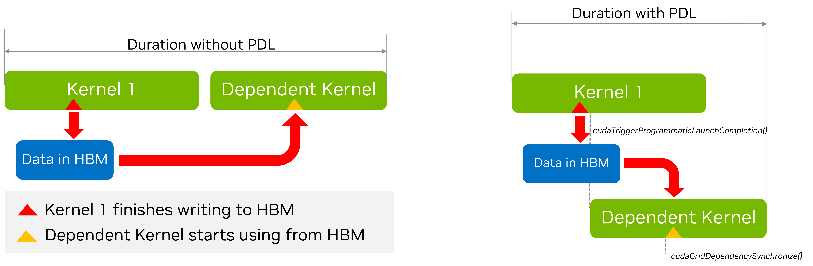

# 3.1 高级 CUDA API 与特性

> 本文档为 [NVIDIA CUDA Programming Guide](https://docs.nvidia.com/cuda/cuda-programming-guide/) 官方文档中文翻译版
>
> 原文地址：[https://docs.nvidia.com/cuda/cuda-programming-guide/03-advanced/advanced-host-programming.html](https://docs.nvidia.com/cuda/cuda-programming-guide/03-advanced/advanced-host-programming.html)

---

此页面是否有帮助？

# 3.1. 高级 CUDA API 与功能

本节将介绍更高级的 CUDA API 和功能的使用。这些主题涵盖的技术或功能通常不需要修改 CUDA 内核，但仍可以从主机端影响应用程序级别的行为，包括 GPU 工作执行和性能以及 CPU 端性能。

## 3.1.1. cudaLaunchKernelEx

当[三重尖括号表示法](../02-basics/intro-to-cuda-cpp.html#intro-cpp-launching-kernels-triple-chevron)在早期版本中引入时，内核的[内核配置](../05-appendices/cpp-language-extensions.html#execution-configuration)只有四个可编程参数：
- 线程块维度
- 网格维度
- 动态共享内存（可选，未指定时为 0）
- 流（未指定时使用默认流）

一些 CUDA 功能可以受益于内核启动时提供的额外属性和提示。`cudaLaunchKernelEx` 使程序能够通过 `cudaLaunchConfig_t` 结构体设置上述执行配置参数。此外，`cudaLaunchConfig_t` 结构体允许程序传递零个或多个 `cudaLaunchAttributes` 来控制或建议内核启动的其他参数。例如，本章后面讨论的 `cudaLaunchAttributePreferredSharedMemoryCarveout`（参见[配置 L1/共享内存平衡](advanced-kernel-programming.html#advanced-kernel-l1-shared-config)）就是使用 `cudaLaunchKernelEx` 指定的。本章后面讨论的 `cudaLaunchAttributeClusterDimension` 属性用于指定内核启动所需的集群大小。

支持的属性及其含义的完整列表记录在 [CUDA 运行时 API 参考文档](https://docs.nvidia.com/cuda/cuda-runtime-api/group__CUDART__TYPES.html#group__CUDART__TYPES_1gfc5ed48085f05863b1aeebb14934b056) 中。

## 3.1.2. 启动集群：

前面章节介绍的[线程块集群](../01-introduction/programming-model.html#programming-model-thread-block-clusters)是计算能力 9.0 及更高版本中可用的一个可选的线程块组织级别，它使应用程序能够保证集群的线程块在单个 GPC 上同时执行。这使得比单个 SM 所能容纳的更大的线程组能够交换数据并相互同步。

[第 2.1.10.1 节](../02-basics/intro-to-cuda-cpp.html#intro-cpp-launching-cluster-triple-chevron)展示了如何使用三重尖括号表示法来指定和启动使用集群的内核。在该节中，使用了 `__cluster_dims__` 注解来指定必须用于启动内核的集群维度。当使用三重尖括号表示法时，集群的大小是隐式确定的。

### 3.1.2.1. 使用 cudaLaunchKernelEx 启动集群

与[使用三重尖括号表示法启动集群内核](../02-basics/intro-to-cuda-cpp.html#intro-cpp-launching-cluster-triple-chevron)不同，线程块集群的大小可以在每次启动时进行配置。下面的代码示例展示了如何使用 `cudaLaunchKernelEx` 启动集群内核。

```c++
// Kernel definition
// No compile time attribute attached to the kernel
__global__ void cluster_kernel(float *input, float* output)
{

}

int main()
{
    float *input, *output;
    dim3 threadsPerBlock(16, 16);
    dim3 numBlocks(N / threadsPerBlock.x, N / threadsPerBlock.y);

    // Kernel invocation with runtime cluster size
    {
        cudaLaunchConfig_t config = {0};
        // The grid dimension is not affected by cluster launch, and is still enumerated
        // using number of blocks.
        // The grid dimension should be a multiple of cluster size.
        config.gridDim = numBlocks;
        config.blockDim = threadsPerBlock;

        cudaLaunchAttribute attribute[1];
        attribute[0].id = cudaLaunchAttributeClusterDimension;
        attribute[0].val.clusterDim.x = 2; // Cluster size in X-dimension
        attribute[0].val.clusterDim.y = 1;
        attribute[0].val.clusterDim.z = 1;
        config.attrs = attribute;
        config.numAttrs = 1;

        cudaLaunchKernelEx(&config, cluster_kernel, input, output);
    }
}
```

There are two `cudaLaunchAttribute` types which are relevant to thread block clusters clusters:  `cudaLaunchAttributeClusterDimension` and `cudaLaunchAttributePreferredClusterDimension`.

The attribute id `cudaLaunchAttributeClusterDimension` specifies the required dimensions with which to execute the cluster. The value for this attribute, `clusterDim`, is a 3-dimensional value. The corresponding dimensions of the grid (x, y, and z) must be divisible by the respective dimensions of the specified cluster dimension. Setting this is similar to using the  `__cluster_dims__` attribute on the kernel definition at compile time as shown in [Launching with Clusters in Triple Chevron Notation](../02-basics/intro-to-cuda-cpp.html#intro-cpp-launching-cluster-triple-chevron), but can be changed at runtime for different launches of the same kernel.

On GPUs with compute capability of 10.0 and higher, another attribute id `cudaLaunchAttributePreferredClusterDimension` allows the application to additionally specify a preferred dimension for the cluster. The preferred dimension must be an integer multiple of the minimum cluster dimensions specified by the `__cluster_dims__` attribute on the kernel or the `cudaLaunchAttributeClusterDimension` attribute to `cudaLaunchKernelEx`. That is, a minimum cluster dimension must be specified in addition to the preferred cluster dimension. The corresponding dimensions of the grid (x, y, and z) must be divisible by the respective dimension of the specified preferred cluster dimension.

All thread blocks will execute in clusters of at least the minimum cluster dimension. Where possible, clusters of the preferred dimension will be used, but not all clusters are guaranteed to execute with the preferred dimensions. All thread blocks will execute in clusters with either the minimum or preferred cluster dimension. Kernels which use a preferred cluster dimension must be written to operate correctly in either the minimum or the preferred cluster dimension.
### 3.1.2.2. 将线程块作为集群

当使用 `__cluster_dims__` 注解定义内核时，网格中的集群数量是隐式的，可以通过将网格大小除以指定的集群大小来计算。

```c++
__cluster_dims__((2, 2, 2)) __global__ void foo();

// 8x8x8 个集群，每个集群包含 2x2x2 个线程块。
foo<<<dim3(16, 16, 16), dim3(1024, 1, 1)>>>();
```

在上面的例子中，内核启动为一个 16x16x16 线程块的网格，这意味着使用了 8x8x8 个集群的网格。

内核也可以使用 `__block_size__` 注解，该注解在内核定义时同时指定所需的块大小和集群大小。使用此注解时，三重尖括号 `<<<>>>` 中的启动参数表示的是集群维度的网格，而不是线程块维度，如下所示。

```c++
// 每个块的线程数和每个集群的块数等实现细节
// 作为内核的属性来处理。
__block_size__((1024, 1, 1), (2, 2, 2)) __global__ void foo();

// 8x8x8 个集群。
foo<<<dim3(8, 8, 8)>>>();
```

`__block_size__` 需要两个字段，每个字段都是一个包含 3 个元素的元组。第一个元组表示块维度，第二个表示集群大小。如果未传递第二个元组，则假定为 `(1,1,1)`。要指定流，必须在 `<<<>>>` 内将 `1` 和 `0` 作为第二和第三个参数传递，最后传递流。传递其他值将导致未定义行为。

请注意，同时指定 `__block_size__` 和 `__cluster_dims__` 的第二个元组是非法的。将 `__block_size__` 与空的 `__cluster_dims__` 一起使用也是非法的。当指定了 `__block_size__` 的第二个元组时，意味着启用了“将线程块作为集群”功能，编译器会将 `<<<>>>` 内的第一个参数识别为集群数量，而不是线程块数量。

## 3.1.3. 关于流和事件的更多信息

[CUDA 流](../02-basics/asynchronous-execution.html#cuda-streams) 介绍了 CUDA 流的基础知识。默认情况下，在给定 CUDA 流上提交的操作是串行化的：一个操作必须在前一个操作完成后才能开始执行。唯一的例外是最近添加的 [编程式依赖启动与同步](../04-special-topics/programmatic-dependent-launch.html#programmatic-dependent-launch-and-synchronization) 功能。拥有多个 CUDA 流是实现并发执行的一种方式；另一种方式是使用 [CUDA 图](../04-special-topics/cuda-graphs.html#cuda-graphs)。这两种方法也可以结合使用。

在不同 CUDA 流上提交的工作在特定情况下可能并发执行，例如，如果没有事件依赖、没有隐式同步、有足够的资源等。

如果不同 CUDA 流的独立操作之间提交了任何针对 NULL 流的 CUDA 操作，则这些操作无法并发运行，除非这些流是非阻塞 CUDA 流。非阻塞流是使用带有 `cudaStreamNonBlocking` 标志的 `cudaStreamCreateWithFlags()` 运行时 API 创建的。为了提高 GPU 工作并发执行的潜力，建议用户创建非阻塞 CUDA 流。
还建议用户选择对其问题而言足够且最不泛化的同步选项。例如，如果要求是让 CPU 等待（阻塞）特定 CUDA 流上的所有工作完成，那么对该流使用 `cudaStreamSynchronize()` 会比使用 `cudaDeviceSynchronize()` 更可取，因为后者会不必要地等待设备上所有 CUDA 流上的 GPU 工作完成。如果要求是让 CPU 以非阻塞方式等待，那么在轮询循环中使用 `cudaStreamQuery()` 并检查其返回值可能更可取。

使用 CUDA 事件（[CUDA 事件](../02-basics/asynchronous-execution.html#cuda-events)）也可以实现类似的同步效果，例如，在该流上记录一个事件并调用 `cudaEventSynchronize()` 以阻塞方式等待该事件捕获的工作完成。同样，这比使用 `cudaDeviceSynchronize()` 更可取且更聚焦。调用 `cudaEventQuery()` 并检查其返回值（例如在轮询循环中）将是一种非阻塞的替代方案。

如果此操作发生在应用程序的关键路径中，则显式同步方法的选择尤为重要。[表 4](#table-streams-event-sync-summary) 提供了与主机进行各种同步选项的高级摘要。

|  | 等待特定流 | 等待特定事件 | 等待设备上的所有内容 |
| --- | --- | --- | --- |
| 非阻塞<br>（需要轮询循环） | cudaStreamQuery() | cudaEventQuery() | 不适用 |
| 阻塞 | cudaStreamSynchronize() | cudaEventSynchronize() | cudaDeviceSynchronize() |

对于 CUDA 流之间的同步（即表达依赖关系），建议使用非计时的 CUDA 事件，如 [CUDA 事件](../02-basics/asynchronous-execution.html#cuda-events) 中所述。用户可以调用 `cudaStreamWaitEvent()` 来强制特定流上未来提交的操作等待先前记录的事件（例如，在另一个流上）完成。请注意，对于任何等待或查询事件的 CUDA API，用户有责任确保已调用 `cudaEventRecord` API，因为未记录的事件将始终返回成功。

默认情况下，CUDA 事件携带计时信息，因为它们可以在 `cudaEventElapsedTime()` API 调用中使用。然而，仅用于表达跨流依赖关系的 CUDA 事件不需要计时信息。对于这种情况，建议创建时禁用计时信息以提高性能。这可以通过使用带有 `cudaEventDisableTiming` 标志的 `cudaEventCreateWithFlags()` API 来实现。

### 3.1.3.1. 流优先级

可以在创建时使用 `cudaStreamCreateWithPriority()` 指定流的相对优先级。允许的优先级范围（按 [最高优先级, 最低优先级] 排序）可以使用 `cudaDeviceGetStreamPriorityRange()` 函数获取。在运行时，GPU 调度器利用流优先级来确定任务执行顺序，但这些优先级仅作为提示而非保证。在选择要启动的工作时，高优先级流中的待处理任务优先于低优先级流中的任务。高优先级任务不会抢占已在运行的低优先级任务。GPU 在任务执行期间不会重新评估工作队列，提高流的优先级不会中断正在进行的工作。流优先级影响任务执行，但不强制执行严格的顺序，因此用户可以利用流优先级来影响任务执行，而无需依赖严格的顺序保证。
以下代码示例获取当前设备允许的优先级范围，并创建具有最高和最低可用优先级的两个非阻塞 CUDA 流。

```c++
// 获取此设备的流优先级范围
int leastPriority, greatestPriority;
cudaDeviceGetStreamPriorityRange(&leastPriority, &greatestPriority);

// 创建具有最高和最低可用优先级的流
cudaStream_t st_high, st_low;
cudaStreamCreateWithPriority(&st_high, cudaStreamNonBlocking, greatestPriority));
cudaStreamCreateWithPriority(&st_low, cudaStreamNonBlocking, leastPriority);
```

### 3.1.3.2. 显式同步

如前所述，有多种方式可以使流与其他流同步。以下提供了不同粒度级别的常用方法：
- `cudaDeviceSynchronize()` 等待所有主机线程的所有流中的所有先前命令完成。
- `cudaStreamSynchronize()` 接受一个流作为参数，并等待给定流中的所有先前命令完成。它可以用于使主机与特定流同步，同时允许其他流在设备上继续执行。
- `cudaStreamWaitEvent()` 接受一个流和一个事件作为参数（有关事件的描述，请参见 [CUDA 事件](../02-basics/asynchronous-execution.html#cuda-events)），并使调用 `cudaStreamWaitEvent()` 之后添加到给定流中的所有命令延迟执行，直到给定事件完成。
- `cudaStreamQuery()` 为应用程序提供了一种方法来了解流中的所有先前命令是否已完成。

### 3.1.3.3. 隐式同步

如果主机线程在来自不同流的两个命令之间发出以下任何操作，则这两个命令不能并发运行：

- 页锁定主机内存分配
- 设备内存分配
- 设备内存设置
- 指向同一设备内存的两个地址之间的内存复制
- 任何对 NULL 流的 CUDA 命令
- L1/共享内存配置之间的切换

需要依赖检查的操作包括与被检查的启动操作在同一流中的任何其他命令以及对该流的任何 `cudaStreamQuery()` 调用。因此，应用程序应遵循以下准则以提高并发内核执行的潜力：

- 所有独立操作应在依赖操作之前发出，
- 任何类型的同步都应尽可能延迟。

## 3.1.4. 程序化依赖内核启动

正如我们之前讨论的，CUDA 流的语义是内核按顺序执行。这样，如果我们有两个连续的内核，其中第二个内核依赖于第一个内核的结果，程序员可以确信，当第二个内核开始执行时，依赖数据将可用。然而，可能存在这样的情况：第一个内核可能已将后续内核所依赖的数据写入全局内存，但它仍有更多工作要做。同样，依赖的第二个内核在需要第一个内核的数据之前可能有一些独立的工作。在这种情况下，可以部分重叠两个内核的执行（假设硬件资源可用）。这种重叠也可以重叠第二个内核的启动开销。除了硬件资源的可用性之外，可以实现的重叠程度取决于内核的具体结构，例如
- 第一个内核何时完成第二个内核所依赖的工作？
- 第二个内核何时开始处理来自第一个内核的数据？

由于这在很大程度上取决于所涉及的具体内核，因此很难完全自动化，因此 CUDA 提供了一种机制，允许应用程序开发者指定两个内核之间的同步点。这是通过一种称为"程序化依赖内核启动"的技术来实现的。下图描述了这种情况。



PDL 有三个主要组成部分。

1. 第一个内核（即所谓的主内核）需要调用一个特殊函数，以表明它已完成后续依赖内核（也称为次内核）所需的所有工作。这是通过调用函数 `cudaTriggerProgrammaticLaunchCompletion()` 来完成的。
2. 相应地，依赖的次内核需要表明它已到达其工作中独立于主内核的部分，并且现在正在等待主内核完成它所依赖的工作。这是通过函数 `cudaGridDependencySynchronize()` 来完成的。
3. 第二个内核需要使用特殊属性 `cudaLaunchAttributeProgrammaticStreamSerialization` 来启动，并将其 `programmaticStreamSerializationAllowed` 字段设置为 '1'。

以下代码片段展示了一个如何实现此功能的示例。

清单 3
两个内核的程序化依赖内核启动示例
#

```c
__global__ void primary_kernel() {
    // 应在启动次内核前完成的初始工作

    // 触发次内核
    cudaTriggerProgrammaticLaunchCompletion();

    // 可与次内核同时进行的工作
}

__global__ void secondary_kernel()
{
    // 初始化、独立工作等

    // 将阻塞，直到次内核所依赖的所有主内核都已完成并将结果刷新到全局内存
    cudaGridDependencySynchronize();

    // 依赖工作
}

// 使用特殊属性启动次内核

// 设置属性
cudaLaunchAttribute attribute[1];
attribute[0].id = cudaLaunchAttributeProgrammaticStreamSerialization;
attribute[0].val.programmaticStreamSerializationAllowed = 1;

// 在内核启动配置中设置属性
 cudaLaunchConfig_t config = {0};

// 基础启动配置
config.gridDim = grid_dim;
config.blockDim = block_dim;
config.dynamicSmemBytes= 0;
config.stream = stream;

// 为 PDL 添加特殊属性
config.attrs = attribute;
config.numAttrs = 1;

// 启动主内核
primary_kernel<<<grid_dim, block_dim, 0, stream>>>();

// 使用包含该属性的配置启动次（依赖）内核
cudaLaunchKernelEx(&config, secondary_kernel);
```

## 3.1.5. 批量内存传输

CUDA 开发中的一个常见模式是使用批处理技术。批处理大致意味着我们将多个（通常较小的）任务组合成一个（通常较大的）操作。批处理的各个组成部分不一定完全相同，尽管它们通常是相同的。这种思想的一个例子是 cuBLAS 提供的批量矩阵乘法操作。
与 CUDA Graphs 和 PDL 类似，批处理的目的是减少与单独分派各个批处理任务相关的开销。就内存传输而言，启动一次内存传输可能会产生一些 CPU 和驱动程序开销。此外，当前形式的常规 `cudaMemcpyAsync()` 函数不一定能为驱动程序提供足够的信息来优化传输，例如关于源和目标的提示。在 Tegra 平台上，可以选择使用流式多处理器（SM）或复制引擎（CE）来执行传输。目前由驱动程序中的启发式算法决定使用哪个。这可能很重要，因为使用 SM 可能会导致更快的传输速度，但它会占用部分可用的计算能力。另一方面，使用 CE 可能会导致传输速度较慢，但整体应用程序性能更高，因为它让 SM 可以自由执行其他工作。

这些考虑因素促使了 `cudaMemcpyBatchAsync()` 函数（及其相关函数 `cudaMemcpyBatch3DAsync()`）的设计。这些函数允许优化批处理内存传输。除了源指针和目标指针列表外，该 API 还使用内存复制属性来指定顺序期望，并提供源和目标位置的提示，以及是否希望传输与计算重叠（目前仅在配备 CE 的 Tegra 平台上支持）。

让我们首先考虑最简单的情况：将数据从固定主机内存批量传输到固定设备内存。

清单 4
从固定主机内存到固定设备内存的同构批处理内存传输示例
#

```cpp
std::vector<void *> srcs(batch_size);
std::vector<void *> dsts(batch_size);
std::vector<void *> sizes(batch_size);

// 分配源缓冲区和目标缓冲区
// 用流编号进行初始化
for (size_t i = 0; i < batch_size; i++) {
    cudaMallocHost(&srcs[i], sizes[i]);
    cudaMalloc(&dsts[i], sizes[i]);
    cudaMemsetAsync(srcs[i], sizes[i], stream);
}

// 为此批复制设置属性
cudaMemcpyAttributes attrs = {};
attrs.srcAccessOrder = cudaMemcpySrcAccessOrderStream;

// 批处理中的所有复制操作具有相同的复制属性。
size_t attrsIdxs = 0;  // 属性的索引

// 启动批处理内存传输
cudaMemcpyBatchAsync(&dsts[0], &srcs[0], &sizes[0], batch_size,
    &attrs, &attrsIdxs, 1 /*numAttrs*/, nullptr /*failIdx*/, stream);
```

`cudaMemcpyBatchAsync()` 函数的前几个参数看起来是直观的。它们由包含源指针和目标指针的数组以及传输大小组成。每个数组必须有 `batch_size` 个元素。新的信息来自属性。该函数需要一个指向属性数组的指针，以及一个对应的属性索引数组。原则上，也可以传递一个 `size_t` 数组，在此数组中记录失败的传输索引，但在此处传递 `nullptr` 是安全的，在这种情况下，失败的索引将不会被记录。
接下来看属性部分，在这个例子中传输是同质的。因此我们只使用一个属性，它将应用于所有传输。这由 `attrIndex` 参数控制。原则上，它可以是一个数组。数组的第 *i* 个元素包含属性数组的第 *i* 个元素所适用的第一个传输的索引。在这个例子中，`attrIndex` 被视为一个单元素数组，其值为 '0'，意味着 `attribute[0]` 将应用于索引为 0 及以上的所有传输，换句话说，就是所有的传输。

最后，我们注意到我们将 `srcAccessOrder` 属性设置为了 `cudaMemcpySrcAccessOrderStream`。这意味着源数据将按照常规的流顺序被访问。换句话说，内存拷贝操作将阻塞，直到之前处理来自这些源指针和目标指针中任何一个的数据的内核完成。

在下一个例子中，我们将考虑一个更复杂的异构批量传输情况。

清单 5
使用临时主机内存到固定设备内存的异构批量内存传输示例
#

```c
std::vector<void *> srcs(batch_size);
std::vector<void *> dsts(batch_size);
std::vector<void *> sizes(batch_size);

// Allocate the src and dst buffers
for (size_t i = 0; i < batch_size - 10; i++) {
    cudaMallocHost(&srcs[i], sizes[i]);
    cudaMalloc(&dsts[i], sizes[i]);
}

int buffer[10];

for (size_t i = batch_size - 10; i < batch_size; i++) {
    srcs[i] = &buffer[10 - (batch_size - i];
    cudaMalloc(&dsts[i], sizes[i]);
}

// Setup attributes for this batch of copies
cudaMemcpyAttributes attrs[2] = {};
attrs[0].srcAccessOrder = cudaMemcpySrcAccessOrderStream;
attrs[1].srcAccessOrder = cudaMemcpySrcAccessOrderDuringApiCall;

size_t attrsIdxs[2];
attrsIdxs[0] = 0;
attrsIdxs[1] = batch_size - 10;

// Launch the batched memory transfer
cudaMemcpyBatchAsync(&dsts[0], &srcs[0], &sizes[0], batch_size,
    &attrs, &attrsIdxs, 2 /*numAttrs*/, nullptr /*failIdx*/, stream);
```

这里我们有两种传输：`batch_size-10` 次从固定主机内存到固定设备内存的传输，以及 10 次从主机数组到固定设备内存的传输。此外，`buffer` 数组不仅位于主机上，而且仅存在于当前作用域中——它的地址就是所谓的*临时指针*。这个指针在 API 调用完成后（它是异步的）可能不再有效。要使用这种临时指针执行拷贝，属性中的 `srcAccessOrder` 必须设置为 `cudaMemcpySrcAccessOrderDuringApiCall`。

我们现在有两个属性，第一个适用于所有索引从 0 开始且小于 `batch_size-10` 的传输。第二个适用于所有索引从 `batch_size-10` 开始且小于 `batch_size` 的传输。

如果不是从栈上分配 `buffer` 数组，而是使用 `malloc` 从堆上分配它，那么数据就不再是临时的了。它将一直有效，直到指针被显式释放。在这种情况下，如何安排拷贝的最佳选择取决于系统是否具有硬件管理内存或通过地址转换实现 GPU 对主机内存的一致性访问（在这种情况下，最好使用流顺序），或者系统不具备这些特性（在这种情况下，立即安排传输最有意义）。在这种情况下，应该为属性的 `srcAccessOrder` 使用值 `cudaMemcpyAccessOrderAny`。
`cudaMemcpyBatchAsync` 函数还允许程序员提供关于源和目标位置的提示。这是通过设置 `cudaMemcpyAttributes` 结构的 `srcLocation` 和 `dstLocation` 字段来实现的。`srcLocation` 和 `dstLocation` 字段都是 `cudaMemLocation` 类型，这是一个包含位置类型和位置 ID 的结构。这与在使用 `cudaMemPrefetchAsync()` 时可以向运行时提供预取提示的 `cudaMemLocation` 结构相同。下面的代码示例说明了如何设置从设备传输到主机特定 NUMA 节点的提示：

清单 6
设置源和目标位置提示的示例
#

```c
// 分配源和目标缓冲区
std::vector<void *> srcs(batch_size);
std::vector<void *> dsts(batch_size);
std::vector<void *> sizes(batch_size);

// 我们将用于提供位置提示的 cudaMemLocation 结构
// 设备 device_id
cudaMemLocation srcLoc = {cudaMemLocationTypeDevice, dev_id};

// 具有 numa 节点 numa_id 的主机
cudaMemLocation dstLoc = {cudaMemLocationTypeHostNuma, numa_id};

// 分配 src 和 dst 缓冲区
for (size_t i = 0; i < batch_size; i++) {
    cudaMallocManaged(&srcs[i], sizes[i]);
    cudaMallocManaged(&dsts[i], sizes[i]);

    cudaMemPrefetchAsync(srcs[i], sizes[i], srcLoc, 0, stream);
    cudaMemPrefetchAsync(dsts[i], sizes[i], dstLoc, 0, stream);
    cudaMemsetAsync(srcs[i], sizes[i], stream);
}

// 为此批复制设置属性
cudaMemcpyAttributes attrs = {};

// 这些是托管内存指针，因此流顺序是合适的
attrs.srcAccessOrder = cudaMemcpySrcAccessOrderStream;

// 现在我们可以在此处指定位置提示。
attrs.srcLocHint = srcLoc;
attrs.dstlocHint = dstLoc;

// 批次中的所有复制都具有相同的复制属性。
size_t attrsIdxs = 0;

// 启动批处理内存传输
cudaMemcpyBatchAsync(&dsts[0], &srcs[0], &sizes[0], batch_size,
    &attrs, &attrsIdxs, 1 /*numAttrs*/, nullptr /*failIdx*/, stream);
```

最后要介绍的是用于提示我们是否希望使用 SM 还是 CE 进行传输的标志。对应的字段是 `cudaMemcpyAttributesflags::flags`，可能的值为：

- `cudaMemcpyFlagDefault` – 默认行为
- `cudaMemcpyFlagPreferOverlapWithCompute` – 此提示系统应优先使用 CE 进行传输，以便传输与计算重叠。此标志在非 Tegra 平台上被忽略

总之，关于 `cudaMemcpyBatchAsync` 的要点如下：

- `cudaMemcpyBatchAsync` 函数（及其 3D 变体）允许程序员指定一批内存传输，从而分摊传输设置的开销。
- 除了源和目标指针以及传输大小之外，该函数还可以接受一个或多个内存复制属性，这些属性提供有关被传输内存类型和源指针的相应流排序行为的信息、关于源和目标位置的提示，以及关于是否优先让传输与计算重叠（如果可能）或是否使用 SM 进行传输的提示。
- 基于上述信息，运行时可以尝试最大程度地优化数据传输。

## 3.1.6. 环境变量

CUDA 提供了多种环境变量（参见 [第 5.2 节](../05-appendices/environment-variables.html#cuda-environment-variables)），这些变量可能会影响执行和性能。如果未明确设置这些变量，CUDA 会为其使用合理的默认值，但在某些特定情况下（例如，出于调试目的或为了获得更好的性能）可能需要特殊处理。

例如，可能需要增加 `CUDA_DEVICE_MAX_CONNECTIONS` 环境变量的值，以减少来自不同 CUDA 流的独立工作因虚假依赖而被序列化的可能性。当使用相同的基础资源时，可能会引入此类虚假依赖。建议从使用默认值开始，仅在出现性能问题时（例如，跨 CUDA 流的独立工作出现意外的序列化，且无法归因于其他因素，如可用的 SM 资源不足）再探究此环境变量的影响。值得注意的是，在 MPS 情况下，此环境变量具有不同的（更低的）默认值。

类似地，对于延迟敏感型应用程序，将 `CUDA_MODULE_LOADING` 环境变量设置为 `EAGER` 可能更可取，以便将所有因模块加载产生的开销移至应用程序初始化阶段，并排除在其关键阶段之外。当前的默认模式是延迟模块加载。在此默认模式下，可以通过在应用程序初始化阶段添加对各种内核的“预热”调用来实现类似于急切模块加载的效果，从而强制模块加载更早发生。

有关各种 CUDA 环境变量的更多详细信息，请参阅 [CUDA 环境变量](../05-appendices/environment-variables.html#cuda-environment-variables)。建议在启动应用程序*之前*将环境变量设置为新值；尝试在应用程序内部设置它们可能无效。

 本页