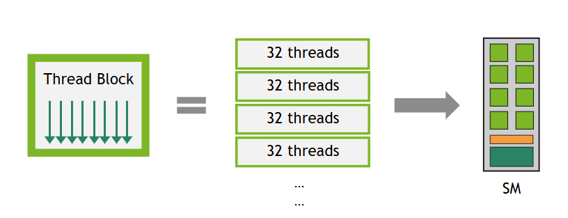

# 3.2 高级内核编程

> 本文档为 [NVIDIA CUDA Programming Guide](https://docs.nvidia.com/cuda/cuda-programming-guide/) 官方文档中文翻译版
>
> 原文地址：[https://docs.nvidia.com/cuda/cuda-programming-guide/03-advanced/advanced-kernel-programming.html](https://docs.nvidia.com/cuda/cuda-programming-guide/03-advanced/advanced-kernel-programming.html)

---

本页面是否有帮助？

# 3.2. 高级内核编程

本章将首先深入探讨 NVIDIA GPU 的硬件模型，然后介绍 CUDA 内核代码中一些旨在提升内核性能的更高级功能。本章将介绍一些与线程作用域、异步执行以及相关的同步原语相关的概念。这些概念性讨论为内核代码中可用的一些高级性能特性提供了必要的基础。

其中一些功能的详细描述包含在本编程指南下一部分专门介绍这些功能的章节中。

- 本章介绍的高级同步原语，在 4.9 节和 4.10 节中有完整介绍。
- 异步数据拷贝，包括张量内存加速器（TMA），在本章中介绍，并在 4.11 节中有完整介绍。

## 3.2.1. 使用 PTX

*并行线程执行*（PTX）是 CUDA 用来抽象硬件指令集架构（ISA）的虚拟机指令集架构，已在 [1.3.3 节](../01-introduction/cuda-platform.html#cuda-platform-ptx) 中介绍。直接使用 PTX 编写代码是一种高度高级的优化技术，对于大多数开发者来说并非必需，应被视为最后的手段。然而，在某些情况下，直接编写 PTX 所实现的细粒度控制能够在特定应用中带来性能提升。这些情况通常出现在应用程序中对性能极其敏感的部分，在那里每百分之零点几的性能提升都具有显著效益。所有可用的 PTX 指令都在 [PTX ISA 文档](https://docs.nvidia.com/cuda/parallel-thread-execution/index.html) 中。

`cuda::ptx`**命名空间**

在代码中直接使用 PTX 的一种方法是使用来自 [libcu++](https://nvidia.github.io/cccl/libcudacxx/) 的 `cuda::ptx` 命名空间。该命名空间提供了直接映射到 PTX 指令的 C++ 函数，简化了它们在 C++ 应用程序中的使用。更多信息，请参阅 [cuda::ptx 命名空间](https://nvidia.github.io/cccl/libcudacxx/ptx_api.html) 文档。

**内联 PTX**

在代码中包含 PTX 的另一种方法是使用内联 PTX。此方法在相应的 [文档](https://docs.nvidia.com/cuda/inline-ptx-assembly/index.html) 中有详细描述。这与在 CPU 上编写汇编代码非常相似。

## 3.2.2. 硬件实现

流式多处理器（SM）（参见 [GPU 硬件模型](../01-introduction/programming-model.html#programming-model-hardware-model)）设计用于并发执行数百个线程。为了管理如此大量的线程，它采用了一种独特的并行计算模型，称为*单指令，多线程*（SIMT），该模型在 [SIMT 执行模型](#advanced-kernels-hardware-implementation-simt-architecture) 中描述。指令是流水线化的，利用了单个线程内的指令级并行性，以及通过 [硬件多线程](#advanced-kernels-hardware-implementation-hardware-multithreading) 中详述的并发硬件多线程实现的广泛线程级并行性。与 CPU 核心不同，SM 按顺序发出指令，不执行分支预测或推测执行。
章节 [SIMT 执行模型](#advanced-kernels-hardware-implementation-simt-architecture) 和 [硬件多线程](#advanced-kernels-hardware-implementation-hardware-multithreading) 描述了所有设备共有的 SM 架构特性。章节 [计算能力](../05-appendices/compute-capabilities.html#compute-capabilities) 提供了不同计算能力设备的具体细节。

NVIDIA GPU 架构使用小端字节序表示法。

### 3.2.2.1. SIMT 执行模型

每个 SM 以称为 *warp* 的 32 个并行线程组为单位，创建、管理、调度和执行线程。组成一个 warp 的各个线程从同一程序地址开始一起执行，但它们拥有各自的指令地址计数器和寄存器状态，因此可以自由地分支并独立执行。术语 *warp* 起源于编织技术，这是最早的并行线程技术。一个 *half-warp* 是指一个 warp 的前半部分或后半部分。一个 *quarter-warp* 是指一个 warp 的第一、第二、第三或第四部分。

一个 warp 一次执行一条公共指令，因此当 warp 中的所有 32 个线程的执行路径一致时，才能实现完全效率。如果 warp 中的线程通过数据相关的条件分支发生分歧，则该 warp 会执行每个被采用的分支路径，同时禁用不在该路径上的线程。分支分歧只发生在一个 warp 内部；不同的 warp 独立执行，无论它们执行的是公共还是互斥的代码路径。

SIMT 架构类似于 SIMD（单指令多数据）向量组织，因为一条指令控制多个处理单元。一个关键区别在于，SIMD 向量组织向软件暴露 SIMD 宽度，而 SIMT 指令指定单个线程的执行和分支行为。与 SIMD 向量机相比，SIMT 使程序员能够为独立的标量线程编写线程级并行代码，也能为协调的线程编写数据并行代码。为了确保正确性，程序员基本上可以忽略 SIMT 行为；然而，通过注意让代码很少要求 warp 中的线程发生分歧，可以实现显著的性能提升。实际上，这类似于缓存行的作用：在设计正确性时可以安全地忽略缓存行大小，但在设计峰值性能时必须在代码结构中予以考虑。另一方面，向量架构要求软件将加载合并为向量并手动管理分歧。

#### 3.2.2.1.1. 独立线程调度

在计算能力低于 7.0 的 GPU 上，warp 使用一个在 warp 内所有 32 个线程间共享的程序计数器，以及一个指定 warp 中活动线程的活动掩码。因此，来自同一 warp 但处于分歧区域或不同执行状态的线程无法相互发信号或交换数据，并且需要由锁或互斥锁保护的细粒度数据共享的算法可能导致死锁，具体取决于竞争线程来自哪个 warp。
在计算能力 7.0 及更高版本的 GPU 中，*独立线程调度*允许线程之间实现完全并发，无论其是否属于同一线程束。通过独立线程调度，GPU 会为每个线程维护执行状态，包括程序计数器和调用栈，并且可以以线程级粒度让出执行权，以便更好地利用执行资源，或者允许一个线程等待另一个线程产生数据。调度优化器决定如何将来自同一线程束的活动线程分组到 SIMT 单元中。这保留了与先前 NVIDIA GPU 相同的 SIMT 执行高吞吐量，但提供了更大的灵活性：线程现在可以在子线程束粒度上发生分支和重新汇聚。

独立线程调度可能会破坏依赖于先前 GPU 架构中隐式线程束同步行为的代码。*线程束同步*代码假设同一线程束中的线程在每个指令处都是锁步执行的，但线程在子线程束粒度上发生分支和重新汇聚的能力使得这种假设不再成立。这可能导致实际执行代码的线程集合与预期不同。任何为 CC 7.0 之前的 GPU 开发的线程束同步代码（例如无需同步的线程束内规约操作）都应重新审视以确保兼容性。开发者应使用 `__syncwarp()` 显式同步此类代码，以确保在所有代次的 GPU 上都能正确运行。

!!! note "注意"
    参与当前指令的线程束中的线程称为活动线程，而未执行当前指令的线程则处于非活动状态（被禁用）。线程可能因多种原因处于非活动状态，包括比其线程束中的其他线程更早退出、采取了与线程束当前执行的分支路径不同的分支路径，或者是线程数不是线程束大小整数倍的线程块中的最后几个线程。如果由线程束执行的非原子指令从该线程束的多个线程向全局内存或共享内存中的同一位置写入数据，那么对该位置发生的序列化写入次数可能会因设备的计算能力而异。然而，对于所有计算能力，最终由哪个线程执行写入是未定义的。如果由线程束执行的原子指令从该线程束的多个线程对全局内存中的同一位置进行读取、修改和写入，那么对该位置的每次读取/修改/写入都会发生，并且它们都是序列化的，但发生的顺序是未定义的。

### 3.2.2.2. 硬件多线程

当一个 SM 获得一个或多个线程块来执行时，它会将这些线程块划分为线程束，每个线程束由一个*线程束调度器*调度执行。将线程块划分为线程束的方式始终相同；每个线程束包含具有连续递增线程 ID 的线程，第一个线程束包含线程 0。[线程层次结构](../02-basics/writing-cuda-kernels.html#writing-cuda-kernels-thread-hierarchy-review) 描述了线程 ID 如何与线程块中的线程索引相关联。
一个线程块中的线程束总数定义如下：

\(\text{ceil}\left( \frac{T}{W_{size}}, 1 \right)\)

- T 是每个线程块的线程数，
- Wsize 是线程束大小，等于 32，
- ceil(x, y) 等于将 x 向上取整到 y 的最近倍数。



*图 19 一个线程块被划分为多个包含 32 个线程的线程束。*

由 SM 处理的每个线程束的执行上下文（程序计数器、寄存器等）在其整个生命周期内都保持在芯片上。因此，在线程束之间切换不会产生开销。在每个指令发出周期，线程束调度器会选择一个其线程已准备好执行下一条指令（该线程束的[活动线程](#simt-architecture-notes)）的线程束，并向这些线程发出指令。

每个 SM 都有一组 32 位寄存器，这些寄存器在线程束之间分配；还有一个[共享内存](../02-basics/writing-cuda-kernels.html#writing-cuda-kernels-shared-memory)，在线程块之间分配。对于给定的内核，能够驻留在 SM 上并同时处理的线程块和线程束的数量，取决于内核使用的寄存器数量和共享内存大小，以及 SM 上可用的寄存器数量和共享内存大小。每个 SM 上可驻留的线程块和线程束数量也存在上限。这些限制，以及 SM 上可用的寄存器数量和共享内存大小，取决于设备的计算能力，并在[计算能力](../05-appendices/compute-capabilities.html#compute-capabilities)中规定。如果每个 SM 上没有足够的可用资源来处理至少一个线程块，则内核将启动失败。为一个线程块分配的寄存器总数和共享内存大小可以通过[占用率](../02-basics/writing-cuda-kernels.html#writing-cuda-kernels-kernel-launch-and-occupancy)部分中记录的几种方式确定。

### 3.2.2.3. 异步执行特性

近几代 NVIDIA GPU 包含了异步执行能力，以允许在 GPU 内部实现数据移动、计算和同步之间更多的重叠。这些能力使得从 GPU 代码调用的某些操作能够与同一线程块中的其他 GPU 代码异步执行。不应将此异步执行与[第 2.3 节](../02-basics/asynchronous-execution.html#asynchronous-execution)中讨论的异步 CUDA API 混淆，后者使 GPU 内核启动或内存操作能够彼此之间或与 CPU 异步运行。

计算能力 8.0（NVIDIA Ampere GPU 架构）引入了从全局内存到共享内存的硬件加速异步数据拷贝和异步屏障（参见 [NVIDIA A100 Tensor Core GPU 架构](https://images.nvidia.com/aem-dam/en-zz/Solutions/data-center/nvidia-ampere-architecture-whitepaper.pdf)）。

计算能力 9.0（NVIDIA Hopper GPU 架构）通过[Tensor Memory Accelerator (TMA)](#advanced-kernels-async-copies)单元扩展了异步执行特性，该单元可以将大数据块和多维张量从全局内存传输到共享内存，反之亦然，还包括异步事务屏障和异步矩阵乘加运算（详见 [Hopper 架构深度解析](https://developer.nvidia.com/blog/nvidia-hopper-architecture-in-depth/)博客文章）。
CUDA 提供了可由设备代码中的线程调用的 API 来使用这些功能。异步编程模型定义了异步操作相对于 CUDA 线程的行为。

异步操作是由 CUDA 线程发起，但由另一个线程（我们称之为 *异步线程*）异步执行的操作。在编写良好的程序中，一个或多个 CUDA 线程会与异步操作进行同步。发起异步操作的 CUDA 线程不一定是参与同步的线程之一。异步线程总是与发起该操作的 CUDA 线程相关联。

异步操作使用同步对象来通知其完成，该同步对象可以是屏障或管道。这些同步对象在[高级同步原语](#advanced-kernels-advanced-sync-primitives)中有详细解释，它们在执行异步内存操作中的作用在[异步数据复制](#advanced-kernels-async-copies)中进行了演示。

#### 3.2.2.3.1. 异步线程与异步代理

异步操作访问内存的方式可能与常规操作不同。为了区分这些不同的内存访问方法，CUDA 引入了 *异步线程*、*通用代理* 和 *异步代理* 的概念。正常操作（加载和存储）通过通用代理进行。一些异步指令，例如 [LDGSTS](../04-special-topics/async-copies.html#async-copies-ldgsts) 和 [STAS/REDAS](../04-special-topics/async-copies.html#async-copies-stas)，被建模为在通用代理中运行的异步线程。其他异步指令，例如使用 TMA 的批量异步复制和一些张量核心操作（tcgen05.*, wgmma.mma_async.*），被建模为在异步代理中运行的异步线程。

**在通用代理中运行的异步线程**。当异步操作被发起时，它会关联一个异步线程，该线程与发起操作的 CUDA 线程不同。*先前* 对同一地址的通用代理（正常）加载和存储保证在异步操作之前排序。然而，*后续* 对同一地址的正常加载和存储不保证保持其顺序，在异步线程完成之前，可能会发生竞态条件。

**在异步代理中运行的异步线程**。当异步操作被发起时，它会关联一个异步线程，该线程与发起操作的 CUDA 线程不同。*先前和后续* 对同一地址的正常加载和存储不保证保持其顺序。需要使用代理栅栏在不同代理之间同步它们，以确保正确的内存排序。章节[使用张量内存加速器 (TMA)](../04-special-topics/async-copies.html#async-copies-tma) 演示了在使用 TMA 执行异步复制时如何使用代理栅栏来确保正确性。
有关这些概念的更多详细信息，请参阅 [PTX ISA](https://docs.nvidia.com/cuda/parallel-thread-execution/index.html?highlight=proxy#proxies) 文档。

## 3.2.3. 线程作用域

CUDA 线程构成一个[线程层次结构](../02-basics/writing-cuda-kernels.html#writing-cuda-kernels-thread-hierarchy-review)，利用此层次结构对于编写正确且高性能的 CUDA 内核至关重要。在此层次结构中，内存操作的可见性和同步作用域可能有所不同。为了解释这种非均匀性，CUDA 编程模型引入了*线程作用域*的概念。线程作用域定义了哪些线程可以观察到某个线程的加载和存储操作，并指定了哪些线程可以使用原子操作和屏障等同步原语相互同步。每个作用域在内存层次结构中都有一个相关的连贯性点。

线程作用域在 [CUDA PTX](https://docs.nvidia.com/cuda/parallel-thread-execution/index.html?highlight=thread%2520scopes#scope) 中公开，也可作为 [libcu++](https://nvidia.github.io/cccl/libcudacxx/extended_api/memory_model.html#thread-scopes) 库中的扩展使用。下表定义了可用的线程作用域：

| CUDA C++ 线程作用域 | CUDA PTX 线程作用域 | 描述 | 内存层次结构中的连贯性点 |
| --- | --- | --- | --- |
| cuda::thread_scope_thread | | 内存操作仅对本地线程可见。 | – |
| cuda::thread_scope_block | .cta | 内存操作对同一线程块中的其他线程可见。 | L1 |
| | .cluster | 内存操作对同一线程块集群中的其他线程可见。 | L2 |
| cuda::thread_scope_device | .gpu | 内存操作对同一 GPU 设备中的其他线程可见。 | L2 |
| cuda::thread_scope_system | .sys | 内存操作对同一系统（CPU、其他 GPU）中的其他线程可见。 | L2 + 连接的缓存 |

[高级同步原语](#advanced-kernels-advanced-sync-primitives) 和 [异步数据拷贝](#advanced-kernels-async-copies) 章节演示了线程作用域的使用。

## 3.2.4. 高级同步原语

本节介绍三类同步原语：

- **作用域原子操作**：将 C++ 内存顺序与 CUDA 线程作用域配对，以在线程块、集群、设备或系统作用域内安全地进行线程间通信（参见 [线程作用域](#323thread-scopes)）。
- **异步屏障**：将同步拆分为到达和等待阶段，可用于跟踪异步操作的进度。
- **流水线**：对工作进行分段并协调多缓冲区生产者-消费者模式，通常用于将计算与异步数据拷贝重叠。

### 3.2.4.1. 作用域原子操作

[第 5.4.5 节](../05-appendices/cpp-language-extensions.html#atomic-functions) 概述了 CUDA 中可用的原子函数。在本节中，我们将重点介绍支持 [C++ 标准原子内存](https://en.cppreference.com/w/cpp/atomic/memory_order.html) 语义的*作用域*原子操作，可通过 [libcu++](https://nvidia.github.io/cccl/libcudacxx/extended_api/synchronization_primitives.html) 库或编译器内置函数获得。作用域原子操作为在 CUDA 线程层次结构的适当级别进行高效同步提供了工具，从而在复杂的并行算法中实现正确性和性能。
#### 3.2.4.1.1. 线程作用域与内存排序

作用域原子操作结合了两个关键概念：

- **线程作用域**：定义了哪些线程可以观察到原子操作的效果（参见线程作用域）。
- **内存排序**：定义了相对于其他内存操作的排序约束（参见 C++ 标准原子内存语义）。

**CUDA C++ `cuda::atomic`**

```cuda
#include <cuda/atomic>

__global__ void block_scoped_counter() {
    // 仅在此线程块内可见的共享原子计数器
    __shared__ cuda::atomic<int, cuda::thread_scope_block> counter;

    // 初始化计数器（应仅由一个线程执行）
    if (threadIdx.x == 0) {
        counter.store(0, cuda::memory_order_relaxed);
    }
    __syncthreads();

    // 线程块中的所有线程原子地递增
    int old_value = counter.fetch_add(1, cuda::memory_order_relaxed);

    // 使用 old_value...
}
```

**内置原子函数**

```cuda
__global__ void block_scoped_counter() {
    // 仅在线程块内可见的共享计数器
    __shared__ int counter;

    // 初始化计数器（应仅由一个线程执行）
    if (threadIdx.x == 0) {
        __nv_atomic_store_n(&counter, 0,
                            __NV_ATOMIC_RELAXED,
                            __NV_THREAD_SCOPE_BLOCK);
    }
    __syncthreads();

    // 线程块中的所有线程原子地递增
    int old_value = __nv_atomic_fetch_add(&counter, 1,
                                          __NV_ATOMIC_RELAXED,
                                          __NV_THREAD_SCOPE_BLOCK);

    // 使用 old_value...
}
```

此示例实现了一个*线程块作用域的原子计数器*，展示了作用域原子操作的基本概念：

- **共享变量**：使用 `__shared__` 内存，一个计数器在线程块的所有线程间共享。
- **原子类型声明**：`cuda::atomic<int, cuda::thread_scope_block>` 创建了一个具有线程块级可见性的原子整数。
- **单次初始化**：仅线程 0 初始化计数器，以防止设置期间的竞态条件。
- **线程块同步**：`__syncthreads()` 确保所有线程在继续执行前都能看到已初始化的计数器。
- **原子递增**：每个线程原子地递增计数器并接收其先前的值。

此处选择 `cuda::memory_order_relaxed` 是因为我们只需要原子性（不可分割的读-修改-写），而不需要不同内存位置之间的排序约束。由于这是一个简单的计数操作，递增的顺序对于正确性并不重要。

对于生产者-消费者模式，获取-释放语义确保了正确的排序：

**CUDA C++ `cuda::atomic`**

```cuda
__global__ void producer_consumer() {
    __shared__ int data;
    __shared__ cuda::atomic<bool, cuda::thread_scope_block> ready;

    if (threadIdx.x == 0) {
        // 生产者：写入数据，然后发出就绪信号
        data = 42;
        ready.store(true, cuda::memory_order_release);  // Release 确保数据写入可见
    } else {
        // 消费者：等待就绪信号，然后读取数据
        while (!ready.load(cuda::memory_order_acquire)) {  // Acquire 确保数据读取能看到写入
            // 自旋等待
        }
        int value = data;
        // 处理 value...
    }
}
```
**内置原子函数**

```cuda
__global__ void producer_consumer() {
    __shared__ int data;
    __shared__ bool ready; // 仅就绪标志需要原子操作

    if (threadIdx.x == 0) {
        // 生产者：写入数据，然后发出就绪信号
        data = 42;
        __nv_atomic_store_n(&ready, true,
                            __NV_ATOMIC_RELEASE,
                            __NV_THREAD_SCOPE_BLOCK);  // Release 确保数据写入对其他线程可见
    } else {
        // 消费者：等待就绪信号，然后读取数据
        while (!__nv_atomic_load_n(&ready,
                                   __NV_ATOMIC_ACQUIRE,
                                   __NV_THREAD_SCOPE_BLOCK)) {  // Acquire 确保数据读取能看到写入
            // 自旋等待
        }
        int value = data;
        // 处理 value...
    }
}
```

#### 3.2.4.1.2. 性能考量

- **使用尽可能窄的作用域**：块作用域的原子操作比系统作用域的原子操作快得多。
- **优先使用较弱的内存序**：仅在正确性需要时才使用更强的内存序。
- **考虑内存位置**：共享内存的原子操作比全局内存的原子操作更快。

### 3.2.4.2. 异步屏障

异步屏障与典型的单阶段屏障（`__syncthreads()`）不同之处在于，线程通知其已到达屏障（“到达”操作）与等待其他线程到达屏障（“等待”操作）是分离的。这种分离通过允许线程执行与屏障无关的额外操作，更有效地利用等待时间，从而提高了执行效率。异步屏障可用于实现 CUDA 线程间的生产者-消费者模式，或通过让复制操作在完成后通知（“到达”）一个屏障，从而在内存层次结构内实现异步数据拷贝。

异步屏障在计算能力 7.0 或更高的设备上可用。计算能力 8.0 或更高的设备为共享内存中的异步屏障提供了硬件加速，并在同步粒度上取得了显著进步，允许对线程块内任意 CUDA 线程子集进行硬件加速的同步。之前的架构仅在整个线程束（`__syncwarp()`）或整个线程块（`__syncthreads()`）级别进行加速同步。

CUDA 编程模型通过 `cuda::std::barrier` 提供异步屏障，这是一个符合 ISO C++ 标准的屏障，可在 [libcu++](https://nvidia.github.io/cccl/libcudacxx/extended_api/synchronization_primitives/barrier.html) 库中找到。除了实现 [std::barrier](https://en.cppreference.com/w/cpp/thread/barrier.html) 外，该库还提供了 CUDA 特定的扩展，用于选择屏障的线程作用域以提高性能，并公开了一个底层的 [cuda::ptx](https://nvidia.github.io/cccl/libcudacxx/ptx_api.html) API。`cuda::barrier` 可以通过使用 `friend` 函数 `cuda::device::barrier_native_handle()` 来检索屏障的原生句柄并将其传递给 `cuda::ptx` 函数，从而实现与 `cuda::ptx` 的互操作。CUDA 还为线程块作用域内共享内存的异步屏障提供了一个[原语 API](../05-appendices/device-callable-apis.html#async-barriers-primitives-api)。
下表概述了可用于不同线程作用域同步的异步屏障。

> 线程作用域
> 内存位置
> 到达屏障
> 等待屏障
> 硬件加速
> CUDA API
> 线程块
> 本地共享内存
> 允许
> 允许
> 是 (8.0+)
> cuda::barrier
> ,
> cuda::ptx
> , 原语
> 集群
> 本地共享内存
> 允许
> 允许
> 是 (9.0+)
> cuda::barrier
> ,
> cuda::ptx
> 集群
> 远程共享内存
> 允许
> 不允许
> 是 (9.0+)
> cuda::barrier
> ,
> cuda::ptx
> 设备
> 全局内存
> 允许
> 允许
> 否
> cuda::barrier
> 系统
> 全局/统一内存
> 允许
> 允许
> 否
> cuda::barrier

**同步的时间拆分**

在没有异步到达-等待屏障的情况下，线程块内的同步是通过使用 `__syncthreads()` 或在使用[协作组](../04-special-topics/cooperative-groups.html#cooperative-groups)时使用 `block.sync()` 来实现的。

```c++
#include <cooperative_groups.h>

__global__ void simple_sync(int iteration_count) {
    auto block = cooperative_groups::this_thread_block();

    for (int i = 0; i < iteration_count; ++i) {
        /* code before arrive */

         // Wait for all threads to arrive here.
        block.sync();

        /* code after wait */
    }
}
```

线程在同步点 (`block.sync()`) 被阻塞，直到所有线程都到达该同步点。此外，保证在同步点之前发生的内存更新，在同步点之后对线程块内的所有线程可见。

这种模式包含三个阶段：

- 同步前的代码执行内存更新，这些更新将在同步后被读取。
- 同步点。
- 同步后的代码，可以看到同步前发生的内存更新。

如果使用异步屏障，时间拆分的同步模式如下所示。

**CUDA C++ cuda::barrier**

```cuda
#include <cuda/barrier>
#include <cooperative_groups.h>

__device__ void compute(float *data, int iteration);

__global__ void split_arrive_wait(int iteration_count, float *data)
{
  using barrier_t = cuda::barrier<cuda::thread_scope_block>;
  __shared__ barrier_t bar;
  auto block = cooperative_groups::this_thread_block();

  if (block.thread_rank() == 0)
  {
    // Initialize barrier with expected arrival count.
    init(&bar, block.size());
  }
  block.sync();

  for (int i = 0; i < iteration_count; ++i)
  {
    /* code before arrive */

    // This thread arrives. Arrival does not block a thread.
    barrier_t::arrival_token token = bar.arrive();

    compute(data, i);

    // Wait for all threads participating in the barrier to complete bar.arrive().
    bar.wait(std::move(token));

    /* code after wait */
  }
}
```

**CUDA C++ cuda::ptx**

```cuda
#include <cuda/ptx>
#include <cooperative_groups.h>

__device__ void compute(float *data, int iteration);

__global__ void split_arrive_wait(int iteration_count, float *data)
{
  __shared__ uint64_t bar;
  auto block = cooperative_groups::this_thread_block();

  if (block.thread_rank() == 0)
  {
    // Initialize barrier with expected arrival count.
    cuda::ptx::mbarrier_init(&bar, block.size());
  }
  block.sync();

  for (int i = 0; i < iteration_count; ++i)
  {
    /* code before arrive */

    // This thread arrives. Arrival does not block a thread.
    uint64_t token = cuda::ptx::mbarrier_arrive(&bar);

    compute(data, i);

    // Wait for all threads participating in the barrier to complete mbarrier_arrive().
    while(!cuda::ptx::mbarrier_try_wait(&bar, token)) {}

    /* code after wait */
  }
}
```
**CUDA C 原语**

```cuda
#include <cuda_awbarrier_primitives.h>
#include <cooperative_groups.h>

__device__ void compute(float *data, int iteration);

__global__ void split_arrive_wait(int iteration_count, float *data)
{
  __shared__ __mbarrier_t bar;
  auto block = cooperative_groups::this_thread_block();

  if (block.thread_rank() == 0)
  {
    // 使用期望到达计数初始化屏障。
    __mbarrier_init(&bar, block.size());
  }
  block.sync();

  for (int i = 0; i < iteration_count; ++i)
  {
    /* 到达点之前的代码 */

    // 此线程到达。到达操作不会阻塞线程。
    __mbarrier_token_t token = __mbarrier_arrive(&bar);

    compute(data, i);

    // 等待参与屏障的所有线程完成 __mbarrier_arrive()。
    while(!__mbarrier_try_wait(&bar, token, 1000)) {}

    /* 等待点之后的代码 */
  }
}
```

在此模式中，同步点被拆分为一个到达点 (`bar.arrive()`) 和一个等待点 (`bar.wait(std::move(token))`)。线程通过首次调用 `bar.arrive()` 开始参与 `cuda::barrier`。当线程调用 `bar.wait(std::move(token))` 时，它将被阻塞，直到参与线程完成 `bar.arrive()` 的次数达到预期值，该预期值即传递给 `init()` 的期望到达计数参数。保证在参与线程调用 `bar.arrive()` 之前发生的内存更新，在它们调用 `bar.wait(std::move(token))` 之后对参与线程可见。请注意，调用 `bar.arrive()` 不会阻塞线程，线程可以继续执行其他不依赖于其他参与线程调用 `bar.arrive()` 之前发生的内存更新的工作。

*到达并等待* 模式包含五个阶段：

-   到达点之前的代码：执行将在等待点之后被读取的内存更新。
-   到达点：带有隐式内存栅栏（即，等同于 `cuda::atomic_thread_fence(cuda::memory_order_seq_cst, cuda::thread_scope_block)`）。
-   到达点和等待点之间的代码。
-   等待点。
-   等待点之后的代码：可以看见在到达点之前执行的更新。

关于如何使用异步屏障的完整指南，请参阅 [异步屏障](../04-special-topics/async-barriers.html#asynchronous-barriers)。

### 3.2.4.3. 流水线

CUDA 编程模型提供了流水线同步对象作为一种协调机制，用于将异步内存复制排序到多个阶段，从而促进双缓冲或多缓冲生产者-消费者模式的实现。流水线是一个双端队列，具有 *头部* 和 *尾部*，按照先进先出（FIFO）的顺序处理工作。生产者线程将工作提交到流水线的头部，而消费者线程则从流水线的尾部拉取工作。

流水线通过 [libcu++](https://nvidia.github.io/cccl/libcudacxx/extended_api/synchronization_primitives/pipeline.html) 库中的 `cuda::pipeline` API 以及一个 [原语 API](../05-appendices/device-callable-apis.html#pipeline-primitives-interface) 公开。下表描述了这两个 API 的主要功能。
| cuda::pipeline API | 描述 |
| --- | --- |
| producer_acquire | 获取流水线内部队列中一个可用的阶段。 |
| producer_commit | 提交在流水线当前获取的阶段上，于 `producer_acquire` 调用后发出的异步操作。 |
| consumer_wait | 等待流水线最旧阶段中的异步操作完成。 |
| consumer_release | 将流水线的最旧阶段释放回流水线对象以供重用。被释放的阶段随后可以被生产者获取。 |

| 原语 API | 描述 |
| --- | --- |
| __pipeline_memcpy_async | 请求一个从全局内存到共享内存的内存复制操作，以提交进行异步评估。 |
| __pipeline_commit | 提交在流水线当前阶段上，于调用之前发出的异步操作。 |
| __pipeline_wait_prior(N) | 等待流水线中除最后 N 次提交之外的所有异步操作完成。 |

`cuda::pipeline` API 具有更丰富的接口和更少的限制，而原语 API 仅支持跟踪从全局内存到共享内存的异步复制，并且有特定的尺寸和对齐要求。原语 API 提供的功能等同于一个具有 `cuda::thread_scope_thread` 作用域的 `cuda::pipeline` 对象。

有关详细的使用模式和示例，请参阅 [流水线](../04-special-topics/pipelines.html#pipelines)。

## 3.2.5. 异步数据复制

在内存层次结构中进行高效的数据移动是实现 GPU 计算高性能的基础。传统的同步内存操作会强制线程在数据传输期间空闲等待。GPU 本质上通过并行性来隐藏内存延迟。也就是说，在内存操作完成期间，SM 会切换去执行另一个线程束。即使通过这种并行性来隐藏延迟，内存延迟仍可能成为内存带宽利用率和计算资源效率的瓶颈。为了解决这些瓶颈，现代 GPU 架构提供了硬件加速的异步数据复制机制，允许内存传输独立进行，而线程可以继续执行其他工作。

异步数据复制通过将内存传输的发起与等待其完成解耦，实现了计算与数据移动的重叠。这样，线程可以在内存延迟期间执行有用的工作，从而提高整体吞吐量和资源利用率。

!!! note "注意"
    虽然本节涉及的概念和原理与前面关于异步执行的章节中讨论的内容相似，但该章节涵盖的是内核和内存传输（例如由 `cudaMemcpyAsync` 调用的那些）的异步执行。这可以被视为应用程序不同组件之间的异步性。本节描述的异步性是指在 GPU 的 DRAM（即全局内存）与 SM 上的内存（如共享内存或张量内存）之间进行数据传输时，不会阻塞 GPU 线程。这是单个内核启动执行过程中的异步性。
要理解异步拷贝如何提升性能，有必要先分析一种常见的 GPU 计算模式。CUDA 应用通常采用一种*拷贝与计算*模式，该模式：

- 从全局内存获取数据，
- 将数据存储到共享内存，并
- 对共享内存中的数据进行计算，并可能将结果写回全局内存。

该模式的*拷贝*阶段通常表示为 `shared[local_idx] = global[global_idx]`。编译器会将这个从全局内存到共享内存的拷贝展开为：先从全局内存读取到寄存器，再从寄存器写入共享内存。

当这种模式出现在迭代算法中时，每个线程块在 `shared[local_idx] = global[global_idx]` 赋值后都需要进行同步，以确保在计算阶段开始前，所有对共享内存的写入操作均已完成。线程块在计算阶段后还需要再次同步，以防止在所有线程完成计算之前覆盖共享内存。以下代码片段展示了这种模式。

```c++
#include <cooperative_groups.h>

__device__ void compute(int* global_out, int const* shared_in) {
    // Computes using all values of current batch from shared memory.
    // Stores this thread's result back to global memory.
}

__global__ void without_async_copy(int* global_out, int const* global_in, size_t size, size_t batch_sz) {
  auto grid = cooperative_groups::this_grid();
  auto block = cooperative_groups::this_thread_block();
  assert(size == batch_sz * grid.size()); // Exposition: input size fits batch_sz * grid_size

  extern __shared__ int shared[]; // block.size() * sizeof(int) bytes

  size_t local_idx = block.thread_rank();

  for (size_t batch = 0; batch < batch_sz; ++batch) {
    // Compute the index of the current batch for this block in global memory.
    size_t block_batch_idx = block.group_index().x * block.size() + grid.size() * batch;
    size_t global_idx = block_batch_idx + threadIdx.x;
    shared[local_idx] = global_in[global_idx];

    // Wait for all copies to complete.
    block.sync();

    // Compute and write result to global memory.
    compute(global_out + block_batch_idx, shared);

    // Wait for compute using shared memory to finish.
    block.sync();
  }
}
```

使用异步数据拷贝时，从全局内存到共享内存的数据移动可以异步执行，从而在等待数据到达的同时，更高效地利用流式多处理器（SM）。

```c++
#include <cooperative_groups.h>
#include <cooperative_groups/memcpy_async.h>

__device__ void compute(int* global_out, int const* shared_in) {
    // Computes using all values of current batch from shared memory.
    // Stores this thread's result back to global memory.
}

__global__ void with_async_copy(int* global_out, int const* global_in, size_t size, size_t batch_sz) {
  auto grid = cooperative_groups::this_grid();
  auto block = cooperative_groups::this_thread_block();
  assert(size == batch_sz * grid.size()); // Exposition: input size fits batch_sz * grid_size

  extern __shared__ int shared[]; // block.size() * sizeof(int) bytes

  size_t local_idx = block.thread_rank();

  for (size_t batch = 0; batch < batch_sz; ++batch) {
    // Compute the index of the current batch for this block in global memory.
    size_t block_batch_idx = block.group_index().x * block.size() + grid.size() * batch;

    // Whole thread-group cooperatively copies whole batch to shared memory.
    cooperative_groups::memcpy_async(block, shared, global_in + block_batch_idx, block.size());

    // Compute on different data while waiting.

    // Wait for all copies to complete.
    cooperative_groups::wait(block);

    // Compute and write result to global memory.
    compute(global_out + block_batch_idx, shared);

    // Wait for compute using shared memory to finish.
    block.sync();
  }
}
```
[cooperative_groups::memcpy_async](../05-appendices/device-callable-apis.html#cg-api-async-memcpy) 函数将 `block.size()` 个元素从全局内存复制到 `shared` 数据。此操作仿佛由另一个线程执行，该线程在复制完成后与当前线程对 [cooperative_groups::wait](../05-appendices/device-callable-apis.html#cg-api-async-wait) 的调用进行同步。在复制操作完成之前，修改全局数据或读写共享数据将引入数据竞争。

此示例说明了所有异步复制操作背后的基本概念：它们将内存传输的启动与完成解耦，允许线程在数据于后台移动的同时执行其他工作。CUDA 编程模型提供了多个 API 来访问这些功能，包括 [Cooperative Groups](../05-appendices/device-callable-apis.html#cg-api-async-memcpy) 和 [libcu++](https://nvidia.github.io/cccl/libcudacxx/extended_api/asynchronous_operations/memcpy_async.html) 库中可用的 `memcpy_async` 函数，以及更低级别的 `cuda::ptx` 和原语 API。这些 API 共享相似的语义：它们将对象从源复制到目标，仿佛由另一个线程执行，该线程在复制完成后，可以使用不同的完成机制进行同步。

现代 GPU 架构为异步数据移动提供了多种硬件机制。

- LDGSTS（计算能力 8.0+）允许从全局内存到共享内存的高效小规模异步传输。
- 张量内存加速器（TMA，计算能力 9.0+）扩展了这些功能，提供了针对大型多维数据传输优化的批量异步复制操作。
- STAS 指令（计算能力 9.0+）支持从寄存器到集群内分布式共享内存的小规模异步传输。

这些机制支持不同的数据路径、传输大小和对齐要求，允许开发人员为其特定的数据访问模式选择最合适的方法。下表概述了 GPU 内支持的异步复制数据路径。

| 方向 | 复制机制 |  |  |
| --- | --- | --- | --- |
| 源 | 目标 | 异步复制 | 批量异步复制 |
| global | global |  |  |
| shared::cta | global |  | 支持 (TMA, 9.0+) |
| global | shared::cta | 支持 (LDGSTS, 8.0+) | 支持 (TMA, 9.0+) |
| global | shared::cluster |  | 支持 (TMA, 9.0+) |
| shared::cluster | shared::cta |  | 支持 (TMA, 9.0+) |
| shared::cta | shared::cta |  |  |
| registers | shared::cluster | 支持 (STAS, 9.0+) |  |

章节 [使用 LDGSTS](../04-special-topics/async-copies.html#async-copies-ldgsts)、[使用张量内存加速器 (TMA)](../04-special-topics/async-copies.html#async-copies-tma) 和 [使用 STAS](../04-special-topics/async-copies.html#async-copies-stas) 将详细介绍每种机制。
## 3.2.6. 配置 L1/共享内存平衡

如 [L1 数据缓存](../02-basics/writing-cuda-kernels.html#writing-cuda-kernels-caches) 中所述，SM 上的 L1 缓存和共享内存使用相同的物理资源，称为统一数据缓存。在大多数架构上，如果内核使用很少或根本不使用共享内存，则可以将统一数据缓存配置为提供该架构允许的最大 L1 缓存量。

为共享内存保留的统一数据缓存可按内核进行配置。应用程序可以在内核启动前调用 [cudaFuncSetAttribute](https://docs.nvidia.com/cuda/cuda-runtime-api/group__CUDART__EXECUTION.html#group__CUDART__EXECUTION_1g317e77d2657abf915fd9ed03e75f3eb0) 函数来设置 `carveout`，即首选的共享内存容量。

```c++
cudaFuncSetAttribute(kernel_name, cudaFuncAttributePreferredSharedMemoryCarveout, carveout);
```

应用程序可以将 `carveout` 设置为该架构支持的最大共享内存容量的整数百分比。除了整数百分比外，还提供了三个方便的枚举作为 carveout 值。

- cudaSharedmemCarveoutDefault
- cudaSharedmemCarveoutMaxL1
- cudaSharedmemCarveoutMaxShared

支持的最大共享内存和支持的 carveout 大小因架构而异；详情请参阅 [每个计算能力的共享内存容量](../05-appendices/compute-capabilities.html#compute-capabilities-table-shared-memory-capacity-per-compute-capability)。

当所选的整数百分比 carveout 无法精确映射到支持的共享内存容量时，将使用下一个更大的容量。例如，对于计算能力为 12.0 的设备，其最大共享内存容量为 100KB，将 carveout 设置为 50% 将导致 64KB 的共享内存，而不是 50KB，因为计算能力 12.0 的设备支持的共享内存大小为 0、8、16、32、64 和 100。

传递给 `cudaFuncSetAttribute` 的函数必须使用 `__global__` 说明符声明。`cudaFuncSetAttribute` 被驱动程序解释为一个提示，如果需要执行内核，驱动程序可能会选择不同的 carveout 大小。

!!! note "注意"
    另一个 CUDA API，`cudaFuncSetCacheConfig`，也允许应用程序调整内核的 L1 和共享内存之间的平衡。然而，此 API 为内核启动设置了共享内存/L1 平衡的硬性要求。因此，交错运行具有不同共享内存配置的内核将不必要地使启动在共享内存重新配置后串行化。`cudaFuncSetAttribute` 是首选，因为如果需要执行函数或避免抖动，驱动程序可能会选择不同的配置。

依赖每个线程块分配超过 48 KB 共享内存的内核是特定于架构的。因此，它们必须使用 [动态共享内存](../02-basics/writing-cuda-kernels.html#writing-cuda-kernels-dynamic-allocation-shared-memory) 而不是静态大小的数组，并且需要使用 `cudaFuncSetAttribute` 进行显式选择加入，如下所示。

```c++
// Device code
__global__ void MyKernel(...)
{
  extern __shared__ float buffer[];
  ...
}

// Host code
int maxbytes = 98304; // 96 KB
cudaFuncSetAttribute(MyKernel, cudaFuncAttributeMaxDynamicSharedMemorySize, maxbytes);
MyKernel <<<gridDim, blockDim, maxbytes>>>(...);
```

 On this page