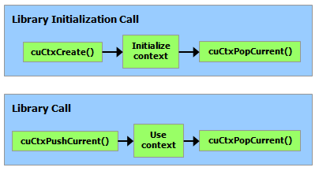

# 3.3 CUDA 驱动 API

> 本文档为 [NVIDIA CUDA Programming Guide](https://docs.nvidia.com/cuda/cuda-programming-guide/) 官方文档中文翻译版
>
> 原文地址：[https://docs.nvidia.com/cuda/cuda-programming-guide/03-advanced/driver-api.html](https://docs.nvidia.com/cuda/cuda-programming-guide/03-advanced/driver-api.html)

---

此页面是否有帮助？

# 3.3. CUDA 驱动程序 API

本指南的前几节已涵盖 CUDA 运行时。如 [CUDA 运行时 API 和 CUDA 驱动程序 API](../01-introduction/cuda-platform.html#cuda-platform-driver-and-runtime) 中所述，CUDA 运行时构建在较低级别的 CUDA 驱动程序 API 之上。本节将介绍 CUDA 运行时与驱动程序 API 之间的一些差异，以及如何混合使用它们。大多数应用程序无需与 CUDA 驱动程序 API 交互即可实现全性能运行。然而，新的接口有时会先在驱动程序 API 中提供，然后才出现在运行时 API 中，并且一些高级接口（例如 [虚拟内存管理](../04-special-topics/virtual-memory-management.html#virtual-memory-management)）仅在驱动程序 API 中公开。

驱动程序 API 在 `cuda` 动态库（`cuda.dll` 或 `cuda.so`）中实现，该库在安装设备驱动程序时被复制到系统中。其所有入口点均以 `cu` 为前缀。

它是一个基于句柄的命令式 API：大多数对象通过不透明句柄引用，这些句柄可指定给函数以操作对象。

驱动程序 API 中可用的对象总结于 [表 6](#driver-api-objects-available-in-cuda-driver-api)。

| 对象 | 句柄 | 描述 |
| --- | --- | --- |
| 设备 | CUdevice | 支持 CUDA 的设备 |
| 上下文 | CUcontext | 大致相当于一个 CPU 进程 |
| 模块 | CUmodule | 大致相当于一个动态库 |
| 函数 | CUfunction | 内核 |
| 堆内存 | CUdeviceptr | 指向设备内存的指针 |
| CUDA 数组 | CUarray | 设备上一维或二维数据的不透明容器，可通过纹理或表面引用读取 |
| 纹理对象 | CUtexref | 描述如何解释纹理内存数据的对象 |
| 表面引用 | CUsurfref | 描述如何读取或写入 CUDA 数组的对象 |
| 流 | CUstream | 描述 CUDA 流的对象 |
| 事件 | CUevent | 描述 CUDA 事件的对象 |

在调用驱动程序 API 的任何函数之前，必须使用 `cuInit()` 初始化驱动程序 API。然后必须创建一个 CUDA 上下文，该上下文附加到特定设备，并使其成为调用主机线程的当前上下文，如 [上下文](#driver-api-context) 中详述。

在 CUDA 上下文中，内核由主机代码显式加载为 PTX 或二进制对象，如 [模块](#driver-api-module) 所述。因此，用 C++ 编写的内核必须单独编译为 *PTX* 或二进制对象。内核使用 API 入口点启动，如 [内核执行](#driver-api-kernel-execution) 所述。

任何希望在未来设备架构上运行的应用程序都必须加载 *PTX*，而不是二进制代码。这是因为二进制代码是特定于架构的，因此与未来架构不兼容，而 *PTX* 代码在加载时由设备驱动程序编译为二进制代码。

以下是使用驱动程序 API 编写的 [内核](../02-basics/intro-to-cuda-cpp.html#kernels) 示例的主机代码：

```c++
int main()
{
    int N = ...;
    size_t size = N * sizeof(float);

    // Allocate input vectors h_A and h_B in host memory
    float* h_A = (float*)malloc(size);
    float* h_B = (float*)malloc(size);

    // Initialize input vectors
    ...

    // Initialize
    cuInit(0);

    // Get number of devices supporting CUDA
    int deviceCount = 0;
    cuDeviceGetCount(&deviceCount);
    if (deviceCount == 0) {
        printf("There is no device supporting CUDA.\n");
        exit (0);
    }

    // Get handle for device 0
    CUdevice cuDevice;
    cuDeviceGet(&cuDevice, 0);

    // Create context
    CUcontext cuContext;
    cuCtxCreate(&cuContext, 0, cuDevice);

    // Create module from binary file
    CUmodule cuModule;
    cuModuleLoad(&cuModule, "VecAdd.ptx");

    // Allocate vectors in device memory
    CUdeviceptr d_A;
    cuMemAlloc(&d_A, size);
    CUdeviceptr d_B;
    cuMemAlloc(&d_B, size);
    CUdeviceptr d_C;
    cuMemAlloc(&d_C, size);

    // Copy vectors from host memory to device memory
    cuMemcpyHtoD(d_A, h_A, size);
    cuMemcpyHtoD(d_B, h_B, size);

    // Get function handle from module
    CUfunction vecAdd;
    cuModuleGetFunction(&vecAdd, cuModule, "VecAdd");

    // Invoke kernel
    int threadsPerBlock = 256;
    int blocksPerGrid =
            (N + threadsPerBlock - 1) / threadsPerBlock;
    void* args[] = { &d_A, &d_B, &d_C, &N };
    cuLaunchKernel(vecAdd,
                   blocksPerGrid, 1, 1, threadsPerBlock, 1, 1,
                   0, 0, args, 0);

    ...
}
```

Full code can be found in the `vectorAddDrv` CUDA sample.

## 3.3.1.Context

A CUDA context is analogous to a CPU process. All resources and actions performed within the driver API are encapsulated inside a CUDA context, and the system automatically cleans up these resources when the context is destroyed. Besides objects such as modules and texture or surface references, each context has its own distinct address space. As a result, `CUdeviceptr` values from different contexts reference different memory locations.

A host thread may have only one device context current at a time. When a context is created with `cuCtxCreate()`, it is made current to the calling host thread. CUDA functions that operate in a context (most functions that do not involve device enumeration or context management) will return `CUDA_ERROR_INVALID_CONTEXT` if a valid context is not current to the thread.

Each host thread has a stack of current contexts. `cuCtxCreate()` pushes the new context onto the top of the stack. `cuCtxPopCurrent()` may be called to detach the context from the host thread. The context is then “floating” and may be pushed as the current context for any host thread. `cuCtxPopCurrent()` also restores the previous current context, if any.

A usage count is also maintained for each context. `cuCtxCreate()` creates a context with a usage count of 1. `cuCtxAttach()` increments the usage count and `cuCtxDetach()` decrements it. A context is destroyed when the usage count goes to 0 when calling `cuCtxDetach()` or `cuCtxDestroy()`.
驱动程序 API 与运行时 API 可互操作，并且可以通过 `cuDevicePrimaryCtxRetain()` 从驱动程序 API 访问由运行时管理的主上下文（参见[运行时初始化](../02-basics/intro-to-cuda-cpp.html#intro-cpp-runtime-initialization)）。

使用计数有助于在同一上下文中运行的第三方代码之间的互操作性。例如，如果三个库被加载以使用同一上下文，则每个库在开始使用上下文时会调用 `cuCtxAttach()` 来增加使用计数，在库使用完上下文时会调用 `cuCtxDetach()` 来减少使用计数。对于大多数库，期望应用程序在加载或初始化库之前已创建上下文；这样，应用程序可以使用自己的启发式方法创建上下文，而库只需在提供给它的上下文上操作。希望创建自己上下文的库——其 API 客户端可能已创建也可能未创建自己的上下文，而客户端对此不知情——将使用 `cuCtxPushCurrent()` 和 `cuCtxPopCurrent()`，如下图所示。



*图 20 库上下文管理#*

## 3.3.2. 模块

模块是设备代码和数据的动态可加载包，类似于 Windows 中的 DLL，由 nvcc 输出（参见[使用 NVCC 编译](../02-basics/intro-to-cuda-cpp.html#compilation-with-nvcc)）。所有符号（包括函数、全局变量以及纹理或表面引用）的名称都在模块范围内维护，以便由独立第三方编写的模块可以在同一 CUDA 上下文中互操作。

此代码示例加载一个模块并获取某个内核的句柄：

```c++
CUmodule cuModule;
cuModuleLoad(&cuModule, "myModule.ptx");
CUfunction myKernel;
cuModuleGetFunction(&myKernel, cuModule, "MyKernel");
```

此代码示例从 PTX 代码编译并加载一个新模块，并解析编译错误：

```c++
#define BUFFER_SIZE 8192
CUmodule cuModule;
CUjit_option options[3];
void* values[3];
char* PTXCode = "some PTX code";
char error_log[BUFFER_SIZE];
int err;
options[0] = CU_JIT_ERROR_LOG_BUFFER;
values[0]  = (void*)error_log;
options[1] = CU_JIT_ERROR_LOG_BUFFER_SIZE_BYTES;
values[1]  = (void*)BUFFER_SIZE;
options[2] = CU_JIT_TARGET_FROM_CUCONTEXT;
values[2]  = 0;
err = cuModuleLoadDataEx(&cuModule, PTXCode, 3, options, values);
if (err != CUDA_SUCCESS)
    printf("Link error:\n%s\n", error_log);
```

此代码示例从多个 PTX 代码编译、链接并加载一个新模块，并解析链接和编译错误：

```c++
#define BUFFER_SIZE 8192
CUmodule cuModule;
CUjit_option options[6];
void* values[6];
float walltime;
char error_log[BUFFER_SIZE], info_log[BUFFER_SIZE];
char* PTXCode0 = "some PTX code";
char* PTXCode1 = "some other PTX code";
CUlinkState linkState;
int err;
void* cubin;
size_t cubinSize;
options[0] = CU_JIT_WALL_TIME;
values[0] = (void*)&walltime;
options[1] = CU_JIT_INFO_LOG_BUFFER;
values[1] = (void*)info_log;
options[2] = CU_JIT_INFO_LOG_BUFFER_SIZE_BYTES;
values[2] = (void*)BUFFER_SIZE;
options[3] = CU_JIT_ERROR_LOG_BUFFER;
values[3] = (void*)error_log;
options[4] = CU_JIT_ERROR_LOG_BUFFER_SIZE_BYTES;
values[4] = (void*)BUFFER_SIZE;
options[5] = CU_JIT_LOG_VERBOSE;
values[5] = (void*)1;
cuLinkCreate(6, options, values, &linkState);
err = cuLinkAddData(linkState, CU_JIT_INPUT_PTX,
                    (void*)PTXCode0, strlen(PTXCode0) + 1, 0, 0, 0, 0);
if (err != CUDA_SUCCESS)
    printf("Link error:\n%s\n", error_log);
err = cuLinkAddData(linkState, CU_JIT_INPUT_PTX,
                    (void*)PTXCode1, strlen(PTXCode1) + 1, 0, 0, 0, 0);
if (err != CUDA_SUCCESS)
    printf("Link error:\n%s\n", error_log);
cuLinkComplete(linkState, &cubin, &cubinSize);
printf("Link completed in %fms. Linker Output:\n%s\n", walltime, info_log);
cuModuleLoadData(cuModule, cubin);
cuLinkDestroy(linkState);
```
可以通过使用多线程来加速模块链接/加载过程的某些部分，包括加载 cubin 时。此代码示例使用 `CU_JIT_BINARY_LOADER_THREAD_COUNT` 来加速模块加载。

```c++
#define BUFFER_SIZE 8192
CUmodule cuModule;
CUjit_option options[3];
void* values[3];
char* cubinCode = "some cubin code";
char error_log[BUFFER_SIZE];
int err;
options[0] = CU_JIT_ERROR_LOG_BUFFER;
values[0]  = (void*)error_log;
options[1] = CU_JIT_ERROR_LOG_BUFFER_SIZE_BYTES;
values[1]  = (void*)BUFFER_SIZE;
options[2] = CU_JIT_BINARY_LOADER_THREAD_COUNT;
values[2]  = 0; // Use as many threads as CPUs on the machine
err = cuModuleLoadDataEx(&cuModule, cubinCode, 3, options, values);
if (err != CUDA_SUCCESS)
    printf("Link error:\n%s\n", error_log);
```

完整代码可在 `ptxjit` CUDA 示例中找到。

## 3.3.3. 内核执行

`cuLaunchKernel()` 使用给定的执行配置启动一个内核。

参数可以通过指针数组（`cuLaunchKernel()` 的倒数第二个参数）传递，其中第 n 个指针对应第 n 个参数并指向从中复制参数的内存区域；或者作为额外选项之一（`cuLaunchKernel()` 的最后一个参数）传递。

当参数作为额外选项（`CU_LAUNCH_PARAM_BUFFER_POINTER` 选项）传递时，它们通过指向单个缓冲区的指针传递，其中假定参数根据设备代码中每个参数类型的对齐要求彼此正确偏移。

设备代码中内置向量类型的对齐要求列于[表 42](../05-appendices/cpp-language-extensions.html#vector-types-alignment-requirements-in-device-code)。对于所有其他基本类型，设备代码中的对齐要求与主机代码中的对齐要求匹配，因此可以使用 `__alignof()` 获取。唯一的例外是当主机编译器将 `double` 和 `long long`（以及在 64 位系统上的 `long`）对齐到单字边界而不是双字边界时（例如，使用 `gcc` 的编译标志 `-mno-align-double`），因为在设备代码中这些类型始终对齐到双字边界。

`CUdeviceptr` 是一个整数，但表示一个指针，因此其对齐要求是 `__alignof(void*)`。

以下代码示例使用一个宏（`ALIGN_UP()`）来调整每个参数的偏移量以满足其对齐要求，并使用另一个宏（`ADD_TO_PARAM_BUFFER()`）将每个参数添加到传递给 `CU_LAUNCH_PARAM_BUFFER_POINTER` 选项的参数缓冲区中。

```c++
#define ALIGN_UP(offset, alignment) \
      (offset) = ((offset) + (alignment) - 1) & ~((alignment) - 1)

char paramBuffer[1024];
size_t paramBufferSize = 0;

#define ADD_TO_PARAM_BUFFER(value, alignment)                   \
    do {                                                        \
        paramBufferSize = ALIGN_UP(paramBufferSize, alignment); \
        memcpy(paramBuffer + paramBufferSize,                   \
               &(value), sizeof(value));                        \
        paramBufferSize += sizeof(value);                       \
    } while (0)

int i;
ADD_TO_PARAM_BUFFER(i, __alignof(i));
float4 f4;
ADD_TO_PARAM_BUFFER(f4, 16); // float4's alignment is 16
char c;
ADD_TO_PARAM_BUFFER(c, __alignof(c));
float f;
ADD_TO_PARAM_BUFFER(f, __alignof(f));
CUdeviceptr devPtr;
ADD_TO_PARAM_BUFFER(devPtr, __alignof(devPtr));
float2 f2;
ADD_TO_PARAM_BUFFER(f2, 8); // float2's alignment is 8

void* extra[] = {
    CU_LAUNCH_PARAM_BUFFER_POINTER, paramBuffer,
    CU_LAUNCH_PARAM_BUFFER_SIZE,    &paramBufferSize,
    CU_LAUNCH_PARAM_END
};
cuLaunchKernel(cuFunction,
               blockWidth, blockHeight, blockDepth,
               gridWidth, gridHeight, gridDepth,
               0, 0, 0, extra);
```
结构体的对齐要求等于其各字段对齐要求的最大值。因此，包含内置向量类型、`CUdeviceptr` 或未对齐的 `double` 和 `long long` 的结构体，其对齐要求可能在设备代码和主机代码之间存在差异。此类结构体的填充方式也可能不同。例如，以下结构体在主机代码中完全不进行填充，但在设备代码中，由于字段 `f4` 的对齐要求为 16，会在字段 `f` 之后填充 12 个字节。

```c++
typedef struct {
    float  f;
    float4 f4;
} myStruct;
```

## 3.3.4. 运行时 API 与驱动 API 的互操作性

应用程序可以混合使用运行时 API 代码和驱动 API 代码。

如果通过驱动 API 创建并设置了当前上下文，后续的运行时调用将使用此上下文，而不会创建新的上下文。

如果运行时已初始化，可以使用 `cuCtxGetCurrent()` 来检索初始化期间创建的上下文。后续的驱动 API 调用可以使用此上下文。

运行时隐式创建的上下文称为主上下文（参见[运行时初始化](../02-basics/intro-to-cuda-cpp.html#intro-cpp-runtime-initialization)）。可以通过驱动 API 中的[主上下文管理](https://docs.nvidia.com/cuda/cuda-driver-api/group__CUDA__PRIMARY__CTX.html)函数来管理它。

设备内存可以使用任一 API 进行分配和释放。`CUdeviceptr` 可以转换为常规指针，反之亦然：

```c++
CUdeviceptr devPtr;
float* d_data;

// 使用驱动 API 分配
cuMemAlloc(&devPtr, size);
d_data = (float*)devPtr;

// 使用运行时 API 分配
cudaMalloc(&d_data, size);
devPtr = (CUdeviceptr)d_data;
```

特别地，这意味着使用驱动 API 编写的应用程序可以调用使用运行时 API 编写的库（例如 cuFFT、cuBLAS 等）。

参考手册中设备和版本管理部分的所有函数都可以互换使用。

 本页