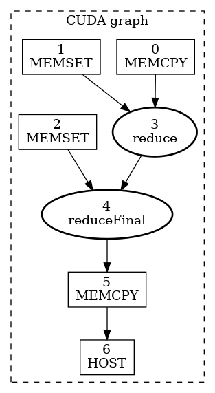
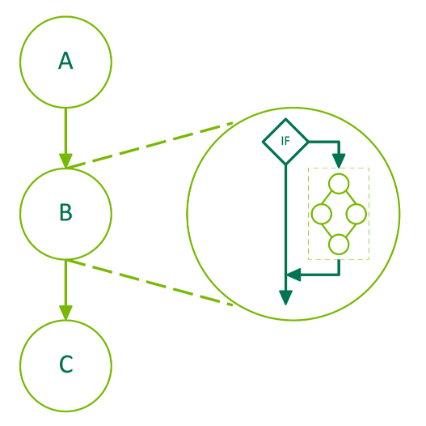
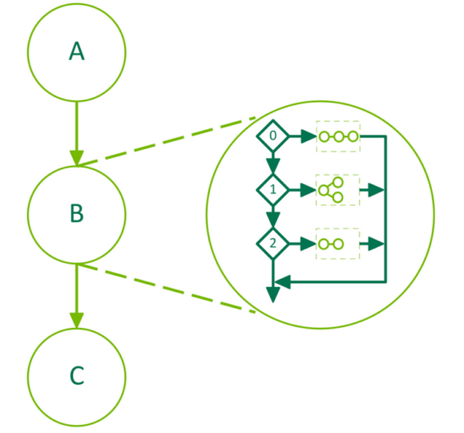
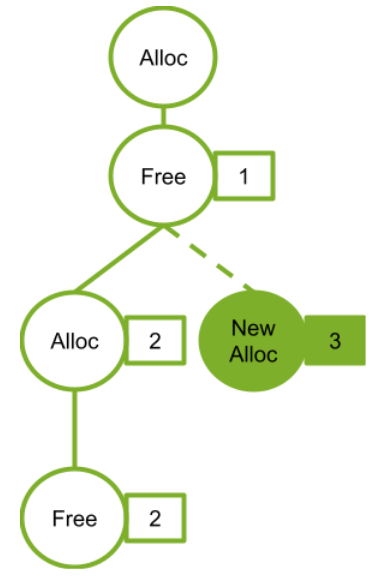
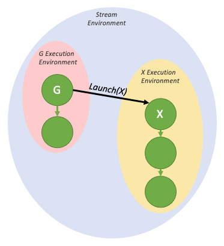

# 4.2 CUDA Graphs

> 本文档为 [NVIDIA CUDA Programming Guide](https://docs.nvidia.com/cuda/cuda-programming-guide/) 官方文档中文翻译版
>
> 原文地址：[https://docs.nvidia.com/cuda/cuda-programming-guide/04-special-topics/cuda-graphs.html](https://docs.nvidia.com/cuda/cuda-programming-guide/04-special-topics/cuda-graphs.html)

---

此页面是否有帮助？

# 4.2. CUDA 图

CUDA 图提供了 CUDA 中另一种工作提交模型。图是由一系列操作（例如内核启动、数据移动等）组成的，这些操作通过依赖关系连接起来，并且其定义与执行是分开的。这使得图可以定义一次，然后重复启动。将图的定义与其执行分离，实现了一系列优化：首先，与流相比，CPU 的启动开销降低了，因为许多设置工作已提前完成；其次，将整个工作流呈现给 CUDA，使得一些在流的分段工作提交机制下无法实现的优化成为可能。

为了理解使用图可能实现的优化，请考虑在流中发生的情况：当您将内核放入流中时，主机驱动程序会执行一系列操作，为在 GPU 上执行内核做准备。这些设置和启动内核所必需的操作是开销成本，每个被提交的内核都必须支付。对于一个执行时间很短的 GPU 内核来说，这种开销成本可能占整个端到端执行时间的很大一部分。通过创建一个包含将多次启动的工作流的 CUDA 图，这些开销成本可以在图实例化时为整个图一次性支付，然后图本身可以以极低的开销重复启动。

## 4.2.1. 图结构

一个操作构成图中的一个节点。操作之间的依赖关系就是边。这些依赖关系约束了操作的执行顺序。

一旦某个节点所依赖的节点完成，该操作就可以在任何时间被调度。调度工作由 CUDA 系统负责。

### 4.2.1.1. 节点类型

图节点可以是以下类型之一：

- 内核
- CPU 函数调用
- 内存复制
- 内存设置（memset）
- 空节点
- 等待 CUDA 事件
- 记录 CUDA 事件
- 通知外部信号量
- 等待外部信号量
- 条件节点
- 内存节点
- 子图：用于执行一个单独的嵌套图，如下图所示。


*图 21 子图示例#*

### 4.2.1.2. 边数据

CUDA 12.3 在 CUDA 图中引入了边数据。目前，非默认边数据的唯一用途是启用[编程式依赖启动](programmatic-dependent-launch.html#programmatic-dependent-launch-and-synchronization)。

一般来说，边数据修改了由边指定的依赖关系，它由三部分组成：出端口、入端口和类型。出端口指定了关联边何时被触发。入端口指定了节点的哪一部分依赖于关联边。类型修改了端点之间的关系。

端口值特定于节点类型和方向，并且边类型可能仅限于特定的节点类型。在所有情况下，零初始化的边数据代表默认行为。出端口 0 等待整个任务，入端口 0 阻塞整个任务，边类型 0 与具有内存同步行为的完全依赖相关联。
边数据可通过与关联节点并行的数组在各种图 API 中可选地指定。如果省略作为输入参数，则使用零初始化的数据。如果省略作为输出（查询）参数，当被忽略的边数据全部为零初始化时，API 会接受此情况；如果调用将丢弃信息，则返回 `cudaErrorLossyQuery`。

边数据在某些流捕获 API 中也可用：`cudaStreamBeginCaptureToGraph()`、`cudaStreamGetCaptureInfo()` 和 `cudaStreamUpdateCaptureDependencies()`。在这些情况下，尚不存在下游节点。数据与一个悬空边（半边）相关联，该边将连接到未来捕获的节点，或在流捕获终止时被丢弃。请注意，某些边类型不等待上游节点的完全完成。在考虑流捕获是否已完全重新加入原始流时，这些边会被忽略，并且不能在捕获结束时被丢弃。请参阅[流捕获](#cuda-graphs-creating-a-graph-using-stream-capture)。

没有节点类型定义额外的传入端口，只有内核节点定义额外的传出端口。存在一种非默认的依赖类型 `cudaGraphDependencyTypeProgrammatic`，用于在两个内核节点之间启用[编程式依赖启动](programmatic-dependent-launch.html#programmatic-dependent-launch-and-synchronization)。

## 4.2.2. 构建与运行图

使用图进行工作提交分为三个不同的阶段：定义、实例化和执行。

- 在定义或创建阶段，程序创建图中操作的描述以及它们之间的依赖关系。
- 实例化对图模板进行快照，验证它，并执行大部分工作的设置和初始化，旨在最小化启动时需要完成的工作。生成的实例称为可执行图。
- 可执行图可以启动到流中，类似于任何其他 CUDA 工作。它可以启动任意次数，而无需重复实例化。

### 4.2.2.1. 图创建

图可以通过两种机制创建：使用显式图 API 和通过流捕获。

#### 4.2.2.1.1. 图 API

以下是创建下图的一个示例（省略了声明和其他样板代码）。注意使用 `cudaGraphCreate()` 创建图，以及使用 `cudaGraphAddNode()` 添加内核节点及其依赖关系。[CUDA 运行时 API 文档](https://docs.nvidia.com/cuda/cuda-runtime-api/group__CUDART__GRAPH.html)列出了所有可用于添加节点和依赖关系的函数。


*图 22 使用图 API 创建图的示例*

```cuda
// 创建图 - 初始为空
cudaGraphCreate(&graph, 0);

// 创建节点及其依赖关系
cudaGraphNode_t nodes[4];
cudaGraphNodeParams kParams = { cudaGraphNodeTypeKernel };
kParams.kernel.func         = (void *)kernelName;
kParams.kernel.gridDim.x    = kParams.kernel.gridDim.y  = kParams.kernel.gridDim.z  = 1;
kParams.kernel.blockDim.x   = kParams.kernel.blockDim.y = kParams.kernel.blockDim.z = 1;

cudaGraphAddNode(&nodes[0], graph, NULL, NULL, 0, &kParams);
cudaGraphAddNode(&nodes[1], graph, &nodes[0], NULL, 1, &kParams);
cudaGraphAddNode(&nodes[2], graph, &nodes[0], NULL, 1, &kParams);
cudaGraphAddNode(&nodes[3], graph, &nodes[1], NULL, 2, &kParams);
```
上面的示例展示了四个具有依赖关系的内核节点，用以说明如何创建一个非常简单的图。在典型的用户应用程序中，还需要添加内存操作节点，例如 `cudaGraphAddMemcpyNode()` 等。有关添加节点的所有图 API 函数的完整参考，请参阅 [CUDA 运行时 API 文档](https://docs.nvidia.com/cuda/cuda-runtime-api/group__CUDART__GRAPH.html)。

#### 4.2.2.1.2. 流捕获

流捕获提供了一种从现有的基于流的 API 创建图的机制。可以将一段向流中启动工作的代码（包括现有代码）用 `cudaStreamBeginCapture()` 和 `cudaStreamEndCapture()` 调用括起来。如下所示。

```cuda
cudaGraph_t graph;

cudaStreamBeginCapture(stream);

kernel_A<<< ..., stream >>>(...);
kernel_B<<< ..., stream >>>(...);
libraryCall(stream);
kernel_C<<< ..., stream >>>(...);

cudaStreamEndCapture(stream, &graph);
```

调用 `cudaStreamBeginCapture()` 会使一个流进入捕获模式。当一个流处于捕获状态时，启动到该流中的工作不会排队等待执行，而是被追加到一个逐步构建的内部图中。然后通过调用 `cudaStreamEndCapture()` 返回该图，同时结束该流的捕获模式。通过流捕获正在积极构建的图称为*捕获图*。

流捕获可用于除 `cudaStreamLegacy`（"NULL 流"）之外的任何 CUDA 流。请注意，它*可以*用于 `cudaStreamPerThread`。如果程序正在使用传统流，则可能可以将流 0 重新定义为每线程流，而无需功能更改。请参阅[阻塞和非阻塞流以及默认流](../02-basics/asynchronous-execution.html#async-execution-blocking-non-blocking-default-stream)。

可以使用 `cudaStreamIsCapturing()` 查询流是否正在被捕获。

可以使用 `cudaStreamBeginCaptureToGraph()` 将工作捕获到现有图中。与捕获到内部图不同，工作被捕获到用户提供的图中。

##### 4.2.2.1.2.1. 跨流依赖和事件

流捕获可以处理使用 `cudaEventRecord()` 和 `cudaStreamWaitEvent()` 表达的跨流依赖，前提是等待的事件被记录到同一个捕获图中。

当事件在处于捕获模式的流中被记录时，会产生一个*捕获事件*。捕获事件表示捕获图中的一组节点。

当一个流等待一个捕获事件时，如果该流尚未处于捕获模式，则将其置于捕获模式，并且该流中的下一个项目将对捕获事件中的节点具有额外的依赖关系。然后，这两个流被捕获到同一个捕获图中。

当流捕获中存在跨流依赖时，仍然必须在调用 `cudaStreamBeginCapture()` 的同一个流中调用 `cudaStreamEndCapture()`；这个流称为*原始流*。任何其他由于基于事件的依赖关系而被捕获到同一个捕获图的流，也必须重新连接回原始流。如下所示。所有被捕获到同一个捕获图的流在调用 `cudaStreamEndCapture()` 时都会退出捕获模式。未能重新连接到原始流将导致整个捕获操作失败。

```cuda
// stream1 is the origin stream
cudaStreamBeginCapture(stream1);

kernel_A<<< ..., stream1 >>>(...);

// Fork into stream2
cudaEventRecord(event1, stream1);
cudaStreamWaitEvent(stream2, event1);

kernel_B<<< ..., stream1 >>>(...);
kernel_C<<< ..., stream2 >>>(...);

// Join stream2 back to origin stream (stream1)
cudaEventRecord(event2, stream2);
cudaStreamWaitEvent(stream1, event2);

kernel_D<<< ..., stream1 >>>(...);

// End capture in the origin stream
cudaStreamEndCapture(stream1, &graph);

// stream1 and stream2 no longer in capture mode
```

The graph returned by the above code is shown in [Figure 22](#cuda-graphs-creating-a-graph-using-api-fig-creating-using-graph-apis).

!!! note "Note"
    When a stream is taken out of capture mode, the next non-captured item in the stream (if any) will still have a dependency on the most recent prior non-captured item, despite intermediate items having been removed.

##### 4.2.2.1.2.2.Prohibited and Unhandled Operations

It is invalid to synchronize or query the execution status of a stream which is being captured or a captured event, because they do not represent items scheduled for execution. It is also invalid to query the execution status of or synchronize a broader handle which encompasses an active stream capture, such as a device or context handle when any associated stream is in capture mode.

When any stream in the same context is being captured, and it was not created with `cudaStreamNonBlocking`, any attempted use of the legacy stream is invalid. This is because the legacy stream handle at all times encompasses these other streams; enqueueing to the legacy stream would create a dependency on the streams being captured, and querying it or synchronizing it would query or synchronize the streams being captured.

It is therefore also invalid to call synchronous APIs in this case. One example of a synchronous APIs is `cudaMemcpy()` which enqueues work to the legacy stream and synchronizes on it before returning.

!!! note "Note"
    As a general rule, when a dependency relation would connect something that is captured with something that was not captured and instead enqueued for execution, CUDA prefers to return an error rather than ignore the dependency. An exception is made for placing a stream into or out of capture mode; this severs a dependency relation between items added to the stream immediately before and after the mode transition.

It is invalid to merge two separate capture graphs by waiting on a captured event from a stream which is being captured and is associated with a different capture graph than the event. It is invalid to wait on a non-captured event from a stream which is being captured without specifying the `cudaEventWaitExternal` flag.

A small number of APIs that enqueue asynchronous operations into streams are not currently supported in graphs and will return an error if called with a stream which is being captured, such as `cudaStreamAttachMemAsync()`.

##### 4.2.2.1.2.3.Invalidation
在流捕获期间尝试无效操作时，任何关联的捕获图都将*失效*。当捕获图失效后，继续使用任何正在捕获的流或与该图关联的捕获事件都是无效的，并将返回错误，直到通过 `cudaStreamEndCapture()` 结束流捕获。此调用将使关联的流退出捕获模式，但也会返回错误值和 NULL 图。

##### 4.2.2.1.2.4. 捕获内省

可以使用 `cudaStreamGetCaptureInfo()` 检查活动的流捕获操作。这允许用户获取捕获的状态、捕获的唯一（每个进程）ID、底层图对象以及流中下一个待捕获节点的依赖关系/边数据。此依赖信息可用于获取流中最后捕获的节点的句柄。

#### 4.2.2.1.3. 综合示例

[图 22](#cuda-graphs-creating-a-graph-using-api-fig-creating-using-graph-apis) 中的示例是一个简化的示例，旨在从概念上展示一个小型图。在利用 CUDA 图的应用中，使用图 API 或流捕获都更为复杂。以下代码片段并排比较了使用图 API 和流捕获来创建 CUDA 图以执行简单的两阶段归约算法。

[图 23](#cuda-graphs-visualize-a-graph-using-graphviz) 展示了此 CUDA 图，它是通过对以下代码应用 `cudaGraphDebugDotPrint` 函数生成的，并为了可读性进行了小幅调整，然后使用 [Graphviz](https://graphviz.org/) 渲染而成。



*图 23 使用两阶段归约内核的 CUDA 图示例*

**图 API**

```cuda
void cudaGraphsManual(float  *inputVec_h,
                      float  *inputVec_d,
                      double *outputVec_d,
                      double *result_d,
                      size_t  inputSize,
                      size_t  numOfBlocks)
{
   cudaStream_t                 streamForGraph;
   cudaGraph_t                  graph;
   std::vector<cudaGraphNode_t> nodeDependencies;
   cudaGraphNode_t              memcpyNode, kernelNode, memsetNode;
   double                       result_h = 0.0;

   cudaStreamCreate(&streamForGraph));

   cudaKernelNodeParams kernelNodeParams = {0};
   cudaMemcpy3DParms    memcpyParams     = {0};
   cudaMemsetParams     memsetParams     = {0};

   memcpyParams.srcArray = NULL;
   memcpyParams.srcPos   = make_cudaPos(0, 0, 0);
   memcpyParams.srcPtr   = make_cudaPitchedPtr(inputVec_h, sizeof(float) * inputSize, inputSize, 1);
   memcpyParams.dstArray = NULL;
   memcpyParams.dstPos   = make_cudaPos(0, 0, 0);
   memcpyParams.dstPtr   = make_cudaPitchedPtr(inputVec_d, sizeof(float) * inputSize, inputSize, 1);
   memcpyParams.extent   = make_cudaExtent(sizeof(float) * inputSize, 1, 1);
   memcpyParams.kind     = cudaMemcpyHostToDevice;

   memsetParams.dst         = (void *)outputVec_d;
   memsetParams.value       = 0;
   memsetParams.pitch       = 0;
   memsetParams.elementSize = sizeof(float); // elementSize can be max 4 bytes
   memsetParams.width       = numOfBlocks * 2;
   memsetParams.height      = 1;

   cudaGraphCreate(&graph, 0);
   cudaGraphAddMemcpyNode(&memcpyNode, graph, NULL, 0, &memcpyParams);
   cudaGraphAddMemsetNode(&memsetNode, graph, NULL, 0, &memsetParams);

   nodeDependencies.push_back(memsetNode);
   nodeDependencies.push_back(memcpyNode);

   void *kernelArgs[4] = {(void *)&inputVec_d, (void *)&outputVec_d, &inputSize, &numOfBlocks};

   kernelNodeParams.func           = (void *)reduce;
   kernelNodeParams.gridDim        = dim3(numOfBlocks, 1, 1);
   kernelNodeParams.blockDim       = dim3(THREADS_PER_BLOCK, 1, 1);
   kernelNodeParams.sharedMemBytes = 0;
   kernelNodeParams.kernelParams   = (void **)kernelArgs;
   kernelNodeParams.extra          = NULL;

   cudaGraphAddKernelNode(
      &kernelNode, graph, nodeDependencies.data(), nodeDependencies.size(), &kernelNodeParams);

   nodeDependencies.clear();
   nodeDependencies.push_back(kernelNode);

   memset(&memsetParams, 0, sizeof(memsetParams));
   memsetParams.dst         = result_d;
   memsetParams.value       = 0;
   memsetParams.elementSize = sizeof(float);
   memsetParams.width       = 2;
   memsetParams.height      = 1;
   cudaGraphAddMemsetNode(&memsetNode, graph, NULL, 0, &memsetParams);

   nodeDependencies.push_back(memsetNode);

   memset(&kernelNodeParams, 0, sizeof(kernelNodeParams));
   kernelNodeParams.func           = (void *)reduceFinal;
   kernelNodeParams.gridDim        = dim3(1, 1, 1);
   kernelNodeParams.blockDim       = dim3(THREADS_PER_BLOCK, 1, 1);
   kernelNodeParams.sharedMemBytes = 0;
   void *kernelArgs2[3]            = {(void *)&outputVec_d, (void *)&result_d, &numOfBlocks};
   kernelNodeParams.kernelParams   = kernelArgs2;
   kernelNodeParams.extra          = NULL;

   cudaGraphAddKernelNode(
      &kernelNode, graph, nodeDependencies.data(), nodeDependencies.size(), &kernelNodeParams);

   nodeDependencies.clear();
   nodeDependencies.push_back(kernelNode);

   memset(&memcpyParams, 0, sizeof(memcpyParams));

   memcpyParams.srcArray = NULL;
   memcpyParams.srcPos   = make_cudaPos(0, 0, 0);
   memcpyParams.srcPtr   = make_cudaPitchedPtr(result_d, sizeof(double), 1, 1);
   memcpyParams.dstArray = NULL;
   memcpyParams.dstPos   = make_cudaPos(0, 0, 0);
   memcpyParams.dstPtr   = make_cudaPitchedPtr(&result_h, sizeof(double), 1, 1);
   memcpyParams.extent   = make_cudaExtent(sizeof(double), 1, 1);
   memcpyParams.kind     = cudaMemcpyDeviceToHost;

   cudaGraphAddMemcpyNode(&memcpyNode, graph, nodeDependencies.data(), nodeDependencies.size(), &memcpyParams);
   nodeDependencies.clear();
   nodeDependencies.push_back(memcpyNode);

   cudaGraphNode_t    hostNode;
   cudaHostNodeParams hostParams = {0};
   hostParams.fn                 = myHostNodeCallback;
   callBackData_t hostFnData;
   hostFnData.data     = &result_h;
   hostFnData.fn_name  = "cudaGraphsManual";
   hostParams.userData = &hostFnData;

   cudaGraphAddHostNode(&hostNode, graph, nodeDependencies.data(), nodeDependencies.size(), &hostParams);
}
```
**流捕获**

```cuda
void cudaGraphsUsingStreamCapture(float  *inputVec_h,
                      float  *inputVec_d,
                      double *outputVec_d,
                      double *result_d,
                      size_t  inputSize,
                      size_t  numOfBlocks)
{
   cudaStream_t stream1, stream2, stream3, streamForGraph;
   cudaEvent_t  forkStreamEvent, memsetEvent1, memsetEvent2;
   cudaGraph_t  graph;
   double       result_h = 0.0;

   cudaStreamCreate(&stream1);
   cudaStreamCreate(&stream2);
   cudaStreamCreate(&stream3);
   cudaStreamCreate(&streamForGraph);

   cudaEventCreate(&forkStreamEvent);
   cudaEventCreate(&memsetEvent1);
   cudaEventCreate(&memsetEvent2);

   cudaStreamBeginCapture(stream1, cudaStreamCaptureModeGlobal);

   cudaEventRecord(forkStreamEvent, stream1);
   cudaStreamWaitEvent(stream2, forkStreamEvent, 0);
   cudaStreamWaitEvent(stream3, forkStreamEvent, 0);

   cudaMemcpyAsync(inputVec_d, inputVec_h, sizeof(float) * inputSize, cudaMemcpyDefault, stream1);

   cudaMemsetAsync(outputVec_d, 0, sizeof(double) * numOfBlocks, stream2);

   cudaEventRecord(memsetEvent1, stream2);

   cudaMemsetAsync(result_d, 0, sizeof(double), stream3);
   cudaEventRecord(memsetEvent2, stream3);

   cudaStreamWaitEvent(stream1, memsetEvent1, 0);

   reduce<<<numOfBlocks, THREADS_PER_BLOCK, 0, stream1>>>(inputVec_d, outputVec_d, inputSize, numOfBlocks);

   cudaStreamWaitEvent(stream1, memsetEvent2, 0);

   reduceFinal<<<1, THREADS_PER_BLOCK, 0, stream1>>>(outputVec_d, result_d, numOfBlocks);
   cudaMemcpyAsync(&result_h, result_d, sizeof(double), cudaMemcpyDefault, stream1);

   callBackData_t hostFnData = {0};
   hostFnData.data           = &result_h;
   hostFnData.fn_name        = "cudaGraphsUsingStreamCapture";
   cudaHostFn_t fn           = myHostNodeCallback;
   cudaLaunchHostFunc(stream1, fn, &hostFnData);
   cudaStreamEndCapture(stream1, &graph);
}
```

### 4.2.2.2. 图实例化

一旦通过图 API 或流捕获创建了一个图，必须对该图进行实例化以创建可执行图，然后才能启动它。假设 `cudaGraph_t graph` 已成功创建，以下代码将实例化该图并创建可执行图 `cudaGraphExec_t graphExec`：

```cuda
cudaGraphExec_t graphExec;
cudaGraphInstantiate(&graphExec, graph, NULL, NULL, 0);
```

### 4.2.2.3. 图执行

在创建图并实例化生成可执行图之后，就可以启动它了。假设 `cudaGraphExec_t graphExec` 已成功创建，以下代码片段将在指定的流中启动该图：

```cuda
cudaGraphLaunch(graphExec, stream);
```

将以上步骤整合起来，并使用[第 4.2.2.1.2 节](#cuda-graphs-creating-a-graph-using-stream-capture)中的流捕获示例，以下代码片段将创建一个图，对其进行实例化，然后启动它：

```cuda
cudaGraph_t graph;

cudaStreamBeginCapture(stream);

kernel_A<<< ..., stream >>>(...);
kernel_B<<< ..., stream >>>(...);
libraryCall(stream);
kernel_C<<< ..., stream >>>(...);

cudaStreamEndCapture(stream, &graph);

cudaGraphExec_t graphExec;
cudaGraphInstantiate(&graphExec, graph, NULL, NULL, 0);
cudaGraphLaunch(graphExec, stream);
```
## 4.2.3. 更新已实例化的图

当工作流程发生变化时，图会变得过时，必须进行修改。图结构的重大更改（例如拓扑结构或节点类型）需要重新实例化，因为必须重新应用与拓扑相关的优化。然而，常见的情况是只有节点参数（例如内核参数和内存地址）发生变化，而图的拓扑结构保持不变。对于这种情况，CUDA 提供了一种轻量级的“图更新”机制，允许在适当位置修改某些节点参数，而无需重建整个图，这比重新实例化高效得多。

更新会在图下一次启动时生效，因此它们不会影响之前的图启动，即使在更新时之前的图正在运行。一个图可以被反复更新和重新启动，因此可以在一个流上排队多个更新/启动操作。

CUDA 提供了两种机制来更新已实例化图的参数：整图更新和单个节点更新。整图更新允许用户提供一个拓扑结构相同的 `cudaGraph_t` 对象，其节点包含更新后的参数。单个节点更新允许用户显式地更新单个节点的参数。当需要更新大量节点，或者调用者不知道图的拓扑结构时（例如，图是由库调用的流捕获产生的），使用更新后的 `cudaGraph_t` 更为方便。当更改数量较少且用户拥有需要更新的节点的句柄时，首选使用单个节点更新。单个节点更新会跳过未更改节点的拓扑检查和比较，因此在许多情况下可能更高效。

CUDA 还提供了一种机制，用于启用和禁用单个节点，而不影响其当前参数。

以下各节将更详细地解释每种方法。

### 4.2.3.1. 整图更新

`cudaGraphExecUpdate()` 允许使用拓扑结构相同的图（“更新图”）中的参数来更新已实例化的图（“原始图”）。更新图的拓扑结构必须与用于实例化 `cudaGraphExec_t` 的原始图相同。此外，指定依赖关系的顺序也必须匹配。最后，CUDA 需要一致地对汇节点（没有依赖关系的节点）进行排序。CUDA 依赖于特定 API 调用的顺序来实现一致的汇节点排序。

更明确地说，遵循以下规则将使 `cudaGraphExecUpdate()` 能够确定性地配对原始图和更新图中的节点：

1.  对于任何捕获流，对该流进行操作的 API 调用必须以相同的顺序进行，包括事件等待以及其他不直接对应于节点创建的 API 调用。
2.  直接操作给定图节点入边（包括捕获流 API、节点添加 API 以及边添加/移除 API）的 API 调用必须以相同的顺序进行。此外，当通过这些 API 以数组形式指定依赖关系时，这些数组内指定的依赖关系顺序必须匹配。
3. 汇节点必须保持一致的顺序。汇节点是指在调用 `cudaGraphExecUpdate()` 时，最终图中没有依赖节点/出边的节点。以下操作会影响汇节点的顺序（如果存在），并且必须（作为一个组合集）以相同的顺序执行：导致生成汇节点的节点添加 API；导致节点变为汇节点的边移除操作；`cudaStreamUpdateCaptureDependencies()`（如果它从捕获流的依赖集中移除了一个汇节点）；`cudaStreamEndCapture()`。

以下示例展示了如何使用该 API 来更新已实例化的图：

```cuda
cudaGraphExec_t graphExec = NULL;

for (int i = 0; i < 10; i++) {
    cudaGraph_t graph;
    cudaGraphExecUpdateResult updateResult;
    cudaGraphNode_t errorNode;

    // 在此示例中，我们使用流捕获来创建图。
    // 您也可以使用 Graph API 来生成图。
    cudaStreamBeginCapture(stream, cudaStreamCaptureModeGlobal);

    // 调用用户定义的、基于流的工作负载，例如
    do_cuda_work(stream);

    cudaStreamEndCapture(stream, &graph);

    // 如果已经实例化了图，尝试直接更新它
    // 以避免实例化开销
    if (graphExec != NULL) {
        // 如果图更新失败，errorNode 将被设置为
        // 导致失败的节点，updateResult 将被设置为
        // 原因代码。
        cudaGraphExecUpdate(graphExec, graph, &errorNode, &updateResult);
    }

    // 在第一次迭代或更新因任何原因失败时进行实例化
    if (graphExec == NULL || updateResult != cudaGraphExecUpdateSuccess) {

        // 如果之前的更新失败，在重新实例化之前销毁 cudaGraphExec_t
        if (graphExec != NULL) {
            cudaGraphExecDestroy(graphExec);
        }
        // 从 graph 实例化 graphExec。此处未使用错误节点和
        // 错误消息参数。
        cudaGraphInstantiate(&graphExec, graph, NULL, NULL, 0);
    }

    cudaGraphDestroy(graph);
    cudaGraphLaunch(graphExec, stream);
    cudaStreamSynchronize(stream);
}
```

典型的工作流程是：首先使用流捕获或 Graph API 创建初始的 `cudaGraph_t`。然后像通常那样实例化并启动该图。在初始启动之后，使用与初始图相同的方法创建一个新的 `cudaGraph_t`，并调用 `cudaGraphExecUpdate()`。如果图更新成功（如上例中的 `updateResult` 参数所示），则启动更新后的 `cudaGraphExec_t`。如果更新因任何原因失败，则调用 `cudaGraphExecDestroy()` 和 `cudaGraphInstantiate()` 来销毁原始的 `cudaGraphExec_t` 并实例化一个新的。

也可以直接更新 `cudaGraph_t` 节点（例如，使用 `cudaGraphKernelNodeSetParams()`），然后更新 `cudaGraphExec_t`，但使用下一节介绍的显式节点更新 API 效率更高。
条件句柄标志和默认值会作为图更新的一部分进行更新。

有关使用方法和当前限制的更多信息，请参阅[图 API](https://docs.nvidia.com/cuda/cuda-runtime-api/group__CUDART__GRAPH.html#group__CUDART__GRAPH)。

### 4.2.3.2. 单个节点更新

已实例化的图节点参数可以直接更新。这消除了实例化的开销以及创建新 `cudaGraph_t` 的开销。如果相对于图中节点总数，需要更新的节点数量较少，则最好单独更新节点。以下方法可用于更新 `cudaGraphExec_t` 节点：

| API | 节点类型 |
| --- | --- |
| cudaGraphExecKernelNodeSetParams() | 内核节点 |
| cudaGraphExecMemcpyNodeSetParams() | 内存复制节点 |
| cudaGraphExecMemsetNodeSetParams() | 内存设置节点 |
| cudaGraphExecHostNodeSetParams() | 主机节点 |
| cudaGraphExecChildGraphNodeSetParams() | 子图节点 |
| cudaGraphExecEventRecordNodeSetEvent() | 事件记录节点 |
| cudaGraphExecEventWaitNodeSetEvent() | 事件等待节点 |
| cudaGraphExecExternalSemaphoresSignalNodeSetParams() | 外部信号量信号节点 |
| cudaGraphExecExternalSemaphoresWaitNodeSetParams() | 外部信号量等待节点 |

有关使用方法和当前限制的更多信息，请参阅[图 API](https://docs.nvidia.com/cuda/cuda-runtime-api/group__CUDART__GRAPH.html#group__CUDART__GRAPH)。

### 4.2.3.3. 单个节点启用/禁用

可以使用 `cudaGraphNodeSetEnabled()` API 来启用或禁用已实例化图中的内核、memset 和 memcpy 节点。这允许创建一个包含所需功能超集的图，该图可以为每次启动进行定制。可以使用 `cudaGraphNodeGetEnabled()` API 查询节点的启用状态。

一个被禁用的节点在功能上等同于空节点，直到它被重新启用。节点参数不受启用/禁用节点的影响。启用状态不受单个节点更新或使用 `cudaGraphExecUpdate()` 进行整个图更新的影响。节点被禁用时的参数更新将在节点重新启用时生效。

有关使用方法和当前限制的更多信息，请参阅[图 API](https://docs.nvidia.com/cuda/cuda-runtime-api/group__CUDART__GRAPH.html#group__CUDART__GRAPH)。

### 4.2.3.4. 图更新限制

内核节点：
- 函数所属的上下文不能更改。
- 原本未使用 CUDA 动态并行性的函数节点不能更新为使用 CUDA 动态并行性的函数。

`cudaMemset` 和 `cudaMemcpy` 节点：
- 操作数分配/映射到的 CUDA 设备不能更改。
- 源/目标内存必须从与原始源/目标内存相同的上下文中分配。
- 只能更改一维的 cudaMemset / cudaMemcpy 节点。

额外的 memcpy 节点限制：
- 不支持更改源或目标内存类型（例如，cudaPitchedPtr、cudaArray_t 等）或传输类型（例如，cudaMemcpyKind）。
外部信号量等待节点和记录节点：

- 不支持更改信号量数量。

条件节点：

- 句柄创建和分配的顺序必须在图之间匹配。
- 不支持更改节点参数（即条件节点中的图数量、节点上下文等）。
- 更改条件体图中节点的参数需遵守上述规则。

内存节点：

- 如果 `cudaGraph_t` 当前已实例化为不同的 `cudaGraphExec_t`，则无法使用该 `cudaGraph_t` 更新 `cudaGraphExec_t`。

对主机节点、事件记录节点或事件等待节点的更新没有限制。

## 4.2.4. 条件图节点

条件节点允许执行条件节点内包含的图的条件执行和循环。这使得动态和迭代的工作流能够完全在图中表示，并释放主机 CPU 以并行执行其他工作。

当条件节点的依赖项满足时，将在设备上评估条件值。条件节点可以是以下类型之一：

- 条件 IF 节点：如果节点执行时条件值非零，则执行其体图一次。可以提供可选的第二个体图，如果节点执行时条件值为零，则该体图将执行一次。
- 条件 WHILE 节点：如果节点执行时条件值非零，则执行其体图，并将继续执行其体图，直到条件值为零。
- 条件 SWITCH 节点：如果条件值等于 n，则执行从零开始索引的第 n 个体图一次。如果条件值不对应于任何体图，则不启动任何体图。

条件值通过[条件句柄](#cuda-graphs-conditional-handles)访问，该句柄必须在节点之前创建。条件值可以通过设备代码使用 `cudaGraphSetConditional()` 设置。在创建句柄时，还可以指定每次图启动时应用的默认值。

创建条件节点时，会创建一个空图，并将句柄返回给用户，以便填充该图。可以使用[图 API](#cuda-graphs-creating-a-graph-using-graph-apis) 或 [cudaStreamBeginCaptureToGraph()](#cuda-graphs-creating-a-graph-using-stream-capture) 来填充此条件体图。

条件节点可以嵌套。

### 4.2.4.1. 条件句柄

条件值由 `cudaGraphConditionalHandle` 表示，并通过 `cudaGraphConditionalHandleCreate()` 创建。

句柄必须与单个条件节点关联。句柄无法销毁，因此无需跟踪它们。

如果在创建句柄时指定了 `cudaGraphCondAssignDefault`，则条件值将在每次图执行开始时初始化为指定的默认值。如果未提供此标志，则条件值在每次图执行开始时是未定义的，代码不应假设条件值在执行之间保持不变。
与句柄关联的默认值和标志将在[全图更新](#cuda-graphs-whole-graph-update)期间更新。

### 4.2.4.2. 条件节点主体图要求

一般要求：

-   图的所有节点必须位于单个设备上。
-   图只能包含内核节点、空节点、内存复制节点、内存设置节点、子图节点和条件节点。

内核节点：

-   不允许图中的内核使用 CUDA 动态并行或设备图启动。
-   只要未使用 MPS，就允许协作启动。

内存复制/内存设置节点：

-   只允许涉及设备内存和/或固定的设备映射主机内存的复制/设置操作。
-   不允许涉及 CUDA 数组的复制/设置操作。
-   两个操作数在实例化时必须可从当前设备访问。请注意，复制操作将由图所在的设备执行，即使其目标是另一个设备上的内存。

### 4.2.4.3. 条件 IF 节点

如果节点执行时条件非零，则 IF 节点的主体图将执行一次。下图描述了一个包含三个节点的图，其中中间的节点 B 是一个条件节点：



*图 24 条件 IF 节点*

以下代码说明了如何创建一个包含 IF 条件节点的图。条件默认值使用上游内核设置。条件主体使用[图 API](#cuda-graphs-creating-a-graph-using-graph-apis) 填充。

```cuda
__global__ void setHandle(cudaGraphConditionalHandle handle, int value)
{
    ...
    // Set the condition value to the value passed to the kernel
    cudaGraphSetConditional(handle, value);
    ...
}

void graphSetup() {
    cudaGraph_t graph;
    cudaGraphExec_t graphExec;
    cudaGraphNode_t node;
    void *kernelArgs[2];
    int value = 1;

    // Create the graph
    cudaGraphCreate(&graph, 0);

    // Create the conditional handle; because no default value is provided, the condition value is undefined at the start of each graph execution
    cudaGraphConditionalHandle handle;
    cudaGraphConditionalHandleCreate(&handle, graph);

    // Use a kernel upstream of the conditional to set the handle value
    cudaGraphNodeParams params = { cudaGraphNodeTypeKernel };
    params.kernel.func = (void *)setHandle;
    params.kernel.gridDim.x = params.kernel.gridDim.y = params.kernel.gridDim.z = 1;
    params.kernel.blockDim.x = params.kernel.blockDim.y = params.kernel.blockDim.z = 1;
    params.kernel.kernelParams = kernelArgs;
    kernelArgs[0] = &handle;
    kernelArgs[1] = &value;
    cudaGraphAddNode(&node, graph, NULL, 0, &params);

    // Create and add the conditional node
    cudaGraphNodeParams cParams = { cudaGraphNodeTypeConditional };
    cParams.conditional.handle = handle;
    cParams.conditional.type   = cudaGraphCondTypeIf;
    cParams.conditional.size   = 1; // There is only an "if" body graph
    cudaGraphAddNode(&node, graph, &node, 1, &cParams);

    // Get the body graph of the conditional node
    cudaGraph_t bodyGraph = cParams.conditional.phGraph_out[0];

    // Populate the body graph of the IF conditional node
    ...
    cudaGraphAddNode(&node, bodyGraph, NULL, 0, &params);

    // Instantiate and launch the graph
    cudaGraphInstantiate(&graphExec, graph, NULL, NULL, 0);
    cudaGraphLaunch(graphExec, 0);
    cudaDeviceSynchronize();

    // Clean up
    cudaGraphExecDestroy(graphExec);
    cudaGraphDestroy(graph);
}
```
IF 节点还可以包含一个可选的第二个主体图，当节点执行时，如果条件值为零，该主体图会执行一次。

```cuda
void graphSetup() {
    cudaGraph_t graph;
    cudaGraphExec_t graphExec;
    cudaGraphNode_t node;
    void *kernelArgs[2];
    int value = 1;

    // 创建图
    cudaGraphCreate(&graph, 0);

    // 创建条件句柄；由于未提供默认值，条件值在每次图执行开始时是未定义的
    cudaGraphConditionalHandle handle;
    cudaGraphConditionalHandleCreate(&handle, graph);

    // 在条件节点上游使用一个内核来设置句柄值
    cudaGraphNodeParams params = { cudaGraphNodeTypeKernel };
    params.kernel.func = (void *)setHandle;
    params.kernel.gridDim.x = params.kernel.gridDim.y = params.kernel.gridDim.z = 1;
    params.kernel.blockDim.x = params.kernel.blockDim.y = params.kernel.blockDim.z = 1;
    params.kernel.kernelParams = kernelArgs;
    kernelArgs[0] = &handle;
    kernelArgs[1] = &value;
    cudaGraphAddNode(&node, graph, NULL, 0, &params);

    // 创建并添加 IF 条件节点
    cudaGraphNodeParams cParams = { cudaGraphNodeTypeConditional };
    cParams.conditional.handle = handle;
    cParams.conditional.type   = cudaGraphCondTypeIf;
    cParams.conditional.size   = 2; // 同时包含 "if" 和 "else" 主体图
    cudaGraphAddNode(&node, graph, &node, 1, &cParams);

    // 获取条件节点的主体图
    cudaGraph_t ifBodyGraph = cParams.conditional.phGraph_out[0];
    cudaGraph_t elseBodyGraph = cParams.conditional.phGraph_out[1];

    // 填充 IF 条件节点的主体图
    ...
    cudaGraphAddNode(&node, ifBodyGraph, NULL, 0, &params);
    ...
    cudaGraphAddNode(&node, elseBodyGraph, NULL, 0, &params);

    // 实例化并启动图
    cudaGraphInstantiate(&graphExec, graph, NULL, NULL, 0);
    cudaGraphLaunch(graphExec, 0);
    cudaDeviceSynchronize();

    // 清理
    cudaGraphExecDestroy(graphExec);
    cudaGraphDestroy(graph);
}
```

### 4.2.4.4. 条件 WHILE 节点

只要条件非零，WHILE 节点的主体图就会执行。条件将在节点执行时以及主体图完成后进行评估。下图描述了一个包含三个节点的图，其中中间节点 B 是一个条件节点：


*图 25 条件 WHILE 节点*

以下代码说明了如何创建一个包含 WHILE 条件节点的图。句柄是使用 *cudaGraphCondAssignDefault* 创建的，以避免需要上游内核。条件的主体是使用[图 API](#cuda-graphs-creating-a-graph-using-graph-apis) 填充的。

```cuda
__global__ void loopKernel(cudaGraphConditionalHandle handle, char *dPtr)
{
   // 递减 dPtr 的值，一旦 dPtr 为 0，就将条件值设置为 0
   if (--(*dPtr) == 0) {
      cudaGraphSetConditional(handle, 0);
   }
}

void graphSetup() {
    cudaGraph_t graph;
    cudaGraphExec_t graphExec;
    cudaGraphNode_t node;
    void *kernelArgs[2];

    // 分配一个字节的设备内存作为输入
    char *dPtr;
    cudaMalloc((void **)&dPtr, 1);

    // 创建图
    cudaGraphCreate(&graph, 0);

    // 创建条件句柄，默认值为 1
    cudaGraphConditionalHandle handle;
    cudaGraphConditionalHandleCreate(&handle, graph, 1, cudaGraphCondAssignDefault);

    // 创建并添加 WHILE 条件节点
    cudaGraphNodeParams cParams = { cudaGraphNodeTypeConditional };
    cParams.conditional.handle = handle;
    cParams.conditional.type   = cudaGraphCondTypeWhile;
    cParams.conditional.size   = 1;
    cudaGraphAddNode(&node, graph, NULL, 0, &cParams);

    // 获取条件节点的主体图
    cudaGraph_t bodyGraph = cParams.conditional.phGraph_out[0];

    // 填充条件节点的主体图
    cudaGraphNodeParams params = { cudaGraphNodeTypeKernel };
    params.kernel.func = (void *)loopKernel;
    params.kernel.gridDim.x = params.kernel.gridDim.y = params.kernel.gridDim.z = 1;
    params.kernel.blockDim.x = params.kernel.blockDim.y = params.kernel.blockDim.z = 1;
    params.kernel.kernelParams = kernelArgs;
    kernelArgs[0] = &handle;
    kernelArgs[1] = &dPtr;
    cudaGraphAddNode(&node, bodyGraph, NULL, 0, &params);

    // 初始化设备内存，实例化并启动图
    cudaMemset(dPtr, 10, 1); // 将 dPtr 设置为 10；循环将运行直到 dPtr 为 0
    cudaGraphInstantiate(&graphExec, graph, NULL, NULL, 0);
    cudaGraphLaunch(graphExec, 0);
    cudaDeviceSynchronize();

    // 清理
    cudaGraphExecDestroy(graphExec);
    cudaGraphDestroy(graph);
    cudaFree(dPtr);
}
```
### 4.2.4.5. 条件 SWITCH 节点

当执行 SWITCH 节点时，如果条件值等于 n，则其从零开始索引的第 n 个体图将被执行一次。下图描述了一个包含三个节点的图，其中中间的节点 B 是一个条件节点：



*图 26 条件 SWITCH 节点*

以下代码说明了如何创建一个包含 SWITCH 条件节点的图。条件值通过一个上游内核设置。条件节点的各个体图使用[图 API](#cuda-graphs-creating-a-graph-using-graph-apis) 进行填充。

```cuda
__global__ void setHandle(cudaGraphConditionalHandle handle, int value)
{
    ...
    // 将条件值设置为传递给内核的值
    cudaGraphSetConditional(handle, value);
    ...
}

void graphSetup() {
    cudaGraph_t graph;
    cudaGraphExec_t graphExec;
    cudaGraphNode_t node;
    void *kernelArgs[2];
    int value = 1;

    // 创建图
    cudaGraphCreate(&graph, 0);

    // 创建条件句柄；由于未提供默认值，条件值在每次图执行开始时是未定义的
    cudaGraphConditionalHandle handle;
    cudaGraphConditionalHandleCreate(&handle, graph);

    // 使用条件节点上游的一个内核来设置句柄值
    cudaGraphNodeParams params = { cudaGraphNodeTypeKernel };
    params.kernel.func = (void *)setHandle;
    params.kernel.gridDim.x = params.kernel.gridDim.y = params.kernel.gridDim.z = 1;
    params.kernel.blockDim.x = params.kernel.blockDim.y = params.kernel.blockDim.z = 1;
    params.kernel.kernelParams = kernelArgs;
    kernelArgs[0] = &handle;
    kernelArgs[1] = &value;
    cudaGraphAddNode(&node, graph, NULL, 0, &params);

    // 创建并添加条件 SWITCH 节点
    cudaGraphNodeParams cParams = { cudaGraphNodeTypeConditional };
    cParams.conditional.handle = handle;
    cParams.conditional.type   = cudaGraphCondTypeSwitch;
    cParams.conditional.size   = 5;
    cudaGraphAddNode(&node, graph, &node, 1, &cParams);

    // 获取条件节点的体图
    cudaGraph_t *bodyGraphs = cParams.conditional.phGraph_out;

    // 填充 SWITCH 条件节点的体图
    ...
    cudaGraphAddNode(&node, bodyGraphs[0], NULL, 0, &params);
    ...
    cudaGraphAddNode(&node, bodyGraphs[4], NULL, 0, &params);

    // 实例化并启动图
    cudaGraphInstantiate(&graphExec, graph, NULL, NULL, 0);
    cudaGraphLaunch(graphExec, 0);
    cudaDeviceSynchronize();

    // 清理
    cudaGraphExecDestroy(graphExec);
    cudaGraphDestroy(graph);
}
```

## 4.2.5. 图内存节点

### 4.2.5.1. 简介

图内存节点允许图创建并拥有内存分配。图内存节点具有 GPU 顺序生命周期语义，这些语义规定了何时允许在设备上访问内存。这些 GPU 顺序生命周期语义支持驱动程序管理的内存重用，并且与流顺序分配 API `cudaMallocAsync` 和 `cudaFreeAsync` 的语义相匹配，这些 API 在创建图时可以被捕获。
图分配在图的整个生命周期内（包括重复实例化和启动）具有固定地址。这使得内存可以被图中的其他操作直接引用，而无需更新图，即使 CUDA 更改了底层物理内存。在一个图内，其图序生命周期不重叠的分配可以使用相同的底层物理内存。

CUDA 可以在多个图之间重用相同的物理内存进行分配，根据 GPU 序生命周期语义对虚拟地址映射进行别名化。例如，当不同的图被启动到同一个流中时，CUDA 可以虚拟别名化相同的物理内存，以满足具有单图生命周期的分配需求。

### 4.2.5.2. API 基础

图内存节点是表示内存分配或释放操作的图节点。简而言之，分配内存的节点称为分配节点。同样，释放内存的节点称为释放节点。由分配节点创建的分配称为图分配。CUDA 在节点创建时为图分配分配虚拟地址。虽然这些虚拟地址在分配节点的生命周期内是固定的，但分配内容在释放操作后不会持久存在，并且可能被引用不同分配的访问覆盖。

图分配在每次图运行时都被视为重新创建。图分配的生命周期（不同于节点的生命周期）始于 GPU 执行到达分配图节点时，并在以下任一情况发生时结束：

- GPU 执行到达释放图节点
- GPU 执行到达释放的 `cudaFreeAsync()` 流调用
- 调用 `cudaFree()` 释放时立即结束

!!! note "注意"
    图销毁不会自动释放任何存活的图分配内存，即使它结束了分配节点的生命周期。分配必须随后在另一个图中释放，或使用 `cudaFreeAsync()` / `cudaFree()`。

就像其他[图结构](#cuda-graphs-graph-structure)一样，图内存节点通过依赖边在图中排序。程序必须保证访问图内存的操作：

- 在分配节点之后排序
- 在释放内存的操作之前排序

图分配生命周期根据 GPU 执行（而非 API 调用）开始并通常结束。GPU 顺序是工作在 GPU 上运行的顺序，而非工作入队或描述的顺序。因此，图分配被认为是“GPU 序的”。

#### 4.2.5.2.1. 图节点 API

图内存节点可以通过节点创建 API `cudaGraphAddNode` 显式创建。添加 `cudaGraphNodeTypeMemAlloc` 节点时分配的地址会在传递的 `cudaGraphNodeParams` 结构的 `alloc::dptr` 字段中返回给用户。在分配图中使用图分配的所有操作必须在分配节点之后排序。类似地，任何释放节点必须在图中所有使用该分配的操作之后排序。释放节点使用 `cudaGraphAddNode` 和节点类型 `cudaGraphNodeTypeMemFree` 创建。
在下图中，有一个包含分配节点和释放节点的示例图。内核节点 **a**、**b** 和 **c** 被安排在分配节点之后、释放节点之前，这样内核就可以访问该分配。内核节点 **e** 没有安排在分配节点之后，因此无法安全地访问该内存。内核节点 **d** 没有安排在释放节点之前，因此它无法安全地访问该内存。


*图 27 内核节点*

以下代码片段建立了图中的关系：

```cuda
// 创建图 - 初始为空
cudaGraphCreate(&graph, 0);

// 基本分配的参数
cudaGraphNodeParams params = { cudaGraphNodeTypeMemAlloc };
params.alloc.poolProps.allocType = cudaMemAllocationTypePinned;
params.alloc.poolProps.location.type = cudaMemLocationTypeDevice;
// 指定设备 0 为常驻设备
params.alloc.poolProps.location.id = 0;
params.alloc.bytesize = size;

cudaGraphAddNode(&allocNode, graph, NULL, NULL, 0, &params);

// 创建一个使用图分配的内核节点
cudaGraphNodeParams nodeParams = { cudaGraphNodeTypeKernel };
nodeParams.kernel.kernelParams[0] = params.alloc.dptr;
// ...设置其他内核节点参数...

// 将内核节点添加到图中
cudaGraphAddNode(&a, graph, &allocNode, 1, NULL, &nodeParams);
cudaGraphAddNode(&b, graph, &a, 1, NULL, &nodeParams);
cudaGraphAddNode(&c, graph, &a, 1, NULL, &nodeParams);
cudaGraphNode_t dependencies[2];
// 内核节点 b 和 c 正在使用图分配，因此释放节点必须依赖于它们。由于节点 b 对节点 a 的依赖建立了间接依赖，释放节点不需要显式依赖于节点 a。
dependencies[0] = b;
dependencies[1] = c;
cudaGraphNodeParams freeNodeParams = { cudaGraphNodeTypeMemFree };
freeNodeParams.free.dptr = params.alloc.dptr;
cudaGraphAddNode(&freeNode, graph, dependencies, NULL, 2, freeNodeParams);
// 释放节点不依赖于内核节点 d，因此 d 不得访问已释放的图分配。
cudaGraphAddNode(&d, graph, &c, NULL, 1, &nodeParams);

// 节点 e 不依赖于分配节点，因此它不得访问该分配。即使释放节点依赖于内核节点 e，情况也是如此。
cudaGraphAddNode(&e, graph, NULL, NULL, 0, &nodeParams);
```

#### 4.2.5.2.2. 流捕获

可以通过捕获相应的流顺序分配和释放调用 `cudaMallocAsync` 和 `cudaFreeAsync` 来创建图内存节点。在这种情况下，捕获的分配 API 返回的虚拟地址可以被图中的其他操作使用。由于流顺序依赖关系将被捕获到图中，流顺序分配 API 的排序要求保证了图内存节点将相对于捕获的流操作被正确排序（对于正确编写的流代码）。

为了清晰起见，忽略内核节点 **d** 和 **e**，以下代码片段展示了如何使用流捕获来创建上图中的图：

```cuda
cudaMallocAsync(&dptr, size, stream1);
kernel_A<<< ..., stream1 >>>(dptr, ...);

// Fork into stream2
cudaEventRecord(event1, stream1);
cudaStreamWaitEvent(stream2, event1);

kernel_B<<< ..., stream1 >>>(dptr, ...);
// event dependencies translated into graph dependencies, so the kernel node created by the capture of kernel C will depend on the allocation node created by capturing the cudaMallocAsync call.
kernel_C<<< ..., stream2 >>>(dptr, ...);

// Join stream2 back to origin stream (stream1)
cudaEventRecord(event2, stream2);
cudaStreamWaitEvent(stream1, event2);

// Free depends on all work accessing the memory.
cudaFreeAsync(dptr, stream1);

// End capture in the origin stream
cudaStreamEndCapture(stream1, &graph);
```

#### 4.2.5.2.3.Accessing and Freeing Graph Memory Outside of the Allocating Graph

Graph allocations do not have to be freed by the allocating graph. When a graph does not free an allocation, that allocation persists beyond the execution of the graph and can be accessed by subsequent CUDA operations. These allocations may be accessed in another graph or directly using a stream operation as long as the accessing operation is ordered after the allocation through CUDA events and other stream ordering mechanisms. An allocation may subsequently be freed by regular calls to `cudaFree`, `cudaFreeAsync`, or by the launch of another graph with a corresponding free node, or a subsequent launch of the allocating graph (if it was instantiated with the [graph-memory-nodes-cudagraphinstantiateflagautofreeonlaunch](#cuda-graphs-graph-memory-nodes-cudagraphinstantiateflagautofreeonlaunch) flag). It is illegal to access memory after it has been freed - the free operation must be ordered after all operations accessing the memory using graph dependencies, CUDA events, and other stream ordering mechanisms.

!!! note "Note"
    Since graph allocations may share underlying physical memory, free operations must be ordered after all device operations complete. Out-of-band synchronization (such as memory-based synchronization within a compute kernel) is insufficient for ordering between memory writes and free operations. For more information, see the Virtual Aliasing Support rules relating to consistency and coherency.

The three following code snippets demonstrate accessing graph allocations outside of the allocating graph with ordering properly established by: using a single stream, using events between streams, and using events baked into the allocating and freeing graph.

First, ordering established by using a single stream:

```cuda
// Contents of allocating graph
void *dptr;
cudaGraphNodeParams params = { cudaGraphNodeTypeMemAlloc };
params.alloc.poolProps.allocType = cudaMemAllocationTypePinned;
params.alloc.poolProps.location.type = cudaMemLocationTypeDevice;
params.alloc.bytesize = size;
cudaGraphAddNode(&allocNode, allocGraph, NULL, NULL, 0, &params);
dptr = params.alloc.dptr;

cudaGraphInstantiate(&allocGraphExec, allocGraph, NULL, NULL, 0);

cudaGraphLaunch(allocGraphExec, stream);
kernel<<< ..., stream >>>(dptr, ...);
cudaFreeAsync(dptr, stream);
```
其次，通过记录和等待 CUDA 事件建立的顺序：

```cuda
// 分配图的内容
void *dptr;

// 分配图的内容
cudaGraphAddNode(&allocNode, allocGraph, NULL, NULL, 0, &allocNodeParams);
dptr = allocNodeParams.alloc.dptr;

// 消费/释放图的内容
kernelNodeParams.kernel.kernelParams[0] = allocNodeParams.alloc.dptr;
cudaGraphAddNode(&freeNode, freeGraph, NULL, NULL, 1, dptr);

cudaGraphInstantiate(&allocGraphExec, allocGraph, NULL, NULL, 0);
cudaGraphInstantiate(&freeGraphExec, freeGraph, NULL, NULL, 0);

cudaGraphLaunch(allocGraphExec, allocStream);

// 建立 stream2 对分配节点的依赖
// 注意：此依赖也可以通过流同步操作建立
cudaEventRecord(allocEvent, allocStream);
cudaStreamWaitEvent(stream2, allocEvent);

kernel<<< ..., stream2 >>> (dptr, ...);

// 建立 stream3 与分配使用之间的依赖
cudaStreamRecordEvent(streamUseDoneEvent, stream2);
cudaStreamWaitEvent(stream3, streamUseDoneEvent);

// 现在可以安全地启动释放图，它也可以访问该内存
cudaGraphLaunch(freeGraphExec, stream3);
```

第三，通过使用图外部事件节点建立的顺序：

```cuda
// 分配图的内容
void *dptr;
cudaEvent_t allocEvent; // 指示分配何时可供使用的事件
cudaEvent_t streamUseDoneEvent; // 指示流操作何时完成对分配的使用的事件

// 包含事件记录节点的分配图内容
cudaGraphAddNode(&allocNode, allocGraph, NULL, NULL, 0, &allocNodeParams);
dptr = allocNodeParams.alloc.dptr;
// 注意：此事件记录节点依赖于分配节点

cudaGraphNodeParams allocEventNodeParams = { cudaGraphNodeTypeEventRecord };
allocEventParams.eventRecord.event = allocEvent;
cudaGraphAddNode(&recordNode, allocGraph, &allocNode, NULL, 1, allocEventNodeParams);
cudaGraphInstantiate(&allocGraphExec, allocGraph, NULL, NULL, 0);

// 包含事件等待节点的消费/释放图内容
cudaGraphNodeParams streamWaitEventNodeParams = { cudaGraphNodeTypeEventWait };
streamWaitEventNodeParams.eventWait.event = streamUseDoneEvent;
cudaGraphAddNode(&streamUseDoneEventNode, waitAndFreeGraph, NULL, NULL, 0, streamWaitEventNodeParams);

cudaGraphNodeParams allocWaitEventNodeParams = { cudaGraphNodeTypeEventWait };
allocWaitEventNodeParams.eventWait.event = allocEvent;
cudaGraphAddNode(&allocReadyEventNode, waitAndFreeGraph, NULL, NULL, 0, allocWaitEventNodeParams);

kernelNodeParams->kernelParams[0] = allocNodeParams.alloc.dptr;

// allocReadyEventNode 提供了与分配节点的顺序，以便在消费图中使用。
cudaGraphAddNode(&kernelNode, waitAndFreeGraph, &allocReadyEventNode, NULL, 1, &kernelNodeParams);

// 释放节点必须同时排序在外部和内部用户之后。
// 因此，该节点必须同时依赖于 kernelNode 和 streamUseDoneEventNode。
dependencies[0] = kernelNode;
dependencies[1] = streamUseDoneEventNode;

cudaGraphNodeParams freeNodeParams = { cudaGraphNodeTypeMemFree };
freeNodeParams.free.dptr = dptr;
cudaGraphAddNode(&freeNode, waitAndFreeGraph, &dependencies, NULL, 2, freeNodeParams);
cudaGraphInstantiate(&waitAndFreeGraphExec, waitAndFreeGraph, NULL, NULL, 0);

cudaGraphLaunch(allocGraphExec, allocStream);

// 建立 stream2 对事件节点的依赖，满足顺序要求
cudaStreamWaitEvent(stream2, allocEvent);
kernel<<< ..., stream2 >>> (dptr, ...);
cudaStreamRecordEvent(streamUseDoneEvent, stream2);

// waitAndFreeGraphExec 中的事件等待节点建立了对 "readyForFreeEvent" 的依赖，该依赖是防止在流二中运行的内核在释放节点之后（按执行顺序）访问分配所必需的。
cudaGraphLaunch(waitAndFreeGraphExec, stream3);
```
#### 4.2.5.2.4. cudaGraphInstantiateFlagAutoFreeOnLaunch

在正常情况下，如果图存在未释放的内存分配，CUDA 会阻止其重新启动，因为在同一地址进行多次分配会导致内存泄漏。使用 `cudaGraphInstantiateFlagAutoFreeOnLaunch` 标志实例化图，允许图在仍有未释放分配的情况下重新启动。在这种情况下，启动操作会自动插入对未释放分配的异步释放。

"启动时自动释放"对于单生产者多消费者算法非常有用。在每次迭代中，生产者图会创建多个分配，并且根据运行时条件，一组不同的消费者会访问这些分配。这种可变的执行序列意味着消费者无法释放分配，因为后续的消费者可能需要访问。"启动时自动释放"意味着启动循环不需要跟踪生产者的分配——相反，该信息仅保留在生产者的创建和销毁逻辑中。总的来说，"启动时自动释放"简化了算法，否则算法需要在每次重新启动前释放图所拥有的所有分配。

!!! note "注意"
    cudaGraphInstantiateFlagAutoFreeOnLaunch 标志不会改变图销毁的行为。为了避免内存泄漏，应用程序必须显式释放未释放的内存，即使对于使用此标志实例化的图也是如此。

以下代码展示了如何使用 cudaGraphInstantiateFlagAutoFreeOnLaunch 来简化单生产者/多消费者算法：

```cuda
// Create producer graph which allocates memory and populates it with data
cudaStreamBeginCapture(cudaStreamPerThread, cudaStreamCaptureModeGlobal);
cudaMallocAsync(&data1, blocks * threads, cudaStreamPerThread);
cudaMallocAsync(&data2, blocks * threads, cudaStreamPerThread);
produce<<<blocks, threads, 0, cudaStreamPerThread>>>(data1, data2);
...
cudaStreamEndCapture(cudaStreamPerThread, &graph);
cudaGraphInstantiateWithFlags(&producer,
                              graph,
                              cudaGraphInstantiateFlagAutoFreeOnLaunch);
cudaGraphDestroy(graph);

// Create first consumer graph by capturing an asynchronous library call
cudaStreamBeginCapture(cudaStreamPerThread, cudaStreamCaptureModeGlobal);
consumerFromLibrary(data1, cudaStreamPerThread);
cudaStreamEndCapture(cudaStreamPerThread, &graph);
cudaGraphInstantiateWithFlags(&consumer1, graph, 0); //regular instantiation
cudaGraphDestroy(graph);

// Create second consumer graph
cudaStreamBeginCapture(cudaStreamPerThread, cudaStreamCaptureModeGlobal);
consume2<<<blocks, threads, 0, cudaStreamPerThread>>>(data2);
...
cudaStreamEndCapture(cudaStreamPerThread, &graph);
cudaGraphInstantiateWithFlags(&consumer2, graph, 0);
cudaGraphDestroy(graph);

// Launch in a loop
bool launchConsumer2 = false;
do {
    cudaGraphLaunch(producer, myStream);
    cudaGraphLaunch(consumer1, myStream);
    if (launchConsumer2) {
        cudaGraphLaunch(consumer2, myStream);
    }
} while (determineAction(&launchConsumer2));

cudaFreeAsync(data1, myStream);
cudaFreeAsync(data2, myStream);

cudaGraphExecDestroy(producer);
cudaGraphExecDestroy(consumer1);
cudaGraphExecDestroy(consumer2);
```
#### 4.2.5.2.5. 子图中的内存节点

CUDA 12.9 引入了将子图所有权转移到父图的能力。被移动到父图的子图可以包含内存分配和释放节点。这使得包含分配或释放节点的子图可以在添加到父图之前独立构建。

子图被移动后，适用以下限制：

-   不能独立实例化或销毁。
-   不能作为子图添加到另一个独立的父图中。
-   不能用作 `cuGraphExecUpdate` 的参数。
-   不能添加额外的内存分配或释放节点。

```cuda
// 创建子图
cudaGraphCreate(&child, 0);

// 基本分配的参数
cudaGraphNodeParams allocNodeParams = { cudaGraphNodeTypeMemAlloc };
allocNodeParams.alloc.poolProps.allocType = cudaMemAllocationTypePinned;
allocNodeParams.alloc.poolProps.location.type = cudaMemLocationTypeDevice;
// 指定设备 0 为驻留设备
allocNodeParams.alloc.poolProps.location.id = 0;
allocNodeParams.alloc.bytesize = size;

cudaGraphAddNode(&allocNode, graph, NULL, NULL, 0, &allocNodeParams);
// 可以在此处添加使用该分配的其他节点
cudaGraphNodeParams freeNodeParams = { cudaGraphNodeTypeMemFree };
freeNodeParams.free.dptr = allocNodeParams.alloc.dptr;
cudaGraphAddNode(&freeNode, graph, &allocNode, NULL, 1, freeNodeParams);

// 创建父图
cudaGraphCreate(&parent, 0);

// 将子图移动到父图
cudaGraphNodeParams childNodeParams = { cudaGraphNodeTypeGraph };
childNodeParams.graph.graph = child;
childNodeParams.graph.ownership = cudaGraphChildGraphOwnershipMove;
cudaGraphAddNode(&parentNode, parent, NULL, NULL, 0, &childNodeParams);
```

### 4.2.5.3. 优化的内存复用

CUDA 通过两种方式复用内存：

-   图内的虚拟和物理内存复用基于虚拟地址分配，类似于流顺序分配器。
-   图之间的物理内存复用通过虚拟别名实现：不同的图可以将相同的物理内存映射到它们唯一的虚拟地址。

#### 4.2.5.3.1. 图内的地址复用

CUDA 可以通过将相同的虚拟地址范围分配给生命周期不重叠的不同分配，来复用图内的内存。由于虚拟地址可能被复用，因此指向生命周期互不相交的不同分配的指针不能保证是唯一的。

下图展示了添加一个新的分配节点 (2)，该节点可以复用依赖节点 (1) 释放的地址。


*图 28 添加新的分配节点 2#下图展示了添加一个新的分配节点 (4)。新的分配节点不依赖于释放节点 (2)，因此无法复用关联的分配节点 (2) 的地址。如果分配节点 (2) 使用了释放节点 (1) 释放的地址，那么新的分配节点 3 将需要一个新地址。*


*图 29添加新分配节点 3#*

#### 4.2.5.3.2. 物理内存管理与共享

在 GPU 按顺序到达分配节点之前，CUDA 负责将物理内存映射到虚拟地址。作为内存占用和映射开销的优化，如果多个图不会同时运行，它们可以为不同的分配使用相同的物理内存；然而，如果物理页面同时绑定到多个正在执行的图，或者绑定到一个仍未释放的图分配，则无法重用这些物理页面。

CUDA 可以在图实例化、启动或执行期间的任何时间更新物理内存映射。CUDA 也可能在未来图启动之间引入同步，以防止存活的图分配引用相同的物理内存。至于任何分配-释放-分配模式，如果程序在分配的生命周期之外访问指针，错误的访问可能会静默地读取或写入属于另一个分配的存活数据（即使分配的虚拟地址是唯一的）。使用计算清理工具可以捕获此错误。

下图显示了在同一流中顺序启动的图。在此示例中，每个图都释放其分配的所有内存。由于同一流中的图永远不会并发运行，CUDA 可以且应该使用相同的物理内存来满足所有分配。


*图 30顺序启动的图#*

### 4.2.5.4. 性能考量

当多个图被启动到同一个流中时，CUDA 会尝试为它们分配相同的物理内存，因为这些图的执行无法重叠。图的物理映射在多次启动之间会保留，作为一种优化以避免重新映射的开销。如果后来其中一个图被启动，其执行可能与其他图重叠（例如，如果它被启动到不同的流中），那么 CUDA 必须执行一些重新映射，因为并发运行的图需要不同的内存以避免数据损坏。

通常，CUDA 中图内存的重新映射可能由以下操作引起：

-   更改图被启动到的流
-   对图内存池执行修剪操作，该操作会显式释放未使用的内存（在 graph-memory-nodes-physical-memory-footprint 中讨论）
-   当另一个图的未释放分配映射到相同内存时重新启动一个图，将在重新启动前导致内存重新映射

重新映射必须按执行顺序发生，但要在该图之前的任何执行完成之后（否则仍在使用的内存可能会被取消映射）。由于这种顺序依赖性，以及映射操作是操作系统调用，映射操作可能相对昂贵。应用程序可以通过将包含分配内存节点的图一致地启动到同一个流中来避免此开销。

#### 4.2.5.4.1. 首次启动 / cudaGraphUpload
在图形实例化期间无法分配或映射物理内存，因为图形将执行的流是未知的。映射操作改为在图形启动时进行。调用 `cudaGraphUpload` 可以通过立即为该图形执行所有映射并将图形与上传流关联，从而将分配成本与启动分离开来。如果随后在同一流中启动该图形，它将启动而无需任何额外的重新映射操作。

使用不同的流进行图形上传和图形启动的行为类似于切换流，很可能导致重新映射操作。此外，允许无关的内存池管理从空闲流中提取内存，这可能会抵消上传操作的影响。

### 4.2.5.5.物理内存占用

异步分配的内存池管理行为意味着，销毁包含内存节点（即使其分配已释放）的图形不会立即将物理内存返回给操作系统供其他进程使用。为了显式地将内存释放回操作系统，应用程序应使用 `cudaDeviceGraphMemTrim` API。

`cudaDeviceGraphMemTrim` 将取消映射并释放任何未被图形内存节点主动使用的保留物理内存。尚未释放的分配以及已调度或正在运行的图形被视为正在主动使用物理内存，不会受到影响。使用修剪 API 将使物理内存可供其他分配 API 以及其他应用程序或进程使用，但会导致 CUDA 在下次启动已修剪的图形时重新分配和重新映射内存。请注意，`cudaDeviceGraphMemTrim` 操作的内存池与 `cudaMemPoolTrimTo()` 不同。图形内存池不暴露给流顺序内存分配器。CUDA 允许应用程序通过 `cudaDeviceGetGraphMemAttribute` API 查询其图形内存占用情况。查询属性 `cudaGraphMemAttrReservedMemCurrent` 返回驱动程序为当前进程中图形分配保留的物理内存量。查询 `cudaGraphMemAttrUsedMemCurrent` 返回当前至少被一个图形映射的物理内存量。这两个属性中的任何一个都可用于跟踪 CUDA 为分配图形而获取新物理内存的时间。这两个属性对于检查共享机制节省了多少内存都很有用。

### 4.2.5.6.对等访问

可以配置图形分配以支持从多个 GPU 访问，在这种情况下，CUDA 将根据需要将分配映射到对等 GPU 上。CUDA 允许需要不同映射的图形分配重用相同的虚拟地址。当这种情况发生时，地址范围将映射到不同分配所需的所有 GPU 上。这意味着分配有时可能允许比创建期间请求的更多的对等访问；然而，依赖这些额外的映射仍然是错误的。

#### 4.2.5.6.1.使用图形节点 API 进行对等访问

`cudaGraphAddNode` API 在分配节点参数结构的 `accessDescs` 数组字段中接受映射请求。嵌入的 `poolProps.location` 结构指定分配的驻留设备。假定需要从分配 GPU 进行访问，因此应用程序无需在 `accessDescs` 数组中为驻留设备指定条目。

```cuda
cudaGraphNodeParams allocNodeParams = { cudaGraphNodeTypeMemAlloc };
allocNodeParams.alloc.poolProps.allocType = cudaMemAllocationTypePinned;
allocNodeParams.alloc.poolProps.location.type = cudaMemLocationTypeDevice;
// specify device 1 as the resident device
allocNodeParams.alloc.poolProps.location.id = 1;
allocNodeParams.alloc.bytesize = size;

// allocate an allocation resident on device 1 accessible from device 1
cudaGraphAddNode(&allocNode, graph, NULL, NULL, 0, &allocNodeParams);

accessDescs[2];
// boilerplate for the access descs (only ReadWrite and Device access supported by the add node api)
accessDescs[0].flags = cudaMemAccessFlagsProtReadWrite;
accessDescs[0].location.type = cudaMemLocationTypeDevice;
accessDescs[1].flags = cudaMemAccessFlagsProtReadWrite;
accessDescs[1].location.type = cudaMemLocationTypeDevice;

// access being requested for device 0 & 2.  Device 1 access requirement left implicit.
accessDescs[0].location.id = 0;
accessDescs[1].location.id = 2;

// access request array has 2 entries.
allocNodeParams.accessDescCount = 2;
allocNodeParams.accessDescs = accessDescs;

// allocate an allocation resident on device 1 accessible from devices 0, 1 and 2. (0 & 2 from the descriptors, 1 from it being the resident device).
cudaGraphAddNode(&allocNode, graph, NULL, NULL, 0, &allocNodeParams);
```

#### 4.2.5.6.2.Peer Access with Stream Capture

For stream capture, the allocation node records the peer accessibility of the allocating pool at the time of the capture. Altering the peer accessibility of the allocating pool after a `cudaMallocFromPoolAsync` call is captured does not affect the mappings that the graph will make for the allocation.

```cuda
// boilerplate for the access descs (only ReadWrite and Device access supported by the add node api)
accessDesc.flags = cudaMemAccessFlagsProtReadWrite;
accessDesc.location.type = cudaMemLocationTypeDevice;
accessDesc.location.id = 1;

// let memPool be resident and accessible on device 0

cudaStreamBeginCapture(stream);
cudaMallocAsync(&dptr1, size, memPool, stream);
cudaStreamEndCapture(stream, &graph1);

cudaMemPoolSetAccess(memPool, &accessDesc, 1);

cudaStreamBeginCapture(stream);
cudaMallocAsync(&dptr2, size, memPool, stream);
cudaStreamEndCapture(stream, &graph2);

//The graph node allocating dptr1 would only have the device 0 accessibility even though memPool now has device 1 accessibility.
//The graph node allocating dptr2 will have device 0 and device 1 accessibility, since that was the pool accessibility at the time of the cudaMallocAsync call.
```

## 4.2.6.Device Graph Launch

There are many workflows which need to make data-dependent decisions during runtime and execute different operations depending on those decisions. Rather than offloading this decision-making process to the host, which may require a round-trip from the device, users may prefer to perform it on the device. To that end, CUDA provides a mechanism to launch graphs from the device.

Device graph launch provides a convenient way to perform dynamic control flow from the device, be it something as simple as a loop or as complex as a device-side work scheduler.
此后，可以从设备启动的图将被称为设备图，而不能从设备启动的图将被称为主机图。

设备图既可以从主机启动，也可以从设备启动，而主机图只能从主机启动。与主机启动不同，如果从设备启动一个设备图时，该图的上一次启动仍在运行，将会导致错误，返回 `cudaErrorInvalidValue`；因此，一个设备图不能同时从设备启动两次。同时从主机和设备启动一个设备图将导致未定义行为。

### 4.2.6.1. 设备图创建

为了使一个图能够从设备启动，必须显式地将其实例化为设备启动。这是通过向 `cudaGraphInstantiate()` 调用传递 `cudaGraphInstantiateFlagDeviceLaunch` 标志来实现的。与主机图的情况一样，设备图的结构在实例化时是固定的，如果不重新实例化则无法更新，并且实例化只能在主机上执行。为了使一个图能够被实例化为设备启动，它必须满足各种要求。

#### 4.2.6.1.1. 设备图要求

一般要求：

- 图的所有节点必须位于单个设备上。
- 图只能包含内核节点、内存复制节点、内存设置节点和子图节点。

内核节点：

- 不允许图中的内核使用 CUDA 动态并行。
- 只要未使用 MPS，就允许协作启动。

内存复制节点：

- 只允许涉及设备内存和/或固定的设备映射主机内存的复制。
- 不允许涉及 CUDA 数组的复制。
- 两个操作数在实例化时必须可从当前设备访问。请注意，复制操作将由图所在的设备执行，即使其目标是另一个设备上的内存。

#### 4.2.6.1.2. 设备图上传

为了在设备上启动一个图，必须首先将其上传到设备以填充必要的设备资源。这可以通过以下两种方式之一实现。

首先，可以显式地上传图，可以通过 `cudaGraphUpload()`，或者通过 `cudaGraphInstantiateWithParams()` 请求将上传作为实例化的一部分。

或者，可以首先从主机启动该图，这将作为启动的一部分隐式执行此上传步骤。

以下展示了所有三种方法的示例：

```cuda
// 实例化后显式上传
cudaGraphInstantiate(&deviceGraphExec1, deviceGraph1, cudaGraphInstantiateFlagDeviceLaunch);
cudaGraphUpload(deviceGraphExec1, stream);

// 作为实例化一部分的显式上传
cudaGraphInstantiateParams instantiateParams = {0};
instantiateParams.flags = cudaGraphInstantiateFlagDeviceLaunch | cudaGraphInstantiateFlagUpload;
instantiateParams.uploadStream = stream;
cudaGraphInstantiateWithParams(&deviceGraphExec2, deviceGraph2, &instantiateParams);

// 通过主机启动隐式上传
cudaGraphInstantiate(&deviceGraphExec3, deviceGraph3, cudaGraphInstantiateFlagDeviceLaunch);
cudaGraphLaunch(deviceGraphExec3, stream);
```
#### 4.2.6.1.3. 设备图更新

设备图只能从主机进行更新，并且必须在可执行图更新后重新上传到设备，更改才能生效。这可以使用[设备图上传](#cuda-graphs-device-graph-upload)章节中概述的相同方法来实现。与主机图不同，在应用更新期间从设备启动设备图将导致未定义行为。

### 4.2.6.2. 设备启动

设备图可以通过 `cudaGraphLaunch()` 从主机和设备启动，该函数在设备上的签名与在主机上相同。设备图在主机和设备上通过相同的句柄启动。当从设备启动时，设备图必须从另一个图中启动。

设备端图启动是**按线程**的，不同线程可能同时发生多次启动，因此用户需要选择一个线程来启动给定的图。

与主机启动不同，设备图不能启动到常规的 CUDA 流中，只能启动到不同的命名流中，每个命名流表示一种特定的启动模式。下表列出了可用的启动模式。

| 流 | 启动模式 |
| --- | --- |
| cudaStreamGraphFireAndForget | 即发即弃启动 |
| cudaStreamGraphTailLaunch | 尾部启动 |
| cudaStreamGraphFireAndForgetAsSibling | 兄弟启动 |

#### 4.2.6.2.1. 即发即弃启动

顾名思义，即发即弃启动会立即提交给 GPU，并且独立于启动它的图运行。在即发即弃场景中，启动图是父图，被启动的图是子图。


*图 31 即发即弃启动#*

上图可以通过以下示例代码生成：

```cuda
__global__ void launchFireAndForgetGraph(cudaGraphExec_t graph) {
    cudaGraphLaunch(graph, cudaStreamGraphFireAndForget);
}

void graphSetup() {
    cudaGraphExec_t gExec1, gExec2;
    cudaGraph_t g1, g2;

    // 创建、实例化并上传设备图。
    create_graph(&g2);
    cudaGraphInstantiate(&gExec2, g2, cudaGraphInstantiateFlagDeviceLaunch);
    cudaGraphUpload(gExec2, stream);

    // 创建并实例化启动图。
    cudaStreamBeginCapture(stream, cudaStreamCaptureModeGlobal);
    launchFireAndForgetGraph<<<1, 1, 0, stream>>>(gExec2);
    cudaStreamEndCapture(stream, &g1);
    cudaGraphInstantiate(&gExec1, g1);

    // 启动主机图，主机图将进而启动设备图。
    cudaGraphLaunch(gExec1, stream);
}
```

一个图在其执行过程中最多可以有 120 个即发即弃图。这个总数在同一个父图的多次启动之间会重置。

##### 4.2.6.2.1.1. 图执行环境

为了充分理解设备端同步模型，首先需要理解执行环境的概念。

当一个图从设备启动时，它被启动到自己的执行环境中。给定图的执行环境封装了图中的所有工作以及所有生成的即发即弃工作。当图完成执行并且所有生成的子工作都完成时，该图可以被视为已完成。
下图展示了上一节中"发射后不管"（fire-and-forget）示例代码将生成的环境封装结构。


*图 32 发射后不管启动的执行环境#*

这些环境同样具有层次结构，因此一个图环境可以包含来自多次"发射后不管"启动的多级子环境。


*图 33 嵌套的发射后不管环境#*

当从主机启动一个图时，会存在一个流环境作为被启动图的执行环境的父环境。该流环境封装了作为整体启动一部分生成的所有工作。当整个流环境被标记为完成时，流启动即告完成（即下游依赖工作现在可以运行）。


*图 34 流环境示意图#*

#### 4.2.6.2.2. 尾部启动

与主机端不同，无法通过 `cudaDeviceSynchronize()` 或 `cudaStreamSynchronize()` 等传统方法从 GPU 端与设备图进行同步。相反，为了支持串行工作依赖关系，提供了一种不同的启动模式——尾部启动（tail launch），以实现类似的功能。

当某个图的环境被视为完成时（即该图及其所有子图均已完成），尾部启动便会执行。当一个图完成时，尾部启动列表中的下一个图的环境将替换已完成的环境，成为父环境的子环境。与"发射后不管"启动类似，一个图可以排队多个图进行尾部启动。


*图 35 简单的尾部启动#*

上述执行流程可由以下代码生成：

```cuda
__global__ void launchTailGraph(cudaGraphExec_t graph) {
    cudaGraphLaunch(graph, cudaStreamGraphTailLaunch);
}

void graphSetup() {
    cudaGraphExec_t gExec1, gExec2;
    cudaGraph_t g1, g2;

    // 创建、实例化并上传设备图。
    create_graph(&g2);
    cudaGraphInstantiate(&gExec2, g2, cudaGraphInstantiateFlagDeviceLaunch);
    cudaGraphUpload(gExec2, stream);

    // 创建并实例化启动图。
    cudaStreamBeginCapture(stream, cudaStreamCaptureModeGlobal);
    launchTailGraph<<<1, 1, 0, stream>>>(gExec2);
    cudaStreamEndCapture(stream, &g1);
    cudaGraphInstantiate(&gExec1, g1);

    // 启动主机图，该图将进而启动设备图。
    cudaGraphLaunch(gExec1, stream);
}
```

由给定图排队的尾部启动将按照它们被排队的顺序依次执行。因此，第一个排队的图将首先运行，然后是第二个，依此类推。


*图 36 尾部启动排序#*

由尾部图排队的尾部启动将在尾部启动列表中先前图排队的尾部启动之前执行。这些新的尾部启动将按照它们被排队的顺序执行。


*图 37 从多个图排队时的尾部启动排序#*

一个图最多可以有 255 个待处理的尾部启动。

##### 4.2.6.2.2.1. 尾部自启动

设备图可以将自身排队以进行尾部启动，尽管一个给定的图一次只能有一个自启动排队。为了查询当前正在运行的设备图以便可以重新启动它，新增了一个设备端函数：

```cuda
cudaGraphExec_t cudaGetCurrentGraphExec();
```

如果当前正在运行的图是设备图，此函数返回其句柄。如果当前正在执行的内核不是设备图内的节点，此函数将返回 NULL。

以下是展示此函数用于重新启动循环的示例代码：

```cuda
__device__ int relaunchCount = 0;

__global__ void relaunchSelf() {
    int relaunchMax = 100;

    if (threadIdx.x == 0) {
        if (relaunchCount < relaunchMax) {
            cudaGraphLaunch(cudaGetCurrentGraphExec(), cudaStreamGraphTailLaunch);
        }

        relaunchCount++;
    }
}
```

#### 4.2.6.2.3. 兄弟启动

兄弟启动是"发射后不管"启动的一种变体，其中图不是作为启动图的执行环境的子级启动，而是作为启动图的父级环境的子级启动。兄弟启动等同于从启动图的父级环境进行的"发射后不管"启动。



*图 38 一个简单的兄弟启动#*

上图可以由以下示例代码生成：

```cuda
__global__ void launchSiblingGraph(cudaGraphExec_t graph) {
    cudaGraphLaunch(graph, cudaStreamGraphFireAndForgetAsSibling);
}

void graphSetup() {
    cudaGraphExec_t gExec1, gExec2;
    cudaGraph_t g1, g2;

    // 创建、实例化并上传设备图。
    create_graph(&g2);
    cudaGraphInstantiate(&gExec2, g2, cudaGraphInstantiateFlagDeviceLaunch);
    cudaGraphUpload(gExec2, stream);

    // 创建并实例化启动图。
    cudaStreamBeginCapture(stream, cudaStreamCaptureModeGlobal);
    launchSiblingGraph<<<1, 1, 0, stream>>>(gExec2);
    cudaStreamEndCapture(stream, &g1);
    cudaGraphInstantiate(&gExec1, g1);

    // 启动主机图，主机图将进而启动设备图。
    cudaGraphLaunch(gExec1, stream);
}
```

由于兄弟启动不是启动到启动图的执行环境中，它们不会阻塞由启动图排队的尾部启动。

## 4.2.7. 使用图 API

`cudaGraph_t` 对象不是线程安全的。用户有责任确保多个线程不会同时访问同一个 `cudaGraph_t`。
`cudaGraphExec_t` 无法与自身并发运行。启动一个 `cudaGraphExec_t` 将被排序在同一个可执行图的前次启动之后。

图的执行在流中完成，以便与其他异步工作排序。然而，该流仅用于排序；它不限制图的内部并行性，也不影响图节点的执行位置。

参见 [Graph API.](https://docs.nvidia.com/cuda/cuda-runtime-api/group__CUDART__GRAPH.html#group__CUDART__GRAPH)

## 4.2.8. CUDA 用户对象

CUDA 用户对象可用于帮助管理 CUDA 中异步工作所用资源的生命周期。此功能对于 [CUDA 图](#cuda-graphs) 和 [流捕获](#cuda-graphs-creating-a-graph-using-stream-capture) 特别有用。

许多资源管理方案与 CUDA 图不兼容。例如，考虑基于事件的池或同步创建、异步销毁的方案。

```cuda
// 使用池分配的库 API
void libraryWork(cudaStream_t stream) {
    auto &resource = pool.claimTemporaryResource();
    resource.waitOnReadyEventInStream(stream);
    launchWork(stream, resource);
    resource.recordReadyEvent(stream);
}
```

```cuda
// 使用异步资源删除的库 API
void libraryWork(cudaStream_t stream) {
    Resource *resource = new Resource(...);
    launchWork(stream, resource);
    cudaLaunchHostFunc(
        stream,
        [](void *resource) {
            delete static_cast<Resource *>(resource);
        },
        resource,
        0);
    // 错误处理考虑未显示
}
```

这些方案在 CUDA 图中难以实现，因为资源的指针或句柄不固定，需要间接引用或图更新，并且每次提交工作时都需要同步的 CPU 代码。如果这些考虑对库的调用者隐藏，并且因为在捕获期间使用了不允许的 API，它们也无法与流捕获一起工作。存在各种解决方案，例如向调用者暴露资源。CUDA 用户对象提供了另一种方法。

CUDA 用户对象将用户指定的析构函数回调与内部引用计数关联起来，类似于 C++ 的 `shared_ptr`。引用可以由用户代码在 CPU 上和由 CUDA 图拥有。请注意，对于用户拥有的引用，与 C++ 智能指针不同，没有表示引用的对象；用户必须手动跟踪用户拥有的引用。典型的用例是在创建用户对象后，立即将唯一的用户拥有引用移动到 CUDA 图。

当引用与 CUDA 图关联时，CUDA 将自动管理图操作。克隆的 `cudaGraph_t` 会保留源 `cudaGraph_t` 拥有的每个引用的副本，并具有相同的多重性。实例化的 `cudaGraphExec_t` 会保留源 `cudaGraph_t` 中每个引用的副本。当 `cudaGraphExec_t` 在未同步的情况下被销毁时，引用将保留直到执行完成。
以下是一个使用示例。

```cuda
cudaGraph_t graph;  // 已存在的图

Object *object = new Object;  // 具有可能非平凡析构函数的 C++ 对象
cudaUserObject_t cuObject;
cudaUserObjectCreate(
    &cuObject,
    object,  // 这里我们为此 API 使用 CUDA 提供的模板包装器，
             // 它提供了一个回调来删除 C++ 对象指针
    1,  // 初始引用计数
    cudaUserObjectNoDestructorSync  // 确认回调无法通过 CUDA 等待
);
cudaGraphRetainUserObject(
    graph,
    cuObject,
    1,  // 引用数量
    cudaGraphUserObjectMove  // 转移调用者拥有的一个引用（不修改总引用计数）
);
// 此线程不再拥有引用；无需调用释放 API
cudaGraphExec_t graphExec;
cudaGraphInstantiate(&graphExec, graph, nullptr, nullptr, 0);  // 将保留一个新引用
cudaGraphDestroy(graph);  // graphExec 仍拥有一个引用
cudaGraphLaunch(graphExec, 0);  // 异步启动可以访问用户对象
cudaGraphExecDestroy(graphExec);  // 启动未同步；如果需要，释放将被推迟
cudaStreamSynchronize(0);  // 启动同步后，剩余的引用被释放，析构函数将执行。
                           // 注意这是异步发生的。
// 如果析构函数回调已发出同步对象信号，此时等待它是安全的。
```

子图节点中图拥有的引用与子图关联，而非父图。如果子图被更新或删除，引用会相应更改。如果可执行图或子图通过 `cudaGraphExecUpdate` 或 `cudaGraphExecChildGraphNodeSetParams` 更新，新源图中的引用会被克隆并替换目标图中的引用。无论哪种情况，如果之前的启动未同步，任何将被释放的引用都会保持到启动执行完成。

目前没有通过 CUDA API 等待用户对象析构函数的机制。用户可以从析构函数代码中手动发出同步对象信号。此外，从析构函数中调用 CUDA API 是不合法的，类似于对 `cudaLaunchHostFunc` 的限制。这是为了避免阻塞 CUDA 内部共享线程并阻碍前进进度。如果依赖是单向的，并且执行调用的线程不会阻塞 CUDA 工作的前进进度，则发出信号让另一个线程执行 API 调用是合法的。

用户对象通过 `cudaUserObjectCreate` 创建，这是浏览相关 API 的良好起点。

在本页面