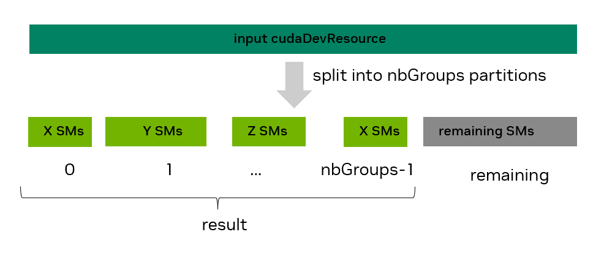
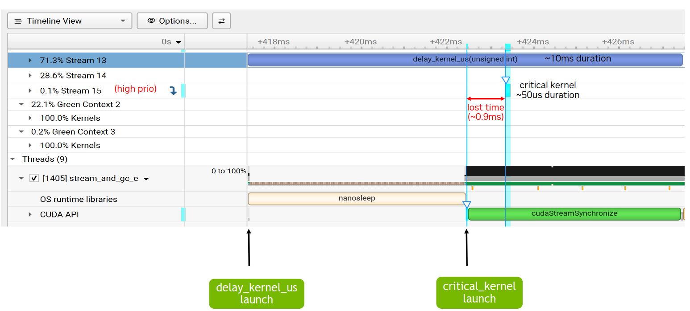

# 4.6 绿色上下文

> 本文档为 [NVIDIA CUDA Programming Guide](https://docs.nvidia.com/cuda/cuda-programming-guide/) 官方文档中文翻译版
>
> 原文地址：[https://docs.nvidia.com/cuda/cuda-programming-guide/04-special-topics/green-contexts.html](https://docs.nvidia.com/cuda/cuda-programming-guide/04-special-topics/green-contexts.html)

---

此页面是否有帮助？

# 4.6. 绿色上下文

绿色上下文（GC）是一种轻量级上下文，从其创建开始就与一组特定的 GPU 资源相关联。用户可以在创建绿色上下文期间对 GPU 资源（目前是流式多处理器（SM）和工作队列（WQ））进行分区，使得针对绿色上下文的 GPU 工作只能使用其已分配的 SM 和工作队列。这样做有助于减少或更好地控制因使用公共资源而产生的干扰。一个应用程序可以拥有多个绿色上下文。

使用绿色上下文不需要对 GPU 代码（内核）进行任何更改，只需在主机端进行少量更改（例如，创建绿色上下文以及为该绿色上下文创建流）。绿色上下文功能在各种场景中都很有用。例如，假设没有其他约束，它可以帮助确保某些 SM 始终可用于延迟敏感的内核开始执行，或者提供一种无需修改任何内核即可测试使用较少 SM 效果的快速方法。

绿色上下文支持最初通过 [CUDA 驱动程序 API](https://docs.nvidia.com/cuda/cuda-driver-api/group__CUDA__GREEN__CONTEXTS.html#group__CUDA__GREEN__CONTEXTS) 提供。从 CUDA 13.1 开始，上下文通过执行上下文（EC）抽象在 CUDA 运行时中公开。目前，一个执行上下文可以对应于主上下文（运行时 API 用户一直隐式交互的上下文）或一个绿色上下文。本节在指代绿色上下文时，将交替使用*执行上下文*和*绿色上下文*这两个术语。

随着绿色上下文在运行时的公开，强烈建议直接使用 CUDA 运行时 API。本节也将仅使用 CUDA 运行时 API。

本节的其余部分组织如下：[第 4.6.1 节](#green-contexts-motivation) 提供了一个动机示例，[第 4.6.2 节](#green-contexts-ease-of-use) 强调了易用性，[第 4.6.3 节](#green-contexts-device-resource-and-desc) 介绍了设备资源和资源描述符结构体。[第 4.6.4 节](#green-contexts-creation-example) 解释了如何创建绿色上下文，[第 4.6.5 节](#green-contexts-launching-work) 说明了如何启动针对它的工作，[第 4.6.6 节](#green-contexts-apis) 重点介绍了一些额外的绿色上下文 API。最后，[第 4.6.7 节](#green-contexts-example) 以一个示例作为总结。

## 4.6.1. 动机 / 何时使用

当启动一个 CUDA 内核时，用户无法直接控制该内核将在多少个 SM 上执行。用户只能通过更改内核的启动几何形状或任何可能影响内核每个 SM 上最大活动线程块数量的因素来间接影响这一点。此外，当多个内核在 GPU 上并行执行时（运行在不同 CUDA 流上的内核或作为 CUDA 图的一部分），它们也可能争夺相同的 SM 资源。

然而，有些用例需要用户确保始终有 GPU 资源可用于延迟敏感的工作尽快开始并完成。绿色上下文通过分区 SM 资源提供了一种实现此目标的方法，因此给定的绿色上下文只能使用特定的 SM（在其创建期间分配的 SM）。
[图 42](#id2) 展示了这样一个例子。假设一个应用程序中，两个独立的内核 A 和 B 在两个不同的非阻塞 CUDA 流上运行。内核 A 首先启动并开始执行，占用了所有可用的 SM 资源。当后来对延迟敏感的内核 B 启动时，已经没有可用的 SM 资源。因此，内核 B 只能在内核 A 缩减规模（即内核 A 的线程块执行完毕）后才能开始执行。第一个图表说明了这种情况，其中关键工作 B 被延迟。y 轴表示 SM 占用百分比，x 轴表示时间。


*图 42 动机：GC 的静态资源分区使对延迟敏感的工作 B 能够更早开始和完成*

使用绿色上下文，可以对 GPU 的 SM 进行分区，使得内核 A 所针对的绿色上下文 A 可以访问 GPU 的部分 SM，而内核 B 所针对的绿色上下文 B 可以访问剩余的 SM。在这种设置下，无论其启动配置如何，内核 A 只能使用为绿色上下文 A 分配的 SM。因此，当关键内核 B 启动时，只要没有其他资源限制，就能保证有可用的 SM 使其立即开始执行。如[图 42](#id2) 中的第二个图表所示，尽管内核 A 的持续时间可能会增加，但对延迟敏感的工作 B 将不再因 SM 不可用而被延迟。图中显示，为说明目的，绿色上下文 A 被分配了相当于 GPU 80% SM 的数量。

无需对内核 A 和 B 进行任何代码修改即可实现此行为。只需确保它们在属于相应绿色上下文的 CUDA 流上启动即可。每个绿色上下文可以访问的 SM 数量应由用户在创建绿色上下文时根据具体情况决定。

**工作队列**：

流式多处理器是可以为绿色上下文分配的一种资源类型。另一种资源类型是工作队列。可以将工作队列视为一个黑盒资源抽象，它也可以与其他因素一起影响 GPU 工作执行的并发性。如果独立的 GPU 工作任务（例如，在不同 CUDA 流上提交的内核）映射到同一个工作队列，则可能在这些任务之间引入错误的依赖关系，从而导致它们串行执行。用户可以通过 `CUDA_DEVICE_MAX_CONNECTIONS` 环境变量影响 GPU 上工作队列的上限（参见[第 5.2 节](../05-appendices/environment-variables.html#cuda-environment-variables)、[第 3.1 节](../03-advanced/advanced-host-programming.html#advanced-apis-and-features)）。

基于前面的示例，假设工作 B 与工作 A 映射到同一个工作队列。在这种情况下，即使 SM 资源可用（绿色上下文的情况），工作 B 可能仍然需要等待工作 A 完全完成。与 SM 类似，用户无法直接控制底层可能使用的特定工作队列。但绿色上下文允许用户根据预期的并发流序工作负载数量来表达他们期望的最大并发性。然后，驱动程序可以将此值作为提示，尝试防止来自不同执行上下文的工作使用相同的工作队列，从而避免执行上下文之间不必要的干扰。
!!! note "注意"
    即使为每个绿色上下文配置了不同的 SM 资源和任务队列，也不能保证独立的 GPU 任务能够并发执行。
最好将绿色上下文章节中描述的所有技术视为消除可能阻碍并发执行的因素（即减少潜在的干扰）。

**绿色上下文与 MIG 或 MPS 的对比**

为求完整，本节将简要比较绿色上下文与另外两种资源分区机制：[MIG（多实例 GPU）](https://docs.nvidia.com/datacenter/tesla/mig-user-guide/index.html) 和 [MPS（多进程服务）](https://docs.nvidia.com/deploy/mps/index.html)。

MIG 将支持 MIG 的 GPU 静态分区为多个 MIG 实例（"小型 GPU"）。这种分区必须在应用程序启动前完成，不同的应用程序可以使用不同的 MIG 实例。对于应用程序持续未充分利用可用 GPU 资源的用户来说，使用 MIG 可能是有益的；随着 GPU 变得更大，这个问题更加明显。通过 MIG，用户可以在不同的 MIG 实例上运行这些不同的应用程序，从而提高 GPU 利用率。对于云服务提供商（CSP）来说，MIG 不仅因为提高了此类应用程序的 GPU 利用率而具有吸引力，还因为它能为运行在不同 MIG 实例上的客户端提供服务质量（QoS）和隔离性。更多详情请参阅上面链接的 MIG 文档。

但是，使用 MIG 无法解决前面描述的问题场景，即关键任务 B 因所有 SM 资源被同一应用程序的其他 GPU 任务占用而延迟。对于在单个 MIG 实例上运行的应用程序，这个问题仍然可能存在。为了解决这个问题，可以结合使用绿色上下文和 MIG。在这种情况下，可用于分区的 SM 资源将是给定 MIG 实例的资源。

MPS 主要针对不同的进程（例如 MPI 程序），允许它们在 GPU 上同时运行而无需时间切片。它要求在应用程序启动前运行一个 MPS 守护进程。默认情况下，MPS 客户端将争用 GPU 或其运行的 MIG 实例的所有可用 SM 资源。在这种多客户端进程设置中，MPS 可以使用活动线程百分比选项来支持 SM 资源的动态分区，该选项限制了 MPS 客户端进程可以使用的 SM 百分比上限。与绿色上下文不同，活动线程百分比分区在 MPS 中是在进程级别进行的，并且该百分比通常在应用程序启动前通过环境变量指定。MPS 活动线程百分比意味着给定的客户端应用程序不能使用超过 GPU SM 的 x%，假设为 N 个 SM。然而，这些 SM 可以是 GPU 的任何 N 个 SM，并且可能随时间变化。另一方面，在创建时配置了 N 个 SM 的绿色上下文只能使用这些特定的 N 个 SM。
自 CUDA 13.1 起，如果在启动 MPS 控制守护进程时显式启用，MPS 也支持静态分区。使用静态分区时，用户必须在启动应用程序时指定 MPS 客户端进程可以使用的静态分区。在这种情况下，带有活动线程百分比的动态共享不再适用。静态分区模式下的 MPS 与绿色上下文之间的一个关键区别在于，MPS 针对不同的进程，而绿色上下文也适用于单个进程内。此外，与绿色上下文相反，采用静态分区的 MPS 不允许超额订阅 SM 资源。

通过 MPS，对于通过 `cuCtxCreate` 驱动程序 API 创建的 CUDA 上下文，也可以结合执行亲和性对 SM 资源进行编程式分区。这种编程式分区允许来自一个或多个进程的不同客户端 CUDA 上下文各自使用最多指定数量的 SM。与活动线程百分比分区一样，这些 SM 可以是 GPU 的任何 SM，并且可以随时间变化，这与绿色上下文的情况不同。即使在存在静态 MPS 分区的情况下，此选项也是可能的。请注意，与 MPS 上下文相比，创建绿色上下文要轻量得多，因为许多底层结构由主上下文拥有并因此共享。

## 4.6.2. 绿色上下文：易于使用

为了强调使用绿色上下文是多么容易，假设您有以下代码片段，它创建两个 CUDA 流，然后调用一个函数，该函数在这些 CUDA 流上通过 `<<<>>>` 启动内核。如前所述，除了更改内核的启动配置外，无法影响这些内核可以使用多少个 SM。

```c++
int gpu_device_index = 0; // GPU 序号
CUDA_CHECK(cudaSetDevice(gpu_device_index));

cudaStream_t strm1, strm2;
CUDA_CHECK(cudaStreamCreateWithFlags(&strm1, cudaStreamNonBlocking));
CUDA_CHECK(cudaStreamCreateWithFlags(&strm2, cudaStreamNonBlocking));

// 无法控制在每个流上运行的内核可以使用多少个 SM
code_that_launches_kernels_on_streams(strm1, strm2); // 此函数中抽象的内容 + 内核是您代码的绝大部分

// 清理代码未显示
```

自 CUDA 13.1 起，可以使用绿色上下文控制给定内核可以访问的 SM 数量。下面的代码片段展示了这有多么容易。只需添加几行代码且无需修改任何内核，您就可以控制在这些不同流上启动的内核可以使用的 SM 资源。

```c++
int gpu_device_index = 0; // GPU 序号
CUDA_CHECK(cudaSetDevice(gpu_device_index));

/* ------------------ 创建绿色上下文所需的代码 --------------------------- */

// 获取所有可用的 GPU SM 资源
cudaDevResource initial_GPU_SM_resources {};
CUDA_CHECK(cudaDeviceGetDevResource(gpu_device_index, &initial_GPU_SM_resources, cudaDevResourceTypeSm));

// 拆分 SM 资源。此示例创建一个包含 16 个 SM 的组和一个包含 8 个 SM 的组。假设您的 GPU 有 >= 24 个 SM
cudaDevSmResource result[2] {{}, {}};
cudaDevSmResourceGroupParams group_params[2] =  {
        {.smCount=16, .coscheduledSmCount=0, .preferredCoscheduledSmCount=0, .flags=0},
        {.smCount=8,  .coscheduledSmCount=0, .preferredCoscheduledSmCount=0, .flags=0}};
CUDA_CHECK(cudaDevSmResourceSplit(&result[0], 2, &initial_GPU_SM_resources, nullptr, 0, &group_params[0]));

// 为每个资源生成资源描述符
cudaDevResourceDesc_t resource_desc1 {};
cudaDevResourceDesc_t resource_desc2 {};
CUDA_CHECK(cudaDevResourceGenerateDesc(&resource_desc1, &result[0], 1));
CUDA_CHECK(cudaDevResourceGenerateDesc(&resource_desc2, &result[1], 1));

// 创建绿色上下文
cudaExecutionContext_t my_green_ctx1 {};
cudaExecutionContext_t my_green_ctx2 {};
CUDA_CHECK(cudaGreenCtxCreate(&my_green_ctx1, resource_desc1, gpu_device_index, 0));
CUDA_CHECK(cudaGreenCtxCreate(&my_green_ctx2, resource_desc2, gpu_device_index, 0));

/* ------------------ 修改后的代码 --------------------------- */

// 您只需要使用不同的 CUDA API 来创建流
cudaStream_t strm1, strm2;
CUDA_CHECK(cudaExecutionCtxStreamCreate(&strm1, my_green_ctx1, cudaStreamDefault, 0));
CUDA_CHECK(cudaExecutionCtxStreamCreate(&strm2, my_green_ctx2, cudaStreamDefault, 0));

/* ------------------ 未更改的代码 --------------------------- */

// 无需修改此函数或内核中的任何代码。
// 提醒：此函数中抽象的内容 + 内核是您代码的绝大部分
// 现在，在流 strm1 上运行的内核将最多使用 16 个 SM，在 strm2 上的内核最多使用 8 个 SM。
code_that_launches_kernels_on_streams(strm1, strm2);

// 清理代码未显示
```
多种执行上下文 API（其中一些已在之前的示例中展示）需要一个显式的 `cudaExecutionContext_t` 句柄，因此会忽略调用线程当前的上下文。迄今为止，不使用驱动 API 的 CUDA 运行时用户默认只会与通过 `cudaSetDevice()` 隐式设置为线程当前上下文的主上下文进行交互。这种向显式基于上下文的编程方式的转变，提供了更易于理解的语义，并且与之前依赖线程本地状态（TLS）的隐式基于上下文的编程相比，可能带来额外的好处。

以下章节将详细解释前面代码片段中展示的所有步骤。

## 4.6.3. 绿色上下文：设备资源和资源描述符

绿色上下文的核心是一个与特定 GPU 设备绑定的设备资源（`cudaDevResource`）。资源可以被组合并封装到一个描述符（`cudaDevResourceDesc_t`）中。绿色上下文只能访问封装在用于创建它的描述符中的资源。

目前 `cudaDevResource` 数据结构定义如下：

```c++
struct {
     enum cudaDevResourceType type;
     union {
         struct cudaDevSmResource sm;
         struct cudaDevWorkqueueConfigResource wqConfig;
         struct cudaDevWorkqueueResource wq;
     };
 };
```

支持的有效资源类型是 `cudaDevResourceTypeSm`、`cudaDevResourceTypeWorkqueueConfig` 和 `cudaDevResourceTypeWorkqueue`，而 `cudaDevResourceTypeInvalid` 标识无效的资源类型。

一个有效的设备资源可以与以下之一关联：

- 一组特定的流式多处理器（SM）（资源类型 cudaDevResourceTypeSm），
- 一个特定的工作队列配置（资源类型 cudaDevResourceTypeWorkqueueConfig），或
- 一个预先存在的工作队列资源（资源类型 cudaDevResourceTypeWorkqueue）。

可以使用 `cudaExecutionCtxGetDevResource` 和 `cudaStreamGetDevResource` API 分别查询给定的执行上下文或 CUDA 流是否与给定类型的 `cudaDevResource` 资源关联。一个执行上下文可以关联不同类型的设备资源（例如，SM 和工作队列），而一个流只能与 SM 类型的资源关联。

默认情况下，一个给定的 GPU 设备拥有所有三种设备资源类型：一个包含 GPU 所有 SM 的 SM 类型资源，一个包含所有可用工作队列的工作队列配置资源，以及其对应的工作队列资源。这些资源可以通过 `cudaDeviceGetDevResource` API 获取。

**相关设备资源结构体概述**

不同类型的资源结构体具有由用户显式设置或由相关 CUDA API 调用设置的字段。建议将所有设备资源结构体进行零初始化。

- SM 类型的设备资源（cudaDevSmResource）具有以下相关字段：
  unsigned int smCount：此资源中可用的 SM 数量
  unsigned int minSmPartitionSize：分区此资源所需的最小 SM 数量
  unsigned int smCoscheduledAlignment：保证在同一 GPU 处理集群上协同调度的资源中的 SM 数量，这与线程块集群相关。当 flags 为零时，smCount 是该值的倍数。
  unsigned int flags：支持的标志是 0（默认）和 cudaDevSmResourceGroupBackfill（参见 cudaDevSmResourceGroup flags）。
  上述字段将通过用于创建此 SM 类型资源的适当拆分 API（cudaDevSmResourceSplitByCount 或 cudaDevSmResourceSplit）设置，或者由检索给定 GPU 设备 SM 资源的 cudaDeviceGetDevResource API 填充。用户绝不应直接设置这些字段。更多详情请参见下一节。
- 工作队列配置设备资源（`cudaDevWorkqueueConfigResource`）包含以下相关字段：
  - `int device`：工作队列资源可用的设备
  - `unsigned int wqConcurrencyLimit`：为避免虚假依赖而预期的流序工作负载数量
  - `enum cudaDevWorkqueueConfigScope sharingScope`：工作队列资源的共享范围。支持的值为：`cudaDevWorkqueueConfigScopeDeviceCtx`（默认）和 `cudaDevWorkqueueConfigScopeGreenCtxBalanced`。使用默认选项时，所有工作队列资源在所有上下文之间共享；而使用平衡选项时，驱动程序会尽可能尝试在绿色上下文之间使用非重叠的工作队列资源，并将用户指定的 `wqConcurrencyLimit` 作为提示。这些字段需要由用户设置。目前没有类似于生成工作队列配置资源的分割 API 的 CUDA API，除了由 `cudaDeviceGetDevResource` API 填充的工作队列配置资源。该 API 可以检索给定 GPU 设备的工作队列配置资源。

- 最后，预先存在的工作队列资源（`cudaDevResourceTypeWorkqueue`）没有可以由用户设置的字段。与其他资源类型一样，`cudaDevGetDevResource` 可以检索给定 GPU 设备的预先存在的工作队列资源。

## 4.6.4. 绿色上下文创建示例

创建绿色上下文主要涉及四个步骤：

- 步骤 1：从一组初始资源开始，例如通过获取 GPU 的可用资源
- 步骤 2：将 SM 资源分割成一个或多个分区（使用可用的分割 API 之一）。
- 步骤 3：如果需要，创建组合了不同资源的资源描述符
- 步骤 4：从描述符创建绿色上下文，并为其配置资源

绿色上下文创建完成后，您可以创建属于该绿色上下文的 CUDA 流。随后在此类流上启动的 GPU 工作（例如通过 `<<< >>>` 启动的内核）将只能访问此绿色上下文所配置的资源。库也可以轻松利用绿色上下文，只要用户向它们传递属于绿色上下文的流即可。更多详情请参见[绿色上下文 - 启动工作](#green-contexts-launching-work)。

### 4.6.4.1. 步骤 1：获取可用 GPU 资源

创建绿色上下文的第一步是获取可用的设备资源并填充 `cudaDevResource` 结构体。目前有三种可能的起点：设备、执行上下文或 CUDA 流。

相关的 CUDA 运行时 API 函数签名如下：

- 对于设备：`cudaError_t cudaDeviceGetDevResource(int device, cudaDevResource* resource, cudaDevResourceType type)`
- 对于执行上下文：`cudaError_t cudaExecutionCtxGetDevResource(cudaExecutionContext_t ctx, cudaDevResource* resource, cudaDevResourceType type)`
- 对于流：`cudaError_t cudaStreamGetDevResource(cudaStream_t hStream, cudaDevResource* resource, cudaDevResourceType type)`
所有有效的 `cudaDevResourceType` 类型都适用于这些 API，但 `cudaStreamGetDevResource` 除外，它仅支持 SM 类型的资源。

通常，起始点将是一个 GPU 设备。下面的代码片段展示了如何获取给定 GPU 设备的可用 SM 资源。在成功的 `cudaDeviceGetDevResource` 调用之后，用户可以查看此资源中可用的 SM 数量。

```c++
int current_device = 0; // 假设设备序号为 0
CUDA_CHECK(cudaSetDevice(current_device));

cudaDevResource initial_SM_resources = {};
CUDA_CHECK(cudaDeviceGetDevResource(current_device /* GPU 设备 */,
                                   &initial_SM_resources /* 要填充的设备资源 */,
                                   cudaDevResourceTypeSm /* 资源类型*/));

std::cout << "初始 SM 资源: " << initial_SM_resources.sm.smCount << " 个 SM" << std::endl; // 可用 SM 的数量

// 与分区相关的特殊字段（参见下面的步骤 3）
std::cout << "最小 SM 分区大小: " <<  initial_SM_resources.sm.minSmPartitionSize << " 个 SM" << std::endl;
std::cout << "SM 协同调度对齐: " <<  initial_SM_resources.sm.smCoscheduledAlignment << " 个 SM" << std::endl;
```

也可以获取可用的工作队列配置资源，如下面的代码片段所示。

```c++
int current_device = 0; // 假设设备序号为 0
CUDA_CHECK(cudaSetDevice(current_device));

cudaDevResource initial_WQ_config_resources = {};
CUDA_CHECK(cudaDeviceGetDevResource(current_device /* GPU 设备 */,
                                   &initial_WQ_config_resources /* 要填充的设备资源 */,
                                   cudaDevResourceTypeWorkqueueConfig /* 资源类型*/));

std::cout << "初始 WQ 配置资源: " << std::endl;
std::cout << "  - WQ 并发限制: " << initial_WQ_config_resources.wqConfig.wqConcurrencyLimit << std::endl;
std::cout << "  - WQ 共享范围: " << initial_WQ_config_resources.wqConfig.sharingScope << std::endl;
```

在成功的 `cudaDeviceGetDevResource` 调用之后，用户可以查看此资源的 `wqConcurrencyLimit`。当起始点是 GPU 设备时，`wqConcurrencyLimit` 将与 `CUDA_DEVICE_MAX_CONNECTIONS` 环境变量或其默认值匹配。

### 4.6.4.2. 步骤 2：划分 SM 资源

创建绿色上下文的第二步是将可用的 `cudaDevResource` SM 资源静态地划分为一个或多个分区，并可能在一个剩余分区中留下一些 SM。可以使用 `cudaDevSmResourceSplitByCount()` 或 `cudaDevSmResourceSplit()` API 进行这种划分。`cudaDevSmResourceSplitByCount()` API 只能创建一个或多个*同构*分区，加上一个可能的*剩余*分区，而 `cudaDevSmResourceSplit()` API 还可以创建*异构*分区，加上可能的*剩余*分区。后续章节将详细描述这两个 API 的功能。这两个 API 仅适用于 SM 类型的设备资源。
**cudaDevSmResourceSplitByCount API**

`cudaDevSmResourceSplitByCount` 运行时 API 的签名为：

`cudaError_t cudaDevSmResourceSplitByCount(cudaDevResource* result, unsigned int* nbGroups, const cudaDevResource* input,
cudaDevResource* remaining, unsigned int useFlags, unsigned int minCount)`

如[图 43](#resource-split-by-count) 所示，用户请求将 `input` SM 类型的设备资源拆分为 `*nbGroups` 个同构组，每组包含 `minCount` 个 SM。然而，最终结果将包含一个可能更新后的 `*nbGroups` 个同构组，每组包含 `N` 个 SM。可能更新后的 `*nbGroups` 将小于或等于最初请求的组数，而 `N` 将等于或大于 `minCount`。这些调整可能由于某些粒度和对齐要求而发生，这些要求是特定于架构的。


*图 43：使用 cudaDevSmResourceSplitByCount API 进行 SM 资源拆分*

[表 30](../05-appendices/compute-capabilities.html#compute-capabilities-table-device-and-streaming-multiprocessor-sm-information-per-compute-capability) 列出了所有当前支持的计算能力在默认 `useFlags=0` 情况下的最小 SM 分区大小和 SM 协同调度对齐要求。也可以通过 `cudaDevSmResource` 的 `minSmPartitionSize` 和 `smCoscheduledAlignment` 字段检索这些值，如[步骤 1：获取可用 GPU 资源](#green-contexts-creation-example-step1)所示。其中一些要求可以通过不同的 `useFlags` 值来降低。[表 14](#split-functionality) 提供了一些相关示例，突出了请求内容与最终结果之间的差异，并附有解释。该表重点关注计算能力（CC 9.0），其中如果 `useFlags` 为零，则每个分区的最小 SM 数为 8，且 SM 数必须是 8 的倍数。

| 请求参数 |  |  | 实际结果（针对具有 132 个 SM 的 GH200） |  |  |
| --- | --- | --- | --- | --- | --- |
| *nbGroups | minCount | useFlags | *nbGroups 与 N 个 SM | 剩余 SM | 原因 |
| 2 | 72 | 0 | 1 组，72 个 SM | 60 | 不能超过 132 个 SM |
| 6 | 11 | 0 | 6 组，每组 16 个 SM | 36 | 需为 8 的倍数 |
| 6 | 11 | CU_DEV_SM_RESOURCE_SPLIT_IGNORE_SM_COSCHEDULING | 6 组，每组 12 个 SM | 60 | 要求降低为 2 的倍数 |
| 2 | 1 | 0 | 2 组，每组 8 个 SM | 116 | 最小 8 个 SM 的要求 |

以下是一个代码片段，请求将可用的 SM 资源拆分为五组，每组 8 个 SM：

```c++
cudaDevResource avail_resources = {};
// 此处省略了填充 avail_resources 的代码

unsigned int min_SM_count = 8;
unsigned int actual_split_groups = 5; // 可能会被更新

cudaDevResource actual_split_result[5] = {{}, {}, {}, {}, {}};
cudaDevResource remaining_partition = {};

CUDA_CHECK(cudaDevSmResourceSplitByCount(&actual_split_result[0],
                                         &actual_split_groups,
                                         &avail_resources,
                                         &remaining_partition,
                                         0 /*useFlags */,
                                         min_SM_count));

std::cout << "Split " << avail_resources.sm.smCount << " SMs into " << actual_split_groups << " groups " \
          << "with " << actual_split_result[0].sm.smCount << " each " \
          << "and a remaining group with " << remaining_partition.sm.smCount << " SMs" << std::endl;
```
请注意：

- 可以使用 `result=nullptr` 来查询将创建的组数
- 如果不关心剩余分区的 SM，可以设置 `remaining=nullptr`
- 剩余分区不具备与 `result` 中同构组相同的功能或性能保证
- 默认情况下 `useFlags` 应为 0，但也支持 `cudaDevSmResourceSplitIgnoreSmCoscheduling` 和 `cudaDevSmResourceSplitMaxPotentialClusterSize` 值
- 任何生成的 `cudaDevResource` 都不能重新分区，除非先从中创建资源描述符和绿色上下文（即下面的步骤 3 和 4）

更多详细信息，请参阅 [cudaDevSmResourceSplitByCount](https://docs.nvidia.com/cuda/cuda-runtime-api/group__CUDART__EXECUTION__CONTEXT.html#group__CUDART__EXECUTION__CONTEXT_1g10ef763a79ff53245bec99b96a7abb73) 运行时 API 参考。

**cudaDevSmResourceSplit API**

如前所述，单个 `cudaDevSmResourceSplitByCount` API 调用只能创建同构分区（即具有相同 SM 数量的分区）加上剩余分区。这对于异构工作负载可能有限制，因为运行在不同绿色上下文上的工作具有不同的 SM 数量要求。要使用按数量分割 API 实现异构分区，通常需要通过重复步骤 1-4（多次）来重新分区现有资源。或者，在某些情况下，可以在步骤 2 中创建 SM 数量等于所有异构分区最大公约数（GCD）的同构分区，然后在步骤 3 中将所需数量的分区合并在一起。但最后这种方法不推荐，因为如果一开始就请求更大的分区，CUDA 驱动程序可能能够创建更好的分区。

`cudaDevSmResourceSplit` API 旨在通过允许用户在单个调用中创建非重叠的异构分区来解决这些限制。`cudaDevSmResourceSplit` 运行时 API 签名为：

`cudaError_t cudaDevSmResourceSplit(cudaDevResource* result, unsigned int nbGroups, const cudaDevResource* input,
cudaDevResource* remainder, unsigned int flags, cudaDevSmResourceGroupParams* groupParams)`

此 API 将尝试根据 `groupParams` 数组中为每个组指定的要求，将 `input` SM 类型资源分区为 `nbGroups` 个有效设备资源（组），并放入 `result` 数组中。也可以创建可选的剩余分区。在成功分割后，如[图 44](#resource-split) 所示，`result` 中的每个资源可以具有不同数量的 SM，但绝不能为零个 SM。



*图 44：使用 cudaDevSmResourceSplit API 进行 SM 资源分割*

当请求异构分割时，需要为 `result` 中的每个资源指定 SM 数量（相关 `groupParams` 条目的 `smCount` 字段）。此 SM 数量应始终为 2 的倍数。对于前一张图中的场景，`groupParams[0].smCount` 将为 `X`，`groupParams[1].smCount` 为 `Y`，依此类推。然而，如果应用程序使用[线程块集群](../01-introduction/programming-model.html#programming-model-thread-block-clusters)，仅指定 SM 数量是不够的。由于保证集群的所有线程块协同调度，用户还需要指定给定资源组应支持的最大集群大小（如果有）。这可以通过相关 `groupParams` 条目的 `coscheduledSmCount` 字段实现。对于计算能力 10.0 及更高版本（CC 10.0+）的 GPU，集群还可以具有首选维度，这是其默认集群维度的倍数。在支持的系统上，单个内核启动期间，如果可能，会尽可能使用此更大的首选集群维度，否则使用较小的默认集群维度。用户可以通过相关 `groupParams` 条目的 `preferredCoscheduledSmCount` 字段表达此首选集群维度提示。最后，在某些情况下，用户可能希望放宽 SM 数量要求，并在给定组中引入更多可用 SM；用户可以通过将相关 `groupParams` 条目的 `flags` 字段设置为其非默认标志值来表达此回填选项。
为了提供更大的灵活性，`cudaDevSmResourceSplit` API 还提供了一种**发现**模式，用于当一个或多个组的精确 SM 数量在事先未知的情况。例如，用户可能希望创建一个拥有尽可能多 SM 的设备资源，同时满足某些协同调度要求（例如，允许大小为 4 的集群）。要使用此发现模式，用户可以将相关 `groupParams` 条目（一个或多个）的 `smCount` 字段设置为零。在成功的 `cudaDevSmResourceSplit` 调用之后，`groupParams` 的 `smCount` 字段将被填充为一个有效的非零值；我们将其称为**实际**的 `smCount` 值。如果 `result` 不为空（即这不是一次空运行），那么 `result` 的相关组的 `smCount` 也将被设置为相同的值。指定 `nbGroups` 个 `groupParams` 条目的顺序很重要，因为它们是从左（索引 0）到右（索引 nbGroups-1）进行评估的。

[表 15](#green-contexts-split-api-table) 提供了 `cudaDevSmResourceSplit` API 所支持参数的高级视图。

|  | groupParams 数组；显示条目 i，其中 i [0, nbGroups) |  |  |  |  |  |  |  |
| --- | --- | --- | --- | --- | --- | --- | --- | --- |
| result | nbGroups | input | remainder | flags | smCount | coscheduledSmCount | preferredCoscheduledSmCount | flags |
| 用于探索性空运行为 nullptr；否则为非空指针 | 组的数量 | 要分割成 nbGroups 个组的资源 | 如果您不想要余数组则为 nullptr | 0 | 0 表示发现模式，或其他有效的 smCount | 0（默认）或有效的协同调度 SM 数量 | 0（默认）或有效的首选协同调度 SM 数量（提示） | 0（默认）或 cudaDevSmResourceGroupBackfill |

注意：

1.  `cudaDevSmResourceSplit` API 的返回值取决于 `result`：

    > `result` != `nullptr`：仅当分割成功并且创建了 `nbGroups` 个满足指定要求的有效 `cudaDevResource` 组时，API 才会返回 `cudaSuccess`；否则，它将返回一个错误。由于不同类型的错误可能返回相同的错误代码（例如，`CUDA_ERROR_INVALID_RESOURCE_CONFIGURATION`），建议在开发过程中使用 `CUDA_LOG_FILE` 环境变量来获取更具信息性的错误描述。
    > `result` == `nullptr`：即使某个组的最终 `smCount` 为零，API 也可能返回 `cudaSuccess`，这种情况在使用非空 `result` 时会返回错误。可以将此模式视为一种空运行测试，您可以在探索支持的功能时使用，尤其是在**发现**模式下。

2.  在 `result != nullptr` 的成功调用中，结果 `result[i]`（其中 i 在 [0, nbGroups) 范围内）的设备资源类型将为 `cudaDevResourceTypeSm`，并且其 `result[i].sm.smCount` 要么是用户指定的非零 `groupParams[i].smCount` 值，要么是发现的值。在这两种情况下，`result[i].sm.smCount` 都将满足以下所有约束：

    > 是 `2` 的**倍数**，并且
> 处于
> [2,
> input.sm.smCount]
> 范围内且
> (flags
> ==
> 0)
> ?
> (实际
> group_params[i].coscheduledSmCount
> 的倍数)
> :
> (>=
> groups_params[i].coscheduledSmCount)

1.  为 `coscheduledSmCount` 和 `preferredCoscheduledSmCount` 字段中的任何一个指定零，表示应使用这些字段的默认值；这些值可能因 GPU 而异。这些默认值都等于通过 `cudaDeviceGetDevResource` API 为给定设备（而非任何 SM 资源）检索到的 SM 资源的 `smCoscheduledAlignment`。要查看这些默认值，可以在成功调用 `cudaDevSmResourceSplit` 后（调用时这些值最初设置为 0），检查相关 `groupParams` 条目中更新后的值；参见下文。

> int
> gpu_device_index
> =
> 0
> ;
> cudaDevResource
> initial_GPU_SM_resources
> {};
> CUDA_CHECK
> (
> cudaDeviceGetDevResource
> (
> gpu_device_index
> ,
> &
> initial_GPU_SM_resources
> ,
> cudaDevResourceTypeSm
> ));
> std
> ::
> cout
> <<
> "默认值将等于 "
> <<
> initial_GPU_SM_resources
> .
> sm
> .
> smCoscheduledAlignment
> <<
> std
> ::
> endl
> ;
> int
> default_split_flags
> =
> 0
> ;
> cudaDevSmResourceGroupParams
> group_params_tmp
> =
> {.
> smCount
> =
> 0
> ,
> .
> coscheduledSmCount
> =
> 0
> ,
> .
> preferredCoscheduledSmCount
> =
> 0
> ,
> .
> flags
> =
> 0
> };
> CUDA_CHECK
> (
> cudaDevSmResourceSplit
> (
> nullptr
> ,
> 1
> ,
> &
> initial_GPU_SM_resources
> ,
> nullptr
> /*remainder*/
> ,
> default_split_flags
> ,
> &
> group_params_tmp
> ));
> std
> ::
> cout
> <<
> "coscheduledSmcount 默认值: "
> <<
> group_params
> .
> coscheduledSmCount
> <<
> std
> ::
> endl
> ;
> std
> ::
> cout
> <<
> "preferredCoscheduledSmcount 默认值: "
> <<
> group_params
> .
> preferredCoscheduledSmCount
> <<
> std
> ::
> endl
> ;

1.  剩余组（如果存在）对其 SM 数量或协同调度要求没有任何约束。这将由用户自行探索。

在提供 `cudaDevSmResourceGroupParams` 各个字段的更详细信息之前，[表 16](#green-contexts-split-api-use-cases-examples) 展示了一些示例用例中这些值可能是什么。假设 `initial_GPU_SM_resources` 设备资源已按前面代码片段中的方式填充，并且是将要拆分的资源。表中的每一行都将具有相同的起点。为简洁起见，该表将仅显示每个用例的 `nbGroups` 值和 `groupParams` 字段，这些值可用于如下所示的代码片段中。

```c++
int nbGroups = 2; // 根据需要更新
unsigned int default_split_flags = 0;
cudaDevResource remainder {}; // 根据需要更新
cudaDevResource result_use_case[2] = {{}, {}}; // 根据计划的分组数量更新。如果计划也使用工作队列资源，请增加大小
cudaDevSmResourceGroupParams group_params_use_case[2] = {{.smCount = X, .coscheduledSmCount=0, .preferredCoscheduledSmCount = 0, .flags = 0},
                                                         {.smCount = Y, .coscheduledSmCount=0, .preferredCoscheduledSmCount = 0, .flags = 0}}
CUDA_CHECK(cudaDevSmResourceSplit(&result_use_case[0], nbGroups, &initial_GPU_SM_resources, remainder, default_split_flags, &group_params_use_case[0]));
```
|  |  |  |  | groupParams[i] 字段（i 按升序显示；见最后一列） | i |  |  |  |
| --- | --- | --- | --- | --- | --- | --- | --- | --- |
| # | 目标/用例 | nbGroups | remainder | smCount | coscheduledSmCount | preferredCoscheduledSmCount | flags |  |
| 1 | 资源包含 16 个 SM。不关心剩余的 SM。可以使用集群。 | 1 | nullptr | 16 | 0 | 0 | 0 | 0 |
|  |  |  |  |  |  |  |  |  |
| 2a | 一个资源包含 16 个 SM，另一个包含其余所有 SM。将不使用集群。（注意：显示两个选项：在选项 (2a) 中，第二个资源是剩余部分；在选项 (2b) 中，它是 result_use_case[1]。） | 1
(2a) | not nullptr | 16 | 2 | 2 | 0 | 0 |
|  |  |  |  |  |  |  |  |  |
| 2b | 2
(2b) | nullptr | 16 | 2 | 2 | 0 | 0 |  |
| 0 | 2 | 2 | cudaDevSmResourceGroupBackfill | 1 |  |  |  |  |
|  |  |  |  |  |  |  |  |  |
|  |  |  |  |  |  |  |  |  |
| 3 | 两个资源分别包含 28 和 32 个 SM。将使用大小为 4 的集群。 | 2 | nullptr | 28 | 4 | 4 | 0 | 0 |
| 32 | 4 | 4 | 0 | 1 |  |  |  |  |
|  |  |  |  |  |  |  |  |  |
|  |  |  |  |  |  |  |  |  |
| 4 | 一个资源包含尽可能多的 SM，可以运行大小为 8 的集群，以及一个剩余部分。 | 1 | not nullptr | 0 | 8 | 8 | 0 | 0 |
|  |  |  |  |  |  |  |  |  |
| 5 | 一个资源包含尽可能多的 SM，可以运行大小为 4 的集群，以及一个包含 8 个 SM 的资源。（注意：顺序很重要！更改 groupParams 数组中条目的顺序可能意味着没有 SM 留给 8-SM 组） | 2 | nullptr | 8 | 2 | 2 | 0 | 0 |
| 0 | 4 | 4 | 0 | 1 |  |  |  |  |
|  |  |  |  |  |  |  |  |  |

**关于各种 cudaDevSmResourceGroupParams 结构体字段的详细信息**

`smCount`:

- 控制结果中对应组的 SM 数量。
- 值：0（发现模式）或有效的非零值（非发现模式）。有效的非零 smCount 值要求：（2 的倍数）且在 [2, input->sm.smCount] 范围内，并且 ((flags == 0) ? 是实际 coscheduledSmCount 的倍数 : 大于或等于 coscheduledSmCount)
- 用例：当 SM 数量未知/不固定时，使用发现模式来探索可能的情况；使用非发现模式来请求特定数量的 SM。
- 注意：在发现模式下，成功调用 split 函数（result 不为 nullptr）后，实际的 SM 数量将满足有效的非零值要求。

`coscheduledSmCount`:

- 控制分组在一起的 SM 数量（“协同调度”），以便在计算能力 9.0+ 上启用不同集群的启动。因此，它会影响结果组中的 SM 数量以及它们可以支持的集群大小。
- 值：0（当前架构的默认值）或有效的非零值。有效的非零值要求：（2 的倍数）直至最大限制。
- 用例：为集群使用默认值或手动选择的值，同时记住给定架构上最大的可移植集群大小。如果你的代码不使用集群，可以使用支持的最小值 2 或默认值。
- 注意：当使用默认值时，成功调用 split 函数后，实际的 coscheduledSmCount 也将满足有效的非零值要求。如果 flags 不为零，则结果的 smCount 将 >= coscheduledSmCount。可以将 coscheduledSmCount 视为为有效的结果组提供某种有保证的底层“结构”（即，在最坏情况下，该组至少可以运行一个大小为 coscheduledSmCount 的集群）。这种类型的结构保证不适用于剩余组；在那里，需要用户自行探索可以启动哪些集群大小。
`preferredCoscheduledSmCount`：

- 作为对驱动程序的提示，尝试将实际的 `coscheduledSmCount` 个 SM 分组合并为更大的 `preferredCoscheduledSmCount` 分组（如果可能）。这样做可以使代码利用计算能力（CC）10.0 及更高版本设备上可用的首选集群维度功能。请参阅 `cudaLaunchAttributeValue::preferredClusterDim`。
- 值：0（当前架构的默认值）或有效的非零值。有效的非零值要求：（是 `actual coscheduledSmCount` 的倍数）
- 使用场景：如果您使用首选集群并且设备计算能力为 10.0（Blackwell）或更高版本，则使用大于 2 的手动选择值。如果您不使用集群，则选择与 `coscheduledSmCount` 相同的值：要么选择支持的最小值 2，要么两者都使用 0。
- 注意：当使用默认值时，在成功的拆分调用后，实际的 `preferredCoscheduledSmCount` 也将满足有效的非零值要求。

`flags`：

- 控制一个组的最终 SM 数量是否必须是实际协同调度 SM 数量的倍数（默认），或者是否可以将 SM 回填到此组中（回填）。在回填情况下，最终的 SM 数量（`result[i].sm.smCount`）将大于或等于指定的 `groupParams[i].smCount`。
- 值：0（默认）或 `cudaDevSmResourceGroupBackfill`
- 使用场景：使用零（默认值），这样最终组具有保证的灵活性，可以支持多个 `coScheduledSmCount` 大小的集群。如果您希望在组中获得尽可能多的 SM，并且其中一些 SM（回填的 SM）不提供任何协同调度保证，则使用回填选项。
- 注意：使用回填标志创建的组仍然可以支持集群（例如，它保证至少支持一个 `coscheduledSmCount` 大小的集群）。

### 4.6.4.3. 步骤 2（续）：添加工作队列资源

如果您还想指定工作队列资源，则需要显式完成。以下示例展示了如何为具有平衡共享范围和并发限制为 4 的特定设备创建工作队列配置资源。

```c++
cudaDevResource split_result[2] = {{}, {}};
// 填充 split_result[0] 的代码未显示；使用了 nbGroups=1 的拆分 API

// 最后一个资源将是工作队列资源。
split_result[1].type = cudaDevResourceTypeWorkqueueConfig;
split_result[1].wqConfig.device = 0; // 假设设备序号为 0
split_result[1].wqConfig.sharingScope = cudaDevWorkqueueConfigScopeGreenCtxBalanced;
split_result[1].wqConfig.wqConcurrencyLimit = 4;
```

工作队列并发限制为 4 是向驱动程序提示用户期望最多有四个并发的流序工作负载。驱动程序将尝试在可能的情况下分配工作队列以遵循此提示。

### 4.6.4.4. 步骤 3：创建资源描述符

在资源拆分之后，下一步是使用 `cudaDevResourceGenerateDesc` API 为绿色上下文预期可用的所有资源生成资源描述符。
相关的 CUDA 运行时 API 函数签名为：

`cudaError_t cudaDevResourceGenerateDesc(cudaDevResourceDesc_t *phDesc, cudaDevResource *resources, unsigned int nbResources)`

可以组合多个 `cudaDevResource` 资源。例如，下面的代码片段展示了如何生成一个封装了三组资源的资源描述符。您只需确保这些资源在 `resources` 数组中都是连续分配的。

```c++
cudaDevResource actual_split_result[5] = {};
// 填充 actual_split_result 的代码未显示

// 生成资源描述符以封装 3 个资源：actual_split_result[2] 到 [4]
cudaDevResourceDesc_t resource_desc;
CUDA_CHECK(cudaDevResourceGenerateDesc(&resource_desc, &actual_split_result[2], 3));
```

也支持组合不同类型的资源。例如，可以生成一个同时包含 SM 和工作队列资源的描述符。

要使 `cudaDevResourceGenerateDesc` 调用成功：

- 所有 nbResources 个资源应属于同一个 GPU 设备。
- 如果组合了多个 SM 类型的资源，它们应来自同一个拆分 API 调用，并且具有相同的 coscheduledSmCount 值（如果不是余数部分）。
- 只能存在一个工作队列配置或工作队列类型的资源。

### 4.6.4.5. 步骤 4：创建绿色上下文

最后一步是使用 `cudaGreenCtxCreate` API 从资源描述符创建一个绿色上下文。该绿色上下文将只能访问在其创建期间指定的资源描述符中封装的资源（例如，SM、工作队列）。这些资源将在此步骤中进行配置。

相关的 CUDA 运行时 API 函数签名为：

`cudaError_t cudaGreenCtxCreate(cudaExecutionContext_t *phCtx, cudaDevResourceDesc_t desc, int device, unsigned int flags)`

`flags` 参数应设置为 0。还建议在创建绿色上下文之前，通过 `cudaInitDevice` API 或 `cudaSetDevice` API 显式初始化设备的主上下文，后者还会将主上下文设置为调用线程的当前上下文。这样做可以确保在绿色上下文创建期间不会产生额外的主上下文初始化开销。

请参见下面的代码片段。

```c++
int current_device = 0; // 假设是单 GPU
CUDA_CHECK(cudaSetDevice(current_device)); // 或者使用 cudaInitDevice

cudaDevResourceDesc_t resource_desc {};
// 生成 resource_desc 的代码未显示

// 在 ID 为 current_device 的 GPU 上创建一个 green_ctx，可以访问 resource_desc 中的资源
cudaExecutionContext_t green_ctx {};
CUDA_CHECK(cudaGreenCtxCreate(&green_ctx, resource_desc, current_device, 0));
```

成功创建绿色上下文后，用户可以通过在该执行上下文上为每种资源类型调用 `cudaExecutionCtxGetDevResource` 来验证其资源。

**创建多个绿色上下文**

一个应用程序可以拥有多个绿色上下文，在这种情况下，应重复上述部分步骤。对于大多数用例，这些绿色上下文各自将拥有一组独立的、不重叠的已配置 SM。例如，对于五个同构的 `cudaDevResource` 组（`actual_split_result` 数组）的情况，一个绿色上下文的描述符可能封装 actual_split_result[2] 到 [4] 的资源，而另一个绿色上下文的描述符可能封装 actual_split_result[0] 到 [1] 的资源。在这种情况下，一个特定的 SM 将仅为此应用程序的两个绿色上下文中的一个进行配置。
但 SM 超量分配也是可能的，在某些情况下可能会被使用。例如，可以接受让第二个绿色上下文的描述符封装 `actual_split_result[0]` 到 `[2]`。在这种情况下，`actual_split_resource[2]` `cudaDevResource` 的所有 SM 将被超量分配，即为两个绿色上下文同时分配，而资源 `actual_split_resource[0]` 到 `[1]` 以及 `actual_split_resource[3]` 到 `[4]` 可能仅由两个绿色上下文中的一个使用。SM 超量分配应根据具体情况审慎使用。

## 4.6.5. 绿色上下文 - 启动工作

要启动一个以前述步骤创建的绿色上下文为目标的内核，首先需要使用 `cudaExecutionCtxStreamCreate` API 为该绿色上下文创建一个流。在该流上使用 `<<< >>>` 或 `cudaLaunchKernel` API 启动内核，将确保该内核只能使用其执行上下文通过该流可用的资源（SM、工作队列）。例如：

```c++
// 为先前创建的绿色上下文 green_ctx 创建 green_ctx_stream CUDA 流
cudaStream_t green_ctx_stream;
int priority = 0;
CUDA_CHECK(cudaExecutionCtxStreamCreate(&green_ctx_stream,
                                        green_ctx,
                                        cudaStreamDefault,
                                        priority));

// 内核 my_kernel 将仅使用 green_ctx_stream 的执行上下文可用的资源（SM、工作队列等，视情况而定）
my_kernel<<<grid_dim, block_dim, 0, green_ctx_stream>>>();
CUDA_CHECK(cudaGetLastError());
```

鉴于 `green_ctx` 是一个绿色上下文，传递给上述流创建 API 的默认流创建标志等同于 `cudaStreamNonBlocking`。

**CUDA 图**

对于作为 CUDA 图一部分启动的内核（参见 [CUDA 图](cuda-graphs.html#cuda-graphs)），还有一些更微妙之处。与内核不同，CUDA 图在其上启动的 CUDA 流**不**决定所使用的 SM 资源，因为该流仅用于依赖关系跟踪。

内核节点（以及其他适用的节点类型）将在其上执行的执行上下文是在节点创建期间设置的。如果 CUDA 图将使用流捕获创建，那么捕获所涉及的流的执行上下文将决定相关图节点的执行上下文。如果图将使用图 API 创建，则用户应显式设置每个相关节点的执行上下文。例如，要添加一个内核节点，用户应使用多态的 `cudaGraphAddNode` API，指定 `cudaGraphNodeTypeKernel` 类型，并显式指定 `cudaKernelNodeParamsV2` 结构体在 `.kernel` 下的 `.ctx` 字段。`cudaGraphAddKernelNode` 不允许用户指定执行上下文，因此应避免使用。请注意，图中的不同图节点可能属于不同的执行上下文。

出于验证目的，可以使用 Nsight Systems 的节点跟踪模式（`--cuda-graph-trace node`）来观察特定图节点将在哪个绿色上下文上执行。请注意，在默认的*图*跟踪模式下，整个图将显示在其启动流的绿色上下文下，但如前所述，这并不提供关于各个图节点执行上下文的任何信息。
为了以编程方式验证，可以潜在使用 CUDA 驱动程序 API `cuGraphKernelNodeGetParams(graph_node, &node_params)`，并将 `node_params.ctx` 上下文句柄字段与该图节点预期的上下文句柄进行比较。鉴于 `CUgraphNode` 和 `cudaGraphNode_t` 可以互换使用，使用驱动程序 API 是可行的，但用户需要包含相关的 `cuda.h` 头文件并直接链接驱动程序库（`-lcuda`）。

**线程块集群**

具有线程块集群的内核（参见[第 1.2.2.1.1 节](../01-introduction/programming-model.html#programming-model-thread-block-clusters)）也可以像任何其他内核一样，在绿色上下文流上启动，从而使用该绿色上下文所分配的资源。[第 4.6.4.2 节](#green-contexts-creation-example-step2)展示了在分割设备资源时，如何指定需要协同调度的 SM 数量，以支持集群。但与任何使用集群的内核一样，用户应利用相关的占用率 API 来确定内核的最大潜在集群大小（通过 `cudaOccupancyMaxPotentialClusterSize`），以及（如果需要）最大活动集群数（`cudaOccupancyMaxActiveClusters`）。如果用户将绿色上下文流指定为相关 `cudaLaunchConfig` 的 `stream` 字段，那么这些占用率 API 将考虑为该绿色上下文分配的 SM 资源。这种用例对于可能由用户传递绿色上下文 CUDA 流的库尤其相关，也适用于从剩余设备资源创建绿色上下文的情况。

下面的代码片段展示了如何使用这些 API。

```c++
// 假设 cudaStream_t gc_stream 已创建，且存在 __global__ void cluster_kernel。

// 如果可能，取消注释以支持非可移植集群大小
// CUDA_CHECK(cudaFuncSetAttribute(cluster_kernel, cudaFuncAttributeNonPortableClusterSizeAllowed, 1))

cudaLaunchConfig_t config = {0};
config.gridDim          = grid_dim; // 必须是 cluster dim 的倍数。
config.blockDim         = block_dim;
config.dynamicSmemBytes = expected_dynamic_shared_mem;

cudaLaunchAttribute attribute[1];
attribute[0].id = cudaLaunchAttributeClusterDimension;
attribute[0].val.clusterDim.x = 1;
attribute[0].val.clusterDim.y = 1;
attribute[0].val.clusterDim.z = 1;
config.attrs = attribute;
config.numAttrs = 1;

config.stream=gc_stream; // 需要传递将用于该内核的 CUDA 流

int max_potential_cluster_size = 0;
// 下一次调用将忽略启动配置中的集群维度
CUDA_CHECK(cudaOccupancyMaxPotentialClusterSize(&max_potential_cluster_size, cluster_kernel, &config));
std::cout << "max potential cluster size is " << max_potential_cluster_size << " for CUDA stream gc_stream" << std::endl;

// 可以选择用 max_potential_cluster_size 更新启动配置的 clusterDim。
// 这样做将导致对同一内核和启动配置的 cudaLaunchKernelEx 调用成功。

int num_clusters= 0;
CUDA_CHECK(cudaOccupancyMaxActiveClusters(&num_clusters, cluster_kernel, &config));
std::cout << "Potential max. active clusters count is " << num_clusters << std::endl;
```
**验证绿色上下文的使用**

除了通过经验观察受绿色上下文配置影响的内核执行时间外，用户还可以在一定程度上利用 [Nsight Systems](https://developer.nvidia.com/nsight-systems) 或 [Nsight Compute](https://developer.nvidia.com/nsight-compute) 这些 CUDA 开发者工具来验证绿色上下文的正确使用。

例如，在属于不同绿色上下文的 CUDA 流上启动的内核，将在 Nsight Systems 报告的 CUDA HW 时间线部分下显示在不同的绿色上下文行中。Nsight Compute 在其会话页面提供了绿色上下文资源概览，并在详细信息部分的启动统计中更新了 # SMs 信息。前者以可视化的位掩码形式显示已配置的资源。如果应用程序使用了不同的绿色上下文，这将特别有用，因为用户可以确认跨绿色上下文的预期重叠情况（如果 SM 被超额订阅，则无重叠或预期的非零重叠）。

[图 45](#green-contexts-ncu-mask) 展示了一个示例的资源情况，该示例配置了两个绿色上下文，分别拥有 112 个和 16 个 SM，且它们之间没有 SM 重叠。提供的视图可以帮助用户验证每个绿色上下文配置的 SM 资源数量。它还有助于确认没有 SM 被超额订阅，因为两个绿色上下文之间没有任何方框被标记为绿色（即为该绿色上下文配置）。


*图 45 Nsight Compute 中的绿色上下文资源部分*

启动统计部分还明确列出了为此绿色上下文配置的 SM 数量，因此该内核可以使用这些 SM。请注意，这些是给定内核在其执行期间可以访问的 SM，而不是该内核实际在其上运行的 SM 数量。这同样适用于前面显示的资源概览。内核实际使用的 SM 数量可能取决于各种因素，包括内核本身（启动配置等）、GPU 上同时运行的其他工作等。

## 4.6.6. 额外的执行上下文 API

本节将介绍一些额外的绿色上下文 API。完整列表请参阅相关的 CUDA 运行时 API [章节](https://docs.nvidia.com/cuda/cuda-runtime-api/group__CUDART__EXECUTION__CONTEXT.html)。

对于使用 CUDA 事件进行同步，可以利用 `cudaError_t cudaExecutionCtxRecordEvent(cudaExecutionContext_t ctx, cudaEvent_t event)` 和 `cudaError_t cudaExecutionCtxWaitEvent(cudaExecutionCtxWaitEvent(cudaExecutionContext_t ctx, cudaEvent_t event)` API。`cudaExecutionCtxRecordEvent` 记录一个 CUDA 事件，捕获调用时指定执行上下文的所有工作/活动，而 `cudaExecutionCtxWaitEvent` 使所有未来提交到该执行上下文的工作等待指定事件中捕获的工作完成。

如果执行上下文有多个 CUDA 流，使用 `cudaExecutionCtxRecordEvent` 比 `cudaEventRecord` 更方便。如果没有这个执行上下文 API 来实现等效行为，就需要在每个执行上下文流上通过 `cudaEventRecord` 记录一个单独的 CUDA 事件，然后让依赖的工作分别等待所有这些事件。类似地，如果需要所有执行上下文流都等待一个事件完成，`cudaExecutionCtxWaitEvent` 比 `cudaStreamWaitEvent` 更方便。替代方案将是在此执行上下文的每个流上分别调用 `cudaStreamWaitEvent`。
对于 CPU 端的阻塞同步，可以使用 `cudaError_t cudaExecutionCtxSynchronize(cudaExecutionContext_t ctx)`。此调用将阻塞，直到指定的执行上下文完成其所有工作。如果指定的执行上下文不是通过 `cudaGreenCtxCreate` 创建的，而是通过 `cudaDeviceGetExecutionCtx` 获取的（因此是设备的主上下文），那么调用该函数也将同步在同一设备上创建的所有绿色上下文。

要检索给定执行上下文所关联的设备，可以使用 `cudaExecutionCtxGetDevice`。要检索给定执行上下文的唯一标识符，可以使用 `cudaExecutionCtxGetId`。

最后，可以通过 `cudaError_t cudaExecutionCtxDestroy(cudaExecutionContext_t ctx)` API 销毁显式创建的执行上下文。

## 4.6.7. 绿色上下文示例

本节说明绿色上下文如何使关键工作能够更早开始和完成。与[第 4.6.1 节](#green-contexts-motivation)中使用的场景类似，应用程序有两个内核，它们将在两个不同的非阻塞 CUDA 流上运行。从 CPU 端看，时间线如下。首先在 CUDA 流 `strm1` 上启动一个长时间运行的内核（`delay_kernel_us`），该内核在完整的 GPU 上需要运行多个波次。然后在短暂的等待时间（小于内核持续时间）之后，在流 `strm2` 上启动一个较短但关键的内核（`critical_kernel`）。测量了两个内核的 GPU 持续时间以及从 CPU 启动到完成的时间。

作为长时间运行内核的代理，使用了一个延迟内核，其中每个线程块运行固定的微秒数，并且线程块的数量超过了 GPU 可用的 SM 数量。

最初，没有使用绿色上下文，但关键内核是在一个比长时间运行内核优先级更高的 CUDA 流上启动的。由于其高优先级流，关键内核可以在长时间运行内核的部分线程块完成后立即开始执行。然而，它仍然需要等待一些可能长时间运行的线程块完成，这将延迟其执行开始。

[图 46](#green-contexts-nsys-example-no-gcs-with-prio) 在 Nsight Systems 报告中展示了此场景。长时间运行的内核在流 13 上启动，而短但关键的内核在流 14 上启动，后者具有更高的流优先级。如图所示，关键内核（在本例中）需要等待 0.9 毫秒才能开始执行。如果两个流具有相同的优先级，关键内核的执行将晚得多。



*图 46 无绿色上下文的 Nsight Systems 时间线*

为了利用绿色上下文功能，创建了两个绿色上下文，每个上下文都配置了一组不同的、不重叠的 SM。为了说明目的，本例中为具有 132 个 SM 的 H100 选择了精确的 SM 划分：16 个 SM 用于关键内核（绿色上下文 3），112 个 SM 用于长时间运行的内核（绿色上下文 2）。如[图 47](#green-contexts-nsys-example-w-gcs) 所示，关键内核现在几乎可以立即启动，因为存在只有绿色上下文 3 可以使用的 SM。
与独立运行时相比，短内核的持续时间可能会增加，因为它现在能使用的 SM 数量受到了限制。长时间运行的内核也是如此，它不能再使用 GPU 的所有 SM，而是受限于其绿色上下文所分配的资源。然而，关键结果是，关键内核工作现在可以比之前更早地开始并完成。这排除了任何其他限制，因为如前所述，无法保证并行执行。


*图 47 带有绿色上下文的 Nsight Systems 时间线*

在所有情况下，确切的 SM 分配应在实验后根据具体情况决定。

 本页