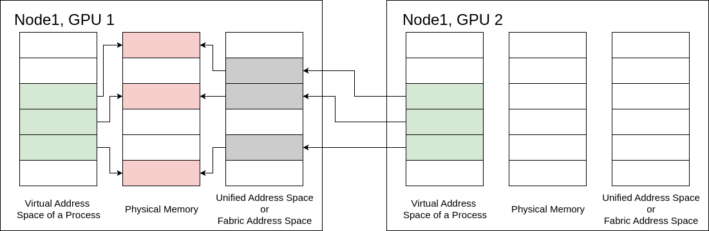

# 4.16 虚拟内存管理

> 本文档为 [NVIDIA CUDA Programming Guide](https://docs.nvidia.com/cuda/cuda-programming-guide/) 官方文档中文翻译版
>
> 原文地址：[https://docs.nvidia.com/cuda/cuda-programming-guide/04-special-topics/virtual-memory-management.html](https://docs.nvidia.com/cuda/cuda-programming-guide/04-special-topics/virtual-memory-management.html)

---

此页面是否有帮助？

# 4.16. 虚拟内存管理

在 CUDA 编程模型中，内存分配调用（例如 `cudaMalloc()`）会返回一个位于 GPU 内存中的地址。该地址可用于任何 CUDA API 或设备内核内部。开发者可以通过使用 `cudaEnablePeerAccess` 来启用对等设备访问该内存分配。这样做之后，不同设备上的内核就可以访问相同的数据。然而，所有过去和未来的用户分配也会被映射到目标对等设备。这可能导致用户无意中为将所有 `cudaMalloc` 分配映射到对等设备而付出运行时成本。在大多数情况下，应用程序仅通过与其他设备共享少量分配来进行通信。通常没有必要将所有分配映射到所有设备。此外，将这种方法扩展到多节点设置本质上变得很困难。

CUDA 提供了一个*虚拟内存管理*（VMM）API，让开发者能够对此过程进行显式的、低级别的控制。

虚拟内存分配是一个由操作系统和内存管理单元（MMU）管理的复杂过程，它分为两个关键阶段。首先，操作系统为程序保留一个连续的虚拟地址范围，而不分配任何物理内存。然后，当程序首次尝试使用该内存时，操作系统提交虚拟地址，根据需要将物理存储分配给虚拟页面。

CUDA 的 VMM API 将类似的概念引入 GPU 内存管理，允许开发者显式地保留一个虚拟地址范围，然后稍后将其映射到物理 GPU 内存。借助 VMM，应用程序可以专门选择某些分配供其他设备访问。

VMM API 让复杂的应用程序能够在多个 GPU（以及 CPU 核心）之间更有效地管理内存。通过支持手动控制内存保留、映射和访问权限，VMM API 实现了诸如细粒度数据共享、零拷贝传输和自定义内存分配器等高级技术。CUDA VMM API 向用户公开了细粒度的控制，用于管理应用程序中的 GPU 内存。

开发者可以通过以下几种关键方式从 VMM API 中受益：

-   对虚拟和物理内存管理进行细粒度控制，允许将非连续的物理内存块分配和映射到连续的虚拟地址空间。这有助于减少 GPU 内存碎片并提高内存利用率，特别是对于像深度神经网络训练这样的大型工作负载。
-   通过将虚拟地址空间的保留与物理内存分配分离，实现高效的内存分配和释放。开发者可以保留大的虚拟内存区域，并按需映射物理内存，而无需昂贵的内存拷贝或重新分配，从而在动态数据结构和可变大小的内存分配中带来性能提升。
-   能够动态增长 GPU 内存分配，而无需复制和重新分配所有数据，类似于 realloc 或 std::vector 的工作方式。
在 CPU 内存管理中。这支持更灵活、更高效的 GPU 内存使用模式。
- 通过提供低级 API 来提升开发者的生产力和应用程序性能，这些 API 允许构建复杂的内存分配器和缓存管理系统，例如在大型语言模型中动态管理键值缓存，从而提高吞吐量和降低延迟。
- CUDA VMM API 在分布式多 GPU 环境中极具价值，因为它支持跨多个 GPU 进行高效的内存共享和访问。通过将虚拟地址与物理内存解耦，该 API 允许开发者创建一个统一的虚拟地址空间，数据可以动态映射到不同的 GPU。这优化了内存使用并减少了数据传输开销。例如，NVIDIA 的 NCCL 和 NVShmem 等库就积极使用 VMM。

总之，CUDA VMM API 为开发者提供了先进的工具，用于实现超越传统类 `malloc` 抽象的更精细、高效、灵活和可扩展的 GPU 内存管理，这对于高性能和大内存应用程序非常重要。

!!! note "注意"
    本节描述的 API 套件要求系统支持 UVA。请参阅《虚拟内存管理 API》。

## 4.16.1. 预备知识

### 4.16.1.1. 定义

**结构内存：** 结构内存指的是可通过高速互连结构（如 NVIDIA 的 NVLink 和 NVSwitch）访问的内存。这种结构在多个 GPU 或节点之间提供了内存一致性和高带宽通信层，使它们能够高效地共享内存，就好像内存连接在一个统一的结构上，而不是孤立在各个设备上。

CUDA 12.4 及更高版本具有 VMM 分配句柄类型 `CU_MEM_HANDLE_TYPE_FABRIC`。在支持的平台上，并且 NVIDIA IMEX 守护进程正在运行时，此分配句柄类型不仅支持使用任何通信机制（例如 MPI）在节点内共享分配，还支持在节点间共享。这使得多节点 NVLink 系统中的 GPU 能够映射属于同一 NVLink 结构的所有其他 GPU 的内存，即使它们位于不同的节点中。

**内存句柄：** 在 VMM 中，句柄是表示物理内存分配的不透明标识符。这些句柄是管理低级 CUDA VMM API 中内存的核心。它们支持对可映射到虚拟地址空间的物理内存对象进行灵活控制。句柄唯一标识一个物理内存分配。句柄作为对内存资源的抽象引用，而不暴露直接指针。句柄允许跨进程或设备执行导出和导入内存等操作，从而促进内存共享和虚拟化。

**IMEX 通道：** IMEX 名称代表*节点间内存交换*，是 NVIDIA 用于跨不同节点进行 GPU 到 GPU 通信的解决方案的一部分。IMEX 通道是 GPU 驱动程序的一项功能，它在 IMEX 域内的多用户或多节点环境中提供基于用户的内存隔离。IMEX 通道作为一种安全和隔离机制。
IMEX 通道与结构体句柄直接相关，必须在多节点 GPU 通信中启用。当 GPU 分配内存并希望使其可被不同节点上的 GPU访问时，它首先需要导出该内存的句柄。IMEX 通道在此导出过程中用于生成一个安全的结构体句柄，该句柄只能由具有正确通道访问权限的远程进程导入。

**单播内存访问：** 在 VMM API 上下文中，单播内存访问指的是由特定设备或进程将物理内存受控地、直接地映射并访问到唯一的虚拟地址范围。与向多个设备广播访问不同，单播内存访问意味着特定的 GPU 设备被授予对映射到物理内存分配的保留虚拟地址范围的显式读/写权限。

**多播内存访问：** 在 VMM API 上下文中，多播内存访问指的是单个物理内存分配或区域能够通过多播机制同时映射到多个设备的虚拟地址空间的能力。这使得数据可以在多个 GPU 之间以一对多的方式高效共享，减少冗余数据传输并提高通信效率。NVIDIA 的 CUDA VMM API 支持创建多播对象，该对象将来自多个设备的物理内存分配绑定在一起。

### 4.16.1.2. 查询支持情况

应用程序在尝试使用功能之前应查询其支持情况，因为其可用性可能因 GPU 架构、驱动程序版本和所使用的特定软件库而异。以下各节详细说明了如何以编程方式检查必要的支持。

**VMM 支持** 在尝试使用 VMM API 之前，应用程序必须确保其要使用的设备支持 CUDA 虚拟内存管理。以下代码示例展示了如何查询 VMM 支持：

```c++
int deviceSupportsVmm;
CUresult result = cuDeviceGetAttribute(&deviceSupportsVmm, CU_DEVICE_ATTRIBUTE_VIRTUAL_MEMORY_MANAGEMENT_SUPPORTED, device);
if (deviceSupportsVmm != 0) {
    // `device` 支持虚拟内存管理
}
```

**结构体内存支持：** 在尝试使用结构体内存之前，应用程序必须确保其要使用的设备支持结构体内存。以下代码示例展示了如何查询结构体内存支持：

```c++
int deviceSupportsFabricMem;
CUresult result = cuDeviceGetAttribute(&deviceSupportsFabricMem, CU_DEVICE_ATTRIBUTE_HANDLE_TYPE_FABRIC_SUPPORTED, device);
if (deviceSupportsFabricMem != 0) {
    // `device` 支持结构体内存
}
```

除了使用 `CU_MEM_HANDLE_TYPE_FABRIC` 作为句柄类型以及不需要依赖操作系统原生机制进行进程间通信来交换可共享句柄之外，使用结构体内存与其他分配句柄类型相比没有区别。

**IMEX 通道支持** 在 IMEX 域内，IMEX 通道支持在多用户环境中安全地共享内存。NVIDIA 驱动程序通过创建一个字符设备 `nvidia-caps-imex-channels` 来实现此功能。要使用基于结构体句柄的共享，用户应验证两件事：
- 首先，应用程序必须验证该设备是否存在于 `/proc/devices` 下：

```c++
# cat /proc/devices | grep nvidia
195 nvidia
195 nvidiactl
234 nvidia-caps-imex-channels
509 nvidia-nvswitch

nvidia-caps-imex-channels 设备应具有一个主设备号（例如 234）。
```

- 其次，对于两个要共享内存的 CUDA 进程（一个导出器和一个导入器），它们都必须能够访问同一个 IMEX 通道文件。这些文件，例如 `/dev/nvidia-caps-imex-channels/channel0`，是代表各个 IMEX 通道的节点。系统管理员必须创建这些文件，例如使用 `mknod()` 命令。

```c++
# mknod /dev/nvidia-caps-imex-channels/channelN c <major_number> 0

此命令使用从 /proc/devices 获取的主设备号创建 channelN。
```

!!! note "注意"
    默认情况下，如果指定了 `NVreg_CreateImexChannel0` 模块参数，驱动程序可以创建 `channel0`。

**多播对象支持：** 在尝试使用多播对象之前，应用程序必须确保它们要使用的设备支持此功能。以下代码示例展示了如何查询多播对象支持：

```c++
int deviceSupportsMultiCast;
CUresult result = cuDeviceGetAttribute(&deviceSupportsMultiCast, CU_DEVICE_ATTRIBUTE_MULTICAST_SUPPORTED, device);
if (deviceSupportsMultiCast != 0) {
    // `device` 支持多播对象
}
```

## 4.16.2. API 概述

VMM API 为开发者提供了对虚拟内存管理的细粒度控制。VMM 是一个非常底层的 API，需要直接使用 [CUDA 驱动程序 API](../03-advanced/driver-api.html#driver-api)。这个多功能的 API 既可用于单节点环境，也可用于多节点环境。

要有效使用 VMM，开发者必须扎实掌握内存管理中的几个关键概念：
- 了解操作系统的虚拟内存基础知识，包括其如何处理页面和地址空间
- 理解内存层次结构和硬件特性是必要的
- 熟悉进程间通信（IPC）方法，例如套接字或消息传递
- 具备内存访问权限安全性的基本知识


*图 52 VMM 使用概述。
此图概述了使用 VMM 所需的一系列步骤。
该过程从评估环境设置开始。基于此评估，用户必须做出一个关键性的初始决定：是使用结构内存句柄还是操作系统特定句柄。
根据初始选择的句柄类型，必须采取一系列不同的后续步骤。然而，最终的内存管理操作——具体来说，对已分配内存的映射、保留和设置访问权限——与所选句柄的类型无关。*

VMM API 工作流涉及一系列内存管理步骤，其关键重点是在不同设备或进程之间共享内存。最初，开发者必须在源设备上分配物理内存。为了便于共享，VMM API 使用句柄将必要信息传递给目标设备或进程。用户必须导出一个用于共享的句柄，该句柄可以是操作系统特定句柄或结构特定句柄。操作系统特定句柄仅限于单节点上的进程间通信，而结构特定句柄则更具通用性，可用于单节点和多节点环境。需要注意的是，使用结构特定句柄需要启用 IMEX 通道。
句柄导出后，必须通过进程间通信协议与接收进程共享，具体方法由开发者选择。接收进程随后使用 VMM API 导入该句柄。句柄成功导出、共享并导入后，源进程和目标进程都必须预留虚拟地址空间，以便映射已分配的物理内存。最后一步是为每个设备设置内存访问权限，确保建立适当的权限。整个过程（包括两种句柄方法）在附图中进一步详细说明。

## 4.16.3. 单播内存共享

GPU 内存共享可以发生在具有多个 GPU 的单台机器上，也可以跨机器网络进行。该过程遵循以下步骤：

- **分配与导出**：一个 GPU 上的 CUDA 程序分配内存并获取其可共享句柄。
- **共享与导入**：然后使用 IPC、MPI 或 NCCL 等方式将句柄发送到节点上的其他程序。在接收 GPU 中，CUDA 驱动程序导入句柄，创建必要的内存对象。
- **预留与映射**：驱动程序创建从程序的虚拟地址（VA）到 GPU 物理地址（PA）再到其网络结构地址（FA）的映射。
- **访问权限**：为分配的内存设置访问权限。
- **释放内存**：程序结束执行时释放所有分配。



*图 53 单播内存共享示例*

### 4.16.3.1. 分配与导出

**分配物理内存**
使用虚拟内存管理 API 进行内存分配的第一步是创建一个物理内存块，为分配提供后备支持。为了分配物理内存，应用程序必须使用 `cuMemCreate` API。此函数创建的分配没有任何设备或主机映射。函数参数 `CUmemGenericAllocationHandle` 描述了要分配内存的属性，例如分配的位置、分配是否将共享给另一个进程（或图形 API），或者要分配内存的物理属性。用户必须确保请求的分配大小与适当的粒度对齐。有关分配粒度要求的信息可以使用 `cuMemGetAllocationGranularity` 查询。

**操作系统特定句柄（Linux）**

```cuda
CUmemGenericAllocationHandle allocatePhysicalMemory(int device, size_t size) {
    CUmemAllocationHandleType handleType = CU_MEM_HANDLE_TYPE_POSIX_FILE_DESCRIPTOR;
    CUmemAllocationProp prop = {};
    prop.type = CU_MEM_ALLOCATION_TYPE_PINNED;
    prop.location.type = CU_MEM_LOCATION_TYPE_DEVICE;
    prop.location.id = device;
    prop.requestedHandleType = handleType;

    size_t granularity = 0;
    cuMemGetAllocationGranularity(&granularity, &prop, CU_MEM_ALLOC_GRANULARITY_MINIMUM);

    // Ensure size matches granularity requirements for the allocation
    size_t padded_size = ROUND_UP(size, granularity);

    // Allocate physical memory
    CUmemGenericAllocationHandle allocHandle;
    cuMemCreate(&allocHandle, padded_size, &prop, 0);

    return allocHandle;
}
```
**Fabric 句柄**

```cuda
CUmemGenericAllocationHandle allocatePhysicalMemory(int device, size_t size) {
    CUmemAllocationHandleType handleType = CU_MEM_HANDLE_TYPE_FABRIC;
    CUmemAllocationProp prop = {};
    prop.type = CU_MEM_ALLOCATION_TYPE_PINNED;
    prop.location.type = CU_MEM_LOCATION_TYPE_DEVICE;
    prop.location.id = device;
    prop.requestedHandleType = handleType;

    size_t granularity = 0;
    cuMemGetAllocationGranularity(&granularity, &prop, CU_MEM_ALLOC_GRANULARITY_MINIMUM);

    // 确保分配大小满足粒度要求
    size_t padded_size = ROUND_UP(size, granularity);

    // 分配物理内存
    CUmemGenericAllocationHandle allocHandle;
    cuMemCreate(&allocHandle, padded_size, &prop, 0);

    return allocHandle;
}
```

!!! note "注意"
    `cuMemCreate` 分配的内存由其返回的 `CUmemGenericAllocationHandle` 引用。请注意，此引用不是指针，其内存尚不可访问。

!!! note "注意"
    可以使用 `cuMemGetAllocationPropertiesFromHandle` 查询分配句柄的属性。

**导出内存句柄** CUDA 虚拟内存管理 API 提供了一种新的进程间通信机制，使用句柄来交换有关分配和物理地址空间的必要信息。可以导出特定于操作系统的 IPC 句柄或特定于 Fabric 的 IPC 句柄。特定于操作系统的 IPC 句柄只能在单节点设置中使用。特定于 Fabric 的句柄可以在单节点或多节点设置中使用。

**特定于操作系统的句柄 (Linux)**

```cuda
CUmemAllocationHandleType handleType = CU_MEM_HANDLE_TYPE_POSIX_FILE_DESCRIPTOR;
CUmemGenericAllocationHandle handle = allocatePhysicalMemory(0, 1<<21);
int fd;
cuMemExportToShareableHandle(&fd, handle, handleType, 0);
```

**Fabric 句柄**

```cuda
CUmemAllocationHandleType handleType = CU_MEM_HANDLE_TYPE_FABRIC;
CUmemGenericAllocationHandle handle = allocatePhysicalMemory(0, 1<<21);
CUmemFabricHandle fh;
cuMemExportToShareableHandle(&fh, handle, handleType, 0);
```

!!! note "注意"
    特定于操作系统的句柄要求所有进程属于同一操作系统。

!!! note "注意"
    特定于 Fabric 的句柄需要系统管理员启用 IMEX 通道。

[memMapIpcDrv](https://github.com/NVIDIA/cuda-samples/tree/master/Samples/3_CUDA_Features/memMapIPCDrv/) 示例可以作为将 IPC 与 VMM 分配一起使用的范例。

### 4.16.3.2. 共享与导入

**共享内存句柄** 一旦句柄被导出，必须使用进程间通信协议将其共享给一个或多个接收进程。开发者可以自由选择任何方法来共享句柄。所使用的具体 IPC 方法取决于应用程序的设计和环境。常见方法包括特定于操作系统的进程间套接字和分布式消息传递。使用特定于操作系统的 IPC 可以提供高性能传输，但仅限于同一台机器上的进程，且不可移植。特定于 Fabric 的 IPC 更简单且更具可移植性。然而，特定于 Fabric 的 IPC 需要系统级支持。所选方法必须安全可靠地将句柄数据传输到目标进程，以便其可用于导入内存并建立有效的映射。选择 IPC 方法的灵活性使得 VMM API 能够集成到广泛的系统架构中，从单节点应用程序到分布式多节点设置。在以下代码片段中，我们将提供使用套接字编程和 MPI 来共享和接收句柄的示例。
**发送：操作系统特定的进程间通信（Linux）**

```cuda
int ipcSendShareableHandle(int socket, int fd, pid_t process) {
    struct msghdr msg;
    struct iovec iov[1];

    union {
        struct cmsghdr cm;
        char* control;
    } control_un;

    size_t sizeof_control = CMSG_SPACE(sizeof(int)) * sizeof(char);
    control_un.control = (char*) malloc(sizeof_control);

    struct cmsghdr *cmptr;
    ssize_t readResult;
    struct sockaddr_un cliaddr;
    socklen_t len = sizeof(cliaddr);

    // 构造要发送此可共享句柄的客户端地址
    memset(&cliaddr, 0, sizeof(cliaddr));
    cliaddr.sun_family = AF_UNIX;
    char temp[20];
    sprintf(temp, "%s%u", "/tmp/", process);
    strcpy(cliaddr.sun_path, temp);
    len = sizeof(cliaddr);

    // 将对应的可共享句柄发送给客户端
    int sendfd = fd;

    msg.msg_control = control_un.control;
    msg.msg_controllen = sizeof_control;

    cmptr = CMSG_FIRSTHDR(&msg);
    cmptr->cmsg_len = CMSG_LEN(sizeof(int));
    cmptr->cmsg_level = SOL_SOCKET;
    cmptr->cmsg_type = SCM_RIGHTS;

    memmove(CMSG_DATA(cmptr), &sendfd, sizeof(sendfd));

    msg.msg_name = (void *)&cliaddr;
    msg.msg_namelen = sizeof(struct sockaddr_un);

    iov[0].iov_base = (void *)"";
    iov[0].iov_len = 1;
    msg.msg_iov = iov;
    msg.msg_iovlen = 1;

    ssize_t sendResult = sendmsg(socket, &msg, 0);
    if (sendResult <= 0) {
        perror("IPC failure: Sending data over socket failed");
        free(control_un.control);
        return -1;
    }

    free(control_un.control);
    return 0;
}
```

**发送：操作系统特定的进程间通信（Windows）**

```cuda
int ipcSendShareableHandle(HANDLE *handle, HANDLE &shareableHandle, PROCESS_INFORMATION process) {
    HANDLE hProcess = OpenProcess(PROCESS_DUP_HANDLE, FALSE, process.dwProcessId);
    HANDLE hDup = INVALID_HANDLE_VALUE;
    DuplicateHandle(GetCurrentProcess(), shareableHandle, hProcess, &hDup, 0, FALSE, DUPLICATE_SAME_ACCESS);
    DWORD cbWritten;
    WriteFile(handle->hMailslot[i], &hDup, (DWORD)sizeof(hDup), &cbWritten, (LPOVERLAPPED)NULL);
    CloseHandle(hProcess);
    return 0;
}
```

**发送：Fabric IPC**

```cuda
MPI_Send(&fh, sizeof(CUmemFabricHandle), MPI_BYTE, 1, 0, MPI_COMM_WORLD);
```

**接收：操作系统特定的进程间通信（Linux）**

```cuda
int ipcRecvShareableHandle(int socket, int* fd) {
    struct msghdr msg = {0};
    struct iovec iov[1];
    struct cmsghdr cm;

    // 联合体用于保证控制数组的对齐要求
    union {
        struct cmsghdr cm;
        // 这在 QNX 上无法工作，因为 QNX 的 CMSG_SPACE 调用了 __cmsg_alignbytes
        // 而 __cmsg_alignbytes 是一个运行时函数，而非编译时宏
        // char control[CMSG_SPACE(sizeof(int))]
        char* control;
    } control_un;

    size_t sizeof_control = CMSG_SPACE(sizeof(int)) * sizeof(char);
    control_un.control = (char*) malloc(sizeof_control);
    struct cmsghdr *cmptr;
    ssize_t n;
    int receivedfd;
    char dummy_buffer[1];
    ssize_t sendResult;
    msg.msg_control = control_un.control;
    msg.msg_controllen = sizeof_control;

    iov[0].iov_base = (void *)dummy_buffer;
    iov[0].iov_len = sizeof(dummy_buffer);

    msg.msg_iov = iov;
    msg.msg_iovlen = 1;
    if ((n = recvmsg(socket, &msg, 0)) <= 0) {
        perror("IPC failure: Receiving data over socket failed");
        free(control_un.control);
        return -1;
    }

    if (((cmptr = CMSG_FIRSTHDR(&msg)) != NULL) &&
        (cmptr->cmsg_len == CMSG_LEN(sizeof(int)))) {
        if ((cmptr->cmsg_level != SOL_SOCKET) || (cmptr->cmsg_type != SCM_RIGHTS)) {
        free(control_un.control);
        return -1;
        }

        memmove(&receivedfd, CMSG_DATA(cmptr), sizeof(receivedfd));
        *fd = receivedfd;
    } else {
        free(control_un.control);
        return -1;
    }

    free(control_un.control);
    return 0;
}
```
**接收：操作系统特定的进程间通信（Windows）**

```cuda
int ipcRecvShareableHandle(HANDLE &handle, HANDLE *shareableHandle) {
    DWORD cbRead;
    ReadFile(handle, shareableHandle, (DWORD)sizeof(*shareableHandles), &cbRead, NULL);
    return 0;
}
```

**接收：结构 IPC**

```cuda
MPI_Recv(&fh, sizeof(CUmemFabricHandle), MPI_BYTE, 1, 0, MPI_COMM_WORLD);
```

**导入内存句柄** 同样，用户可以导入操作系统特定的 IPC 句柄或结构特定的 IPC 句柄。操作系统特定的 IPC 句柄只能在单节点上使用。结构特定的句柄可用于单节点或多节点。

**操作系统特定句柄（Linux）**

```cuda
CUmemAllocationHandleType handleType = CU_MEM_HANDLE_TYPE_POSIX_FILE_DESCRIPTOR;
cuMemImportFromShareableHandle(handle, (void*) &fd, handleType);
```

**结构句柄**

```cuda
CUmemAllocationHandleType handleType = CU_MEM_HANDLE_TYPE_FABRIC;
cuMemImportFromShareableHandle(handle, (void*) &fh, handleType);
```

### 4.16.3.3. 预留与映射

**预留虚拟地址范围**

由于在 VMM 中地址和内存的概念是分离的，应用程序必须开辟出一个地址范围，该范围能够容纳通过 `cuMemCreate` 进行的内存分配。预留的地址范围必须至少与用户计划放置其中的所有物理内存分配的大小总和一样大。

应用程序可以通过向 `cuMemAddressReserve` 传递适当的参数来预留一个虚拟地址范围。获得的地址范围将不会关联任何设备或主机物理内存。预留的虚拟地址范围可以映射到系统中属于任何设备的内存块，从而为应用程序提供一个连续的 VA 范围，该范围由属于不同设备的内存支持和映射。应用程序应使用 `cuMemAddressFree` 将虚拟地址范围返回给 CUDA。用户必须确保在调用 `cuMemAddressFree` 之前，整个 VA 范围都已取消映射。这些函数在概念上类似于 Linux 上的 `mmap` 和 `munmap`，或 Windows 上的 `VirtualAlloc` 和 `VirtualFree`。以下代码片段说明了该函数的用法：

```c++
CUdeviceptr ptr;
// `ptr` 保存返回的预留虚拟地址范围的起始地址。
CUresult result = cuMemAddressReserve(&ptr, size, 0, 0, 0); // alignment = 0 表示使用默认对齐方式
```

**映射内存**

前两节中分配的物理内存和开辟的虚拟地址空间代表了 VMM API 引入的内存和地址的区分。为了使分配的内存可用，用户必须将内存映射到地址空间。从 `cuMemAddressReserve` 获得的地址范围和从 `cuMemCreate` 或 `cuMemImportFromShareableHandle` 获得的物理分配必须通过使用 `cuMemMap` 相互关联。

只要用户开辟了足够的地址空间，就可以将来自多个设备的分配关联到连续的虚拟地址范围中。要解除物理分配和地址范围的关联，用户必须使用 `cuMemUnmap` 取消映射该映射的地址。用户可以随意多次将内存映射到同一地址范围或取消映射，只要确保不会尝试在已经映射的 VA 范围预留上创建映射即可。以下代码片段说明了该函数的用法：

```c++
CUdeviceptr ptr;
// `ptr`: address in the address range previously reserved by cuMemAddressReserve.
// `allocHandle`: CUmemGenericAllocationHandle obtained by a previous call to cuMemCreate.
CUresult result = cuMemMap(ptr, size, 0, allocHandle, 0);
```

### 4.16.3.4.Access Rights

CUDA’s virtual memory management APIs enable applications to explicitly protect their VA ranges with access control mechanisms. Mapping the allocation to a region of the address range using `cuMemMap` does not make the address accessible, and would result in a program crash if accessed by a CUDA kernel. Users must specifically select access control using the `cuMemSetAccess` function on source and accessing devices. This allows or restricts access for specific devices to a mapped  address range. The following code snippet illustrates the usage for the function:

```c++
void setAccessOnDevice(int device, CUdeviceptr ptr, size_t size) {
    CUmemAccessDesc accessDesc = {};
    accessDesc.location.type = CU_MEM_LOCATION_TYPE_DEVICE;
    accessDesc.location.id = device;
    accessDesc.flags = CU_MEM_ACCESS_FLAGS_PROT_READWRITE;

    // Make the address accessible
    cuMemSetAccess(ptr, size, &accessDesc, 1);
}
```

The access control mechanism exposed with VMM allows users to be explicit about which allocations they want to share with other peer devices on the system. As specified earlier, `cudaEnablePeerAccess` forces all prior and future allocations made with `cudaMalloc` to be mapped to the target peer device. This can be convenient in many cases as user doesn’t have to worry about tracking the mapping state of every allocation to every device in the system. But this approach [has performance implications](https://devblogs.nvidia.com/introducing-low-level-gpu-virtual-memory-management/). With access control at allocation granularity, VMM allows peer mappings with minimal overhead.

The `vectorAddMMAP`[sample](https://github.com/NVIDIA/cuda-samples/tree/master/Samples/0_Introduction/vectorAddMMAP) can be used as an example for using the Virtual Memory Management APIs.

### 4.16.3.5.Releasing the Memory

To release the allocated memory and address space, both the source and target processes should use cuMemUnmap, cuMemRelease, and cuMemAddressFree functions in that order. The cuMemUnmap function un-maps a previously mapped memory region from an address range, effectively detaching the physical memory from the reserved virtual address space. Next, cuMemRelease deallocates the physical memory that was previously created, returning it to the system. Finally, cuMemAddressFree frees a virtual address range that was previously reserved, making it available for future use. This specific order ensures a clean and complete deallocation of both the physical memory and the virtual address space.

```c++
cuMemUnmap(ptr, size);
cuMemRelease(handle);
cuMemAddressFree(ptr, size);
```

!!! note "Note"
    In the OS-specific case, the exported handle must be closed using fclose .
此步骤不适用于基于 fabric 的情况。

## 4.16.4. 多播内存共享

[多播对象管理 API](https://docs.nvidia.com/cuda/cuda-driver-api/group__CUDA__MULTICAST.html#group__CUDA__MULTICAST/) 为应用程序提供了一种创建多播对象的方法，结合上述的[虚拟内存管理 API](https://docs.nvidia.com/cuda/cuda-driver-api/group__CUDA__VA.html)，允许应用程序在支持 NVLink SHARP 的、通过 NVSwitch 连接的 NVLink GPU 上利用该功能。NVLink SHARP 允许 CUDA 应用程序利用 fabric 内计算来加速诸如广播和归约等操作，这些操作发生在通过 NVSwitch 连接的 GPU 之间。为此，多个通过 NVLink 连接的 GPU 形成一个多播团队，团队中的每个 GPU 都使用物理内存来支持一个多播对象。因此，一个由 N 个 GPU 组成的多播团队拥有一个多播对象的 N 个物理副本，每个副本位于一个参与的 GPU 本地。使用多播对象映射的 [multimem PTX 指令](https://docs.nvidia.com/cuda/parallel-thread-execution/index.html#data-movement-and-conversion-instructions-multimem-ld-reduce-multimem-st-multimem-red/) 会作用于该多播对象的所有副本。

要使用多播对象，应用程序需要：

-   查询多播支持
-   使用 `cuMulticastCreate` 创建多播句柄。
-   与所有控制应参与多播团队的 GPU 的进程共享该多播句柄。这可以通过上述的 `cuMemExportToShareableHandle` 实现。
-   使用 `cuMulticastAddDevice` 将所有应参与多播团队的 GPU 添加进来。
-   对于每个参与的 GPU，将使用 `cuMemCreate` 分配的物理内存（如上所述）绑定到多播句柄。在任何设备上绑定内存之前，需要将所有设备添加到多播团队中。
-   保留一个地址范围，映射多播句柄并设置访问权限，操作方式与常规单播映射相同。对同一物理内存进行单播和多播映射是可能的。关于如何确保对同一物理内存的多个映射之间的一致性，请参阅上文的虚拟别名支持部分。
-   将 multimem PTX 指令与多播映射一起使用。

[多 GPU 编程模型](https://github.com/NVIDIA/multi-gpu-programming-models/) GitHub 仓库中的 `multi_node_p2p` 示例包含一个使用 fabric 内存（包括多播对象）来利用 NVLink SHARP 的完整示例。请注意，此示例适用于 NCCL 或 NVSHMEM 等库的开发者。它展示了像 NVSHMEM 这样的高级编程模型如何在（多节点）NVLink 域内部工作。应用程序开发者通常应使用更高级的 MPI、NCCL 或 NVSHMEM 接口，而不是直接使用此 API。

### 4.16.4.1. 分配多播对象

可以使用 `cuMulticastCreate` 创建多播对象：

```c++
CUmemGenericAllocationHandle createMCHandle(int numDevices, size_t size) {
    CUmemAllocationProp mcProp = {};
    mcProp.numDevices = numDevices;
    mcProp.handleTypes = CU_MEM_HANDLE_TYPE_FABRIC; // 或者在单节点上使用 CU_MEM_HANDLE_TYPE_POSIX_FILE_DESCRIPTOR

    size_t granularity = 0;
    cuMulticastGetGranularity(&granularity, &mcProp, CU_MEM_ALLOC_GRANULARITY_MINIMUM);

    // 确保大小满足分配所需的粒度要求
    size_t padded_size = ROUND_UP(size, granularity);

    mcProp.size = padded_size;

    // 创建多播对象，此时它还没有关联任何设备或物理内存
    CUmemGenericAllocationHandle mcHandle;
    cuMulticastCreate(&mcHandle, &mcProp);

    return mcHandle;
}
```
### 4.16.4.2. 向多播对象添加设备

可以使用 `cuMulticastAddDevice` 将设备添加到多播团队：

```c++
cuMulticastAddDevice(&mcHandle, device);
```

在任何设备上的内存绑定到多播对象之前，需要在控制参与多播团队的所有设备的所有进程上完成此步骤。

### 4.16.4.3. 将内存绑定到多播对象

创建多播对象并将所有参与设备添加到该对象后，需要使用为每个设备分配的 `cuMemCreate` 物理内存来支持它：

```c++
cuMulticastBindMem(mcHandle, mcOffset, memHandle, memOffset, size, 0 /*flags*/);
```

### 4.16.4.4. 使用多播映射

要在 CUDA C++ 中使用多播映射，必须使用[多内存 PTX 指令](https://docs.nvidia.com/cuda/parallel-thread-execution/index.html#data-movement-and-conversion-instructions-multimem-ld-reduce-multimem-st-multimem-red/)和内联 PTX：

```c++
__global__ void all_reduce_norm_barrier_kernel(float* l2_norm,
                                               float* partial_l2_norm_mc,
                                               unsigned int* arrival_counter_uc, unsigned int* arrival_counter_mc,
                                               const unsigned int expected_count) {
    assert( 1 == blockDim.x * blockDim.y * blockDim.z * gridDim.x * gridDim.y * gridDim.z );
    float l2_norm_sum = 0.0;
#if __CUDA_ARCH__ >= 900

    // 对所有副本进行原子归约
    // 这可以概念上理解为 __threadfence_system(); atomicAdd_system(arrival_counter_mc, 1);
    cuda::ptx::multimem_red(cuda::ptx::release_t, cuda::ptx::scope_sys_t, cuda::ptx::op_add_t, arrival_counter_mc, n);

    // 在对同一内存 `arrival_counter_uc` 和 `arrival_counter_mc` 进行多播（mc）和单播（uc）访问之间需要一个栅栏：
    // - fence.proxy 指令在不同代理可能发生的内存访问之间建立顺序
    // - .proxykind 限定符的 .alias 值指的是使用虚拟别名地址对同一内存位置执行的内存访问。
    // 来自 https://docs.nvidia.com/cuda/parallel-thread-execution/#parallel-synchronization-and-communication-instructions-membar
    cuda::ptx::fence_proxy_alias();

    // 在 UC 映射上使用获取顺序进行自旋等待，直到所有对等体都已到达此迭代
    // 注意：所有等级在此内核之后需要到达另一个屏障，这样，如果某个其他等级较慢，则不可能由下一个迭代的某个等级到达来解除屏障的阻塞。
    cuda::atomic_ref<unsigned int,cuda::thread_scope_system> ac(arrival_counter_uc);
    while (expected_count > ac.load(cuda::memory_order_acquire));

    // 从所有副本进行原子加载归约。它不提供顺序，因此可以是宽松的。
    asm volatile ("multimem.ld_reduce.relaxed.sys.global.add.f32 %0, [%1];" : "=f"(l2_norm_sum) : "l"(partial_l2_norm_mc) : "memory");

#else
    #error "ERROR: multimem instructions require compute capability 9.0 or larger."
#endif

    *l2_norm = std::sqrt(l2_norm_sum);
}
```
## 4.16.5.高级配置

### 4.16.5.1.内存类型

VMM 还为应用程序提供了一种机制，用于分配某些设备可能支持的特殊类型内存。通过 `cuMemCreate`，应用程序可以使用 `CUmemAllocationProp::allocFlags` 来指定内存类型要求，以选择特定的内存功能。应用程序必须确保所请求的内存类型受设备支持。

### 4.16.5.2.可压缩内存

可压缩内存可用于加速对具有非结构化稀疏性及其他可压缩数据模式的数据的访问。根据数据的不同，压缩可以节省 DRAM 带宽、L2 读取带宽和 L2 容量。希望在支持计算数据压缩的设备上分配可压缩内存的应用程序，可以通过将 `CUmemAllocationProp::allocFlags::compressionType` 设置为 `CU_MEM_ALLOCATION_COMP_GENERIC` 来实现。用户必须通过使用 `CU_DEVICE_ATTRIBUTE_GENERIC_COMPRESSION_SUPPORTED` 来查询设备是否支持计算数据压缩。以下代码片段说明了如何查询对可压缩内存的支持 `cuDeviceGetAttribute`。

```c++
int compressionSupported = 0;
cuDeviceGetAttribute(&compressionSupported, CU_DEVICE_ATTRIBUTE_GENERIC_COMPRESSION_SUPPORTED, device);
```

在支持计算数据压缩的设备上，用户必须在分配时选择加入，如下所示：

```c++
prop.allocFlags.compressionType = CU_MEM_ALLOCATION_COMP_GENERIC;
```

由于各种原因（例如有限的硬件资源），分配可能不具有压缩属性。为了验证标志是否生效，用户可以使用 `cuMemGetAllocationPropertiesFromHandle` 查询已分配内存的属性。

```c++
CUmemAllocationProp allocationProp = {};
cuMemGetAllocationPropertiesFromHandle(&allocationProp, allocationHandle);

if (allocationProp.allocFlags.compressionType == CU_MEM_ALLOCATION_COMP_GENERIC)
{
    // 获得了可压缩内存分配
}
```

### 4.16.5.3.虚拟别名支持

虚拟内存管理 API 提供了一种方法，可以通过多次调用 `cuMemMap` 并使用不同的虚拟地址，为同一分配创建多个虚拟内存映射或“代理”。这称为虚拟别名。除非 PTX ISA 中另有说明，否则对分配的一个代理的写入，在写入设备操作（内核启动、内存拷贝、内存设置等）完成之前，被视为与同一内存的任何其他代理不一致且不连贯。在写入设备操作之前存在于 GPU 上但在写入设备操作完成后才读取的内核，也被视为具有不一致且不连贯的代理。

例如，假设设备指针 A 和 B 是同一内存分配的虚拟别名，则以下代码片段被视为未定义行为：

```c++
__global__ void foo(char *A, char *B) {
  *A = 0x1;
  printf("%d\n", *B);    // 未定义行为！*B 可能取之前的值或某个中间值。
}
```

假设这两个内核是按顺序（通过流或事件）单调执行的，则以下行为是定义明确的：

```c++
__global__ void foo1(char *A) {
  *A = 0x1;
}

__global__ void foo2(char *B) {
  printf("%d\n", *B);    // *B == *A == 0x1 assuming foo2 waits for foo1
// to complete before launching
}

cudaMemcpyAsync(B, input, size, stream1);    // Aliases are allowed at
// operation boundaries
foo1<<<1,1,0,stream1>>>(A);                  // allowing foo1 to access A.
cudaEventRecord(event, stream1);
cudaStreamWaitEvent(stream2, event);
foo2<<<1,1,0,stream2>>>(B);
cudaStreamWaitEvent(stream3, event);
cudaMemcpyAsync(output, B, size, stream3);  // Both launches of foo2 and
                                            // cudaMemcpy (which both
                                            // read) wait for foo1 (which writes)
                                            // to complete before proceeding
```

If accessing same allocation through different “proxies” is required in the same kernel, a `fence.proxy.alias` can be used between the two accesses. The above example can thus be made legal with inline PTX assembly:

```c++
__global__ void foo(char *A, char *B) {
  *A = 0x1;
  cuda::ptx::fence_proxy_alias();
  printf("%d\n", *B);    // *B == *A == 0x1
}
```

### 4.16.5.4.OS-Specific Handle Details for IPC

With `cuMemCreate`, users have can indicate at allocation time that they have earmarked a particular allocation for inter-process communication or graphics interop purposes. Applications can do this by setting `CUmemAllocationProp::requestedHandleTypes` to a platform-specific field. On Windows, when `CUmemAllocationProp::requestedHandleTypes` is set to `CU_MEM_HANDLE_TYPE_WIN32` applications must also specify an LPSECURITYATTRIBUTES attribute in `CUmemAllocationProp::win32HandleMetaData`. This security attribute defines the scope of which exported allocations may be transferred to other processes.

Users must ensure they query for support of the requested handle type before attempting to export memory allocated with `cuMemCreate`. The following code snippet illustrates query for handle type support in a platform-specific way.

```c++
int deviceSupportsIpcHandle;
#if defined(__linux__)
    cuDeviceGetAttribute(&deviceSupportsIpcHandle, CU_DEVICE_ATTRIBUTE_HANDLE_TYPE_POSIX_FILE_DESCRIPTOR_SUPPORTED, device));
#else
    cuDeviceGetAttribute(&deviceSupportsIpcHandle, CU_DEVICE_ATTRIBUTE_HANDLE_TYPE_WIN32_HANDLE_SUPPORTED, device));
#endif
```

Users should set the `CUmemAllocationProp::requestedHandleTypes` appropriately as shown below:

```c++
#if defined(__linux__)
    prop.requestedHandleTypes = CU_MEM_HANDLE_TYPE_POSIX_FILE_DESCRIPTOR;
#else
    prop.requestedHandleTypes = CU_MEM_HANDLE_TYPE_WIN32;
    prop.win32HandleMetaData = // Windows specific LPSECURITYATTRIBUTES attribute.
#endif
```

 On this page