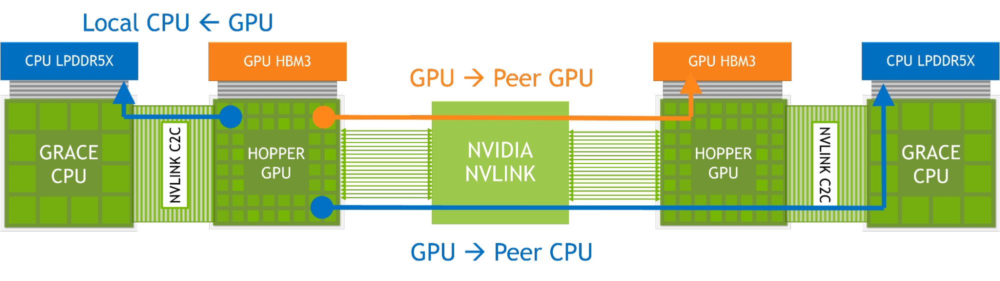

# 4.17 扩展 GPU 内存

> 本文档为 [NVIDIA CUDA Programming Guide](https://docs.nvidia.com/cuda/cuda-programming-guide/) 官方文档中文翻译版
>
> 原文地址：[https://docs.nvidia.com/cuda/cuda-programming-guide/04-special-topics/extended-gpu-memory.html](https://docs.nvidia.com/cuda/cuda-programming-guide/04-special-topics/extended-gpu-memory.html)

---

此页面是否有帮助？

# 4.17. 扩展 GPU 内存

扩展 GPU 内存（EGM）功能利用高带宽的 NVLink-C2C，在单节点和多节点系统中，为 GPU 高效访问所有系统内存提供了便利。EGM 适用于集成了 CPU-GPU 的 NVIDIA 系统，它允许分配可从该配置中任何 GPU 线程访问的物理内存。EGM 确保所有 GPU 都能以 GPU-GPU NVLink 或 NVLink-C2C 的速度访问其资源。



在此配置中，内存访问通过本地高带宽的 NVLink-C2C 进行。对于远程内存访问，则使用 GPU NVLink，在某些情况下也使用 NVLink-C2C。借助 EGM，GPU 线程获得了通过 NVSwitch 架构访问所有可用内存资源（包括 CPU 附加内存和 HBM3）的能力。

## 4.17.1. 预备知识

在深入探讨 EGM 功能的 API 变更之前，我们将先介绍当前支持的拓扑结构、标识符分配、虚拟内存管理的先决条件以及用于 EGM 的 CUDA 类型。

### 4.17.1.1. EGM 平台：系统拓扑

目前，EGM 可以在以下几种平台中启用：**(1) 单节点，单 GPU**：由一个基于 Arm 的 CPU、CPU 附加内存和一个 GPU 组成。CPU 和 GPU 之间通过高带宽的 C2C（芯片到芯片）互连。**(2) 单节点，多 GPU**：由多个基于 ARM 的 CPU（每个都有附加内存）和多个通过基于 NVLink 的网络连接的 GPU 组成。**(3) 多节点，多 GPU**：两个或多个单节点系统，每个系统如上述 (1) 或 (2) 所述，通过基于 NVLink 的网络连接。

!!! note "注意"
    使用 cgroups 来限制可用设备会阻塞通过 EGM 的路由并导致性能问题。请改用 `CUDA_VISIBLE_DEVICES`。

### 4.17.1.2. 插槽标识符：它们是什么？如何访问？

NUMA（非统一内存访问）是一种用于多处理器计算机系统的内存架构，它将内存划分为多个节点。每个节点都有自己的处理器和内存。在这样的系统中，NUMA 将系统划分为节点，并为每个节点分配一个唯一的标识符（numaID）。

EGM 使用由操作系统分配的 NUMA 节点标识符。请注意，此标识符与设备的序号不同，它与最近的主机节点相关联。除了现有方法外，用户可以通过调用 [cuDeviceGetAttribute](https://docs.nvidia.com/cuda/cuda-driver-api/group__CUDA__DEVICE.html#group__CUDA__DEVICE_1g9c3e1414f0ad901d3278a4d6645fc266) 并指定 `CU_DEVICE_ATTRIBUTE_HOST_NUMA_ID` 属性类型来获取主机节点的标识符（numaID），如下所示：

```cuda
int numaId;
cuDeviceGetAttribute(&numaId, CU_DEVICE_ATTRIBUTE_HOST_NUMA_ID, deviceOrdinal);
```

### 4.17.1.3. 分配器与 EGM 支持

将系统内存映射为 EGM 不会导致任何性能问题。实际上，访问映射为 EGM 的远程插槽系统内存将会更快。因为，使用 EGM 可以保证流量通过 NVLinks 路由。目前，`cuMemCreate` 和 `cudaMemPoolCreate` 分配器支持适当的定位类型和 NUMA 标识符。
### 4.17.1.4. 对现有 API 的内存管理扩展

目前，EGM 内存可以通过虚拟内存 (`cuMemCreate`) 或流序内存 (`cudaMemPoolCreate`) 分配器进行映射。用户负责在所有插槽上分配物理内存并将其映射到虚拟内存地址空间。

!!! note "注意"
    多节点、多 GPU 平台需要进程间通信。因此，我们建议读者参阅第 4.15 章。

!!! note "注意"
    我们建议读者阅读 CUDA 编程指南的第 4.16 章和第 4.3 章以获得更好的理解。

新的 CUDA 属性类型已添加到 API 中，允许这些方法使用类似 NUMA 的节点标识符来理解分配位置：

| CUDA 类型 | 用于 |
| --- | --- |
| CU_MEM_LOCATION_TYPE_HOST_NUMA | CUmemAllocationProp（用于 cuMemCreate） |
| cudaMemLocationTypeHostNuma | cudaMemPoolProps（用于 cudaMemPoolCreate） |

!!! note "注意"
    请参阅 CUDA 驱动程序 API 和 CUDA 运行时数据类型以查找有关 NUMA 特定 CUDA 类型的更多信息。

## 4.17.2. 使用 EGM 接口

### 4.17.2.1. 单节点，单 GPU

任何现有的 CUDA 主机分配器以及系统分配的内存都可以用于从高带宽 C2C 中受益。对用户而言，本地访问就是当前主机分配的方式。

!!! note "注意"
    有关内存分配器和页面大小的更多信息，请参阅调优指南。

### 4.17.2.2. 单节点，多 GPU

在多 GPU 系统中，用户必须为主机放置提供信息。正如我们提到的，表达该信息的一种自然方式是使用 NUMA 节点 ID，EGM 遵循这种方法。因此，使用 `cuDeviceGetAttribute` 函数，用户应该能够获知最近的 NUMA 节点 ID。（参见[插槽标识符：它们是什么？如何访问它们？](#socket-identifiers-what-are-they-how-to-access-them)）。然后，用户可以使用 VMM（虚拟内存管理）API 或 CUDA 内存池来分配和管理 EGM 内存。

#### 4.17.2.2.1. 使用 VMM API

使用虚拟内存管理 API 进行内存分配的第一步是创建一个物理内存块，该块将为分配提供支持。有关更多详细信息，请参阅 CUDA 编程指南的[虚拟内存管理部分](#virtual-memory-management)。在 EGM 分配中，用户必须显式提供 `CU_MEM_LOCATION_TYPE_HOST_NUMA` 作为位置类型，并提供 numaID 作为位置标识符。此外，在 EGM 中，分配必须与平台的适当粒度对齐。以下代码片段显示了使用 `cuMemCreate` 分配物理内存：

```cuda
CUmemAllocationProp prop{};
prop.type = CU_MEM_ALLOCATION_TYPE_PINNED;
prop.location.type = CU_MEM_LOCATION_TYPE_HOST_NUMA;
prop.location.id = numaId;
size_t granularity = 0;
cuMemGetAllocationGranularity(&granularity, &prop, MEM_ALLOC_GRANULARITY_MINIMUM);
size_t padded_size = ROUND_UP(size, granularity);
CUmemGenericAllocationHandle allocHandle;
cuMemCreate(&allocHandle, padded_size, &prop, 0);
```
在物理内存分配之后，我们需要预留地址空间并将其映射到指针。这些过程没有针对EGM的特定更改：

```cuda
CUdeviceptr dptr;
cuMemAddressReserve(&dptr, padded_size, 0, 0, 0);
cuMemMap(dptr, padded_size, 0, allocHandle, 0);
```

最后，用户必须显式保护已映射的虚拟地址范围。否则，访问映射空间将导致崩溃。与内存分配类似，用户需要提供 `CU_MEM_LOCATION_TYPE_HOST_NUMA` 作为位置类型，并以 numaId 作为位置标识符。以下代码片段为主机节点和GPU创建访问描述符，以授予两者对映射内存的读写访问权限：

```cuda
CUmemAccessDesc accessDesc[2]{{}};
accessDesc[0].location.type = CU_MEM_LOCATION_TYPE_HOST_NUMA;
accessDesc[0].location.id = numaId;
accessDesc[0].flags = CU_MEM_ACCESS_FLAGS_PROT_READWRITE;
accessDesc[1].location.type = CU_MEM_LOCATION_TYPE_DEVICE;
accessDesc[1].location.id = currentDev;
accessDesc[1].flags = CU_MEM_ACCESS_FLAGS_PROT_READWRITE;
cuMemSetAccess(dptr, size, accessDesc, 2);
```

#### 4.17.2.2.2. 使用 CUDA 内存池

要定义EGM，用户可以在节点上创建内存池并授予对等方访问权限。在这种情况下，用户必须显式定义 `cudaMemLocationTypeHostNuma` 作为位置类型，并以 numaId 作为位置标识符。以下代码片段展示了如何使用 `cudaMemPoolCreate` 创建内存池：

```cuda
cudaSetDevice(homeDevice);
cudaMemPoolProps props{};
props.allocType = cudaMemAllocationTypePinned;
props.location.type = cudaMemLocationTypeHostNuma;
props.location.id = numaId;
cudaMemPoolCreate(&memPool, &props);
```

此外，对于直连对等访问，也可以使用现有的对等访问API `cudaMemPoolSetAccess`。以下代码片段展示了一个针对 accessingDevice 的示例：

```cuda
cudaMemAccessDesc desc{};
desc.flags = cudaMemAccessFlagsProtReadWrite;
desc.location.type = cudaMemLocationTypeDevice;
desc.location.id = accessingDevice;
cudaMemPoolSetAccess(memPool, &desc, 1);
```

当内存池创建完成且访问权限授予后，用户可以将创建的内存池设置为 residentDevice，并开始使用 `cudaMallocAsync` 分配内存：

```cuda
cudaDeviceSetMemPool(residentDevice, memPool);
cudaMallocAsync(&ptr, size, memPool, stream);
```

!!! note "注意"
    EGM 使用 2MB 页面进行映射。因此，当访问非常大的分配时，用户可能会遇到更多的TLB未命中。

### 4.17.2.3. 多节点，多GPU

除了内存分配之外，远程对等访问没有针对EGM的特定修改，它遵循CUDA进程间（IPC）协议。有关IPC的更多详细信息，请参阅 [CUDA编程指南](https://www.google.com/url?q=https://docs.nvidia.com/cuda/cuda-c-programming-guide/index.html%23allocating-physical-memory&sa=D&source=editors&ust=1696873412606850&usg=AOvVaw0IF8bdtDWgRlAiW3tIoyXg)。

用户应使用 `cuMemCreate` 分配内存，并且同样需要显式提供 `CU_MEM_LOCATION_TYPE_HOST_NUMA` 作为位置类型，并以 numaID 作为位置标识符。此外，应将 `CU_MEM_HANDLE_TYPE_FABRIC` 定义为请求的句柄类型。以下代码片段展示了在节点A上分配物理内存：

```cuda
CUmemAllocationProp prop{};
prop.type = CU_MEM_ALLOCATION_TYPE_PINNED;
prop.requestedHandleTypes = CU_MEM_HANDLE_TYPE_FABRIC;
prop.location.type = CU_MEM_LOCATION_TYPE_HOST_NUMA;
prop.location.id = numaId;
size_t granularity = 0;
cuMemGetAllocationGranularity(&granularity, &prop,
                              MEM_ALLOC_GRANULARITY_MINIMUM);
size_t padded_size = ROUND_UP(size, granularity);
size_t page_size = ...;
assert(padded_size % page_size == 0);
CUmemGenericAllocationHandle allocHandle;
cuMemCreate(&allocHandle, padded_size, &prop, 0);
```

After creating allocation handle using `cuMemCreate` the user can export that handle to the other node, Node B, calling `cuMemExportToShareableHandle`:

```cuda
cuMemExportToShareableHandle(&fabricHandle, allocHandle,
                             CU_MEM_HANDLE_TYPE_FABRIC, 0);
// At this point, fabricHandle should be sent to Node B via TCP/IP.
```

On Node B, the handle can be imported using `cuMemImportFromShareableHandle` and treated as any other fabric handle

```cuda
// At this point, fabricHandle should be received from Node A via TCP/IP.
CUmemGenericAllocationHandle allocHandle;
cuMemImportFromShareableHandle(&allocHandle, &fabricHandle,
                               CU_MEM_HANDLE_TYPE_FABRIC);
```

When handle is imported at Node B, then the user can reserve an address space and map it locally in a regular fashion:

```cuda
size_t granularity = 0;
cuMemGetAllocationGranularity(&granularity, &prop,
                              MEM_ALLOC_GRANULARITY_MINIMUM);
size_t padded_size = ROUND_UP(size, granularity);
size_t page_size = ...;
assert(padded_size % page_size == 0);
CUdeviceptr dptr;
cuMemAddressReserve(&dptr, padded_size, 0, 0, 0);
cuMemMap(dptr, padded_size, 0, allocHandle, 0);
```

As the final step, the user should give appropriate accesses to each of the local GPUs at Node B. An example code snippet that gives read and write access to eight local GPUs:

```cuda
// Give all 8 local  GPUS access to exported EGM memory located on Node A.                                                               |
CUmemAccessDesc accessDesc[8];
for (int i = 0; i < 8; i++) {
   accessDesc[i].location.type = CU_MEM_LOCATION_TYPE_DEVICE;
   accessDesc[i].location.id = i;
   accessDesc[i].flags = CU_MEM_ACCESS_FLAGS_PROT_READWRITE;
}
cuMemSetAccess(dptr, size, accessDesc, 8);
```

 On this page